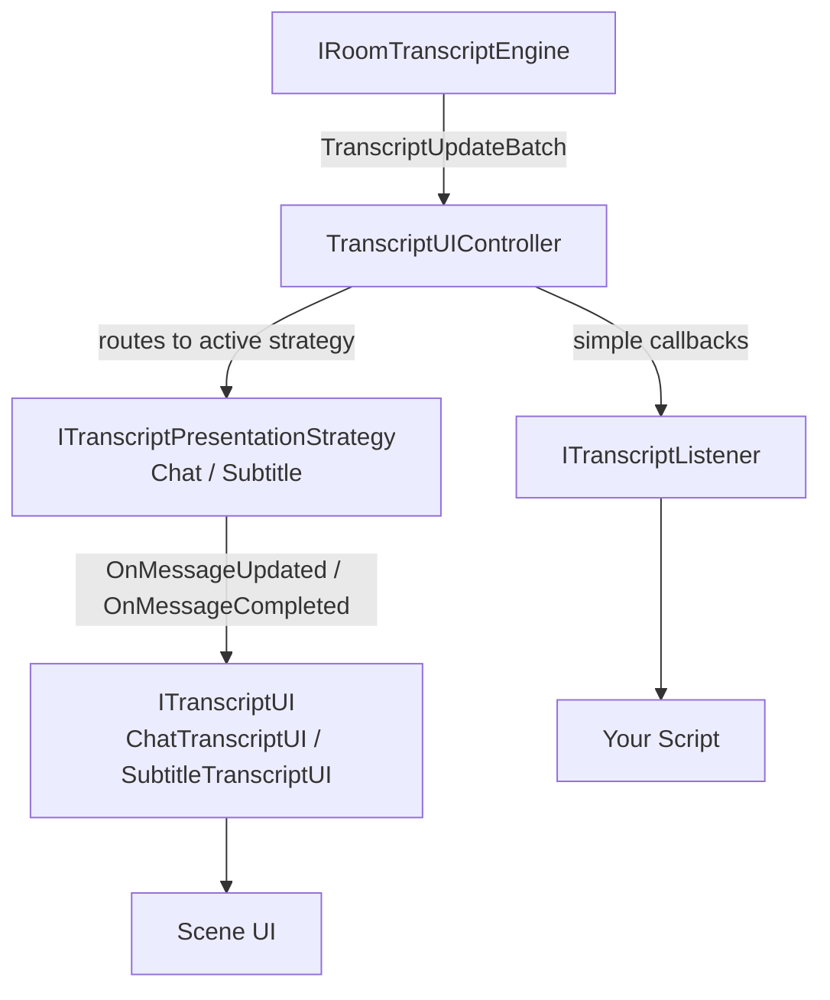

# Transcript UI

### Displaying Character and Player Speech

The transcript system routes every character and player speech segment from the Convai runtime to your UI layer. It handles partial text as speech is recognized, assembles final turns, and drives your UI through a well-defined pipeline — so your display code never touches network or audio state directly.

There are two integration paths. `ITranscriptListener` is a lightweight callback interface suited for scoring, analytics, or driving any custom component from transcript data. `ITranscriptUI` is the full display interface — use it to build a replacement chat panel, a world-space display, or any custom UI that needs complete control over message lifecycle. For querying the full turn history and timeline, see [Transcript History and Queries](/broken/pages/6586bc23ded8d5c72d9a82077d383f6f2099f9a3).

***

### How the Transcript System Works

The following diagram shows how transcript data flows from the runtime through the controller to your scene UI.



`IRoomTranscriptEngine` is the single source of truth for all transcript data. `TranscriptUIController` owns the active presentation strategy and dispatches to whichever `ITranscriptUI` implementation matches the current mode. `ITranscriptListener` is a parallel, simpler path that bypasses the strategy layer entirely.

`ConvaiManager` auto-discovers all `ITranscriptUI` and `ITranscriptListener` implementations in your scene. You do not need to register them manually for the common case.

***

### Choosing an Integration Path

#### ITranscriptListener — Lightweight Callbacks

Use `ITranscriptListener` when you need to react to transcript text without building a full custom UI. Examples: feeding transcripts into a scoring system, writing to a log, driving a custom text component, or triggering scenario events based on what the player says.

**Interface contract:**

```csharp
public interface ITranscriptListener
{
    // Optional. Set to a character ID to receive only that character's transcripts.
    // Return null for no filtering. Player transcripts are always received regardless of this value.
    string FilterCharacterId { get; }

    void OnCharacterTranscript(string characterId, string characterName, string text, bool isFinal);
    void OnPlayerTranscript(string text, bool isFinal);
}
```

`isFinal` is `false` while speech is still being recognized (partial) and `true` when the turn completes. Partial transcripts arrive frequently — react only to final ones unless you need real-time streaming feedback.

**Auto-discovery:** Add `ITranscriptListener` to any `MonoBehaviour` in the scene. `ConvaiManager` discovers and registers all implementations automatically during initialization.

**Multi-user attribution:** For multi-user rooms where you need to know which specific player spoke, implement `IMultiUserTranscriptListener` instead:

```csharp
public interface IMultiUserTranscriptListener : ITranscriptListener
{
    void OnPlayerTranscriptWithSpeaker(
        string speakerId,
        string speakerName,
        string participantId,
        string text,
        bool isFinal);
}
```

#### ITranscriptUI — Full Display Control

Use `ITranscriptUI` to build a complete replacement for the built-in chat or subtitle UI — a custom scroll list, a 3D world-space panel, an HTML overlay in WebGL, or any layout the built-in prefabs cannot provide.

**Interface contract:**

```csharp
public interface ITranscriptUI
{
    // Must match a ConvaiTranscriptMode name: "Chat" or "Subtitle"
    string Identifier { get; }

    bool IsActive { get; }

    // Called for both partial and final transcripts
    void DisplayMessage(TranscriptViewModel viewModel);

    // Called when a specific message bubble should finalize
    void CompleteMessage(string messageId);

    // Called when all active player messages should finalize
    void CompletePlayerTurn();

    // Called to clear all displayed content
    void ClearAll();

    // Called by the controller to activate or deactivate this UI
    void SetActive(bool active);
}
```

`Identifier` determines which `ConvaiTranscriptMode` activates this UI. Use `"Chat"` to replace the chat UI, `"Subtitle"` to replace the subtitle UI.

`DisplayMessage` is called for both partial and final transcripts. Check `viewModel.IsFinal` to decide whether to keep updating a bubble or lock it in.

**Registration:** Add your implementation as a `MonoBehaviour` to the scene. `ConvaiManager` discovers it automatically. For manual control:

| Method                                                                 | Description                                        |
| ---------------------------------------------------------------------- | -------------------------------------------------- |
| `ConvaiManager.ActiveManager.RegisterTranscriptUI(ITranscriptUI ui)`   | Manually register a transcript UI implementation   |
| `ConvaiManager.ActiveManager.UnregisterTranscriptUI(ITranscriptUI ui)` | Manually unregister a transcript UI implementation |

***

### Adding the Built-In Chat UI

The SDK ships `TranscriptUI_Chat.prefab` — a ready-made scrollable chat panel with auto-scroll and sender-colored message bubbles.



**Add the Prefab to Your Scene**

Drag `Packages/com.convai.convai-sdk-for-unity/Prefabs/TranscriptUI/TranscriptUI_Chat.prefab` into your scene's Canvas hierarchy.

The prefab contains a `ChatTranscriptUI` component that registers itself with `ConvaiManager` on `Awake`.



**Ensure an EventSystem Exists**

The chat input field requires an `EventSystem` in the scene. If your scene does not have one, add it via **GameObject → UI → Event System**.



**Run Your Scene**

Connect to a character and speak. Character speech appears in one bubble column; your speech appears in the other. The panel auto-scrolls to the latest message as the conversation progresses.




The chat UI activates automatically when `ConvaiTranscriptMode.Chat` is the current mode, which is the default. No additional configuration is required for basic setup.


***

### ConvaiTranscriptDisplay — Character-Local Display

`ConvaiTranscriptDisplay` is a lightweight component for displaying a single character's transcript directly on that character's `GameObject`. It does not participate in the room transcript pipeline and has no awareness of other characters or the player.

**Inspector fields:**

| Field                     | Default | Description                                                      |
| ------------------------- | ------- | ---------------------------------------------------------------- |
| `_transcriptText`         | —       | `TMP_Text` reference to render into                              |
| `_showPartialTranscripts` | `true`  | Update text during partial recognition                           |
| `_appendMode`             | `false` | Append new transcripts instead of replacing                      |
| `_clearOnNewFinal`        | `true`  | Clear the buffer before each final transcript (append mode only) |
| `_maxCharacters`          | `1000`  | Maximum characters kept in append mode. `0` = unlimited          |

**Requirement:** Must be on the same `GameObject` as `ConvaiCharacter`. Auto-subscribes to that character's transcript events on `Awake`.


Use `ConvaiTranscriptDisplay` for per-character labels — a floating name tag above a training station, a panel beside a character model. For full conversation history or player transcripts, use the chat prefab or `ITranscriptListener`.


***

### Switching the Active Transcript Mode

Switch transcript modes through the runtime settings service. The change applies immediately — the matching `ITranscriptUI` activates and any previous UI deactivates.

```csharp
using Convai.Runtime.Components;
using Convai.Shared.Types;

if (ConvaiManager.ActiveManager.TryGetRuntimeSettingsService(out var settings))
{
    var result = settings.Apply(new ConvaiRuntimeSettingsPatch
    {
        TranscriptMode = ConvaiTranscriptMode.Subtitle
    });

    if (!result.Success)
        Debug.LogWarning($"[Transcript] Mode switch failed: {result.ValidationMessage}");
}
```

Users can also switch modes through the built-in Settings Panel. See [Settings Panel](/broken/pages/370b1c4aa1c4466f3f070e13b5fd640823500165) for details on what modes the panel exposes at runtime.

***

### Clearing the Transcript Display

Call `ClearAll()` on any `ITranscriptUI` component to destroy all displayed message bubbles and reset the panel. This clears the **visual display only** — the underlying room turn history in `ConvaiManager.Transcripts` is read-only and is not affected.

```csharp
using Convai.Runtime.Presentation.Views.Transcript;

// Via serialized field (recommended)
[SerializeField] private ChatTranscriptUI _chatUI;

public void ResetForNextScenario()
{
    _chatUI.ClearAll();
}
```

```csharp
// Or via scene lookup when you don't hold a direct reference
FindObjectOfType<ChatTranscriptUI>()?.ClearAll();
```


`ConvaiManager` does not expose a global `ClearAll()`. Hold a direct component reference, use `FindObjectOfType`, or implement a central reset controller that holds references to all registered UIs.


**Typical use cases:**

* New training scenario starts — clear the previous scenario's conversation history from the screen
* Post-debrief reset — trainee has reviewed the chat; wipe before the next session begins
* Scene transition — clear before loading new content so stale messages do not flash in

***

### Usage Examples

#### Safety Training — Compliance Scoring with `ITranscriptListener`

A workplace safety training simulation scores trainee responses by reading final transcripts from the AI instructor:

```csharp
using Convai.Runtime.Presentation.Services;
using UnityEngine;

public class ComplianceScorer : MonoBehaviour, ITranscriptListener
{
    [SerializeField] private string _instructorCharacterId;
    [SerializeField] private ScoreBoard _scoreBoard;

    public string FilterCharacterId => _instructorCharacterId;

    public void OnCharacterTranscript(string characterId, string characterName, string text, bool isFinal)
    {
        // Instructor prompt — log for reference if needed
    }

    public void OnPlayerTranscript(string text, bool isFinal)
    {
        if (!isFinal) return;
        bool passed = text.Contains("hazard identified", System.StringComparison.OrdinalIgnoreCase);
        _scoreBoard.RecordResponse(text, passed);
    }
}
```

Place on any `GameObject` in the scene. `ConvaiManager` discovers and registers it automatically. At runtime, the scorer evaluates each final player response and records whether the trainee identified the hazard correctly.

#### Museum Kiosk — Per-Character Panel with `ConvaiTranscriptDisplay`

A natural history museum kiosk shows each exhibit character's speech on the physical panel beside their display case:

* Add `ConvaiTranscriptDisplay` to the `ConvaiCharacter` `GameObject`
* Assign the panel's `TMP_Text` to `_transcriptText`
* Set `_appendMode` off and `_clearOnNewFinal` on — each new complete sentence replaces the previous one

At runtime, each character's speech appears on its dedicated panel as the visitor interacts with it, with no UI overhead from the full chat pipeline.

#### Multi-User Fire Drill — Speaker Attribution with `IMultiUserTranscriptListener`

A multi-user fire safety drill tracks which specific trainee spoke and what they said for the post-session report:

```csharp
using Convai.Runtime.Presentation.Services;
using System.Collections.Generic;
using UnityEngine;

public class DrillTranscriptLogger : MonoBehaviour, IMultiUserTranscriptListener
{
    private readonly List<string> _log = new();

    public string FilterCharacterId => null; // receive all characters

    public void OnCharacterTranscript(string characterId, string characterName, string text, bool isFinal)
    {
        if (isFinal) _log.Add($"[Instructor] {characterName}: {text}");
    }

    public void OnPlayerTranscript(string text, bool isFinal)
    {
        // Use OnPlayerTranscriptWithSpeaker for attribution in multi-user rooms
    }

    public void OnPlayerTranscriptWithSpeaker(
        string speakerId, string speakerName, string participantId, string text, bool isFinal)
    {
        if (isFinal) _log.Add($"[Trainee] {speakerName}: {text}");
    }

    public IReadOnlyList<string> GetLog() => _log;
}
```

At runtime, every finalized trainee utterance is attributed to the specific trainee by name, producing a per-participant drill transcript for post-session review.

***

### Next Steps

You have covered the transcript pipeline architecture, both integration paths, the built-in chat prefab, per-character display, mode switching, and display clearing. The next step is configuring which mode renders by default and how each mode looks and behaves.


[Broken link](/broken/pages/6586bc23ded8d5c72d9a82077d383f6f2099f9a3)



[Broken link](/broken/pages/e7083caf90ffa367ea213594f028e67c244ea8da)



[Broken link](/broken/pages/370b1c4aa1c4466f3f070e13b5fd640823500165)

