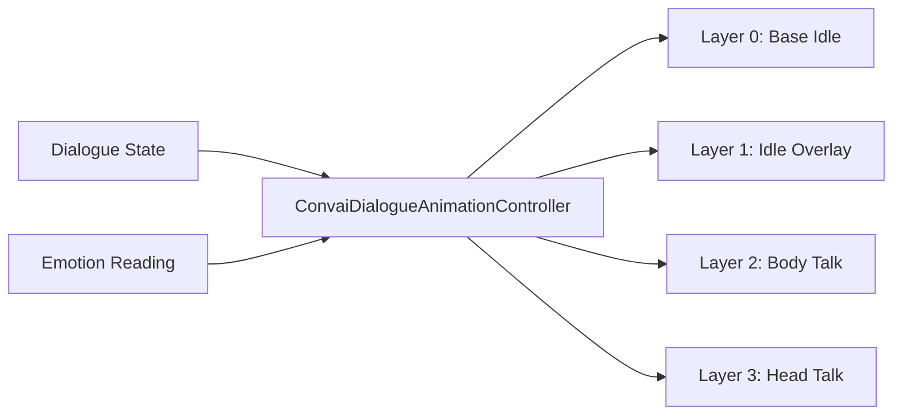

The Dialogue Animation module drives body and head gesture animations on AI characters using dialogue state and detected emotion as inputs. Instead of hard-coded animator states for every clip, it uses an `AnimatorOverrideController` to inject clips from a pooled library at runtime — swapping candidates as dialogue progresses. The module runs entirely inside Unity. No animation data is sent to Convai.

## How the system works

Each frame the module reads two signals: the current **dialogue state** (idle, listening, thinking, speaking, reacting) and the current **emotion reading** from the Emotion module. It uses those signals to select and crossfade clips from a `DialogueAnimationLibrary` across a four-layer animator stack.

The four layers are additive and masked: the base idle plays continuously, the idle overlay adds variation, and the two talk layers fade in when the character speaks. Talk layer clips are routed by `DialogueTalkBodyCoverage` — clips can target head only, body only, or both simultaneously.

## Configuration assets

The module is driven by four ScriptableObject types:

| Asset                            | Purpose                                                                             |
| -------------------------------- | ----------------------------------------------------------------------------------- |
| `DialogueAnimationLibrary`       | Pool of idle and talk clips, each tagged with emotion affinity and character gender |
| `DialogueAnimationRuntimeConfig` | Timing, blend durations, layer weights, and selection parameters                    |
| `DialogueAnimatorContract`       | Maps layer indices and state names to your Animator Controller                      |
| `ConvaiDialogueAnimationProfile` | Bundles the three assets above into a single character preset                       |

Three bundled profiles ship with the SDK: **Balanced**, **Expressive**, and **Subtle**. They cover most characters without custom authoring.

<table data-view="cards"><thead><tr><th></th><th data-hidden data-card-target data-type="content-ref"></th></tr></thead><tbody><tr><td><strong>Quick Start</strong> Add the controller, assign a library and config, and see gesture animation in Play Mode.</td><td><a href="quick-start.md">quick-start.md</a></td></tr><tr><td><strong>Animation Libraries &amp; Profiles</strong> Author and configure DialogueAnimationLibrary, RuntimeConfig, and bundled Profile assets.</td><td><a href="animation-libraries-and-profiles.md">animation-libraries-and-profiles.md</a></td></tr><tr><td><strong>Animator Controller Setup</strong> Wire your Animator Controller to the four-layer contract the module expects.</td><td><a href="animator-controller-setup.md">animator-controller-setup.md</a></td></tr><tr><td><strong>Usage Examples</strong> Inspector-only and scripted examples across training, medical, and corporate simulation scenarios.</td><td><a href="usage-examples.md">usage-examples.md</a></td></tr><tr><td><strong>Scripting API</strong> Complete reference for ConvaiDialogueAnimationController properties and runtime swap methods.</td><td><a href="scripting-api.md">scripting-api.md</a></td></tr><tr><td><strong>Troubleshooting</strong> Symptom-driven fixes for silent talk layers, missing animation, and layer index errors.</td><td><a href="troubleshooting.md">troubleshooting.md</a></td></tr></tbody></table>

## Next steps

Follow the Quick Start to get the module running on your first character, then read Animation Libraries & Profiles to understand how to customize clip selection for your scenario.


[Quick Start](quick-start.md)

