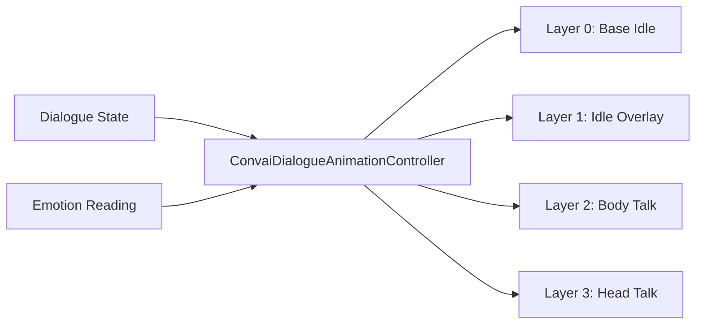

The Dialogue Animation module drives body and head gesture animations on AI characters using dialogue state and detected emotion as inputs. Instead of hard-coded animator states for every clip, it uses an `AnimatorOverrideController` to inject clips from a pooled library at runtime — swapping candidates as dialogue progresses. The module runs entirely inside Unity. No animation data is sent to Convai.

***

## Dialogue states and layer control

Each frame the module reads two signals: the current **dialogue state** (idle, listening, thinking, speaking, reacting) and the current **emotion reading** from the Emotion module. It uses those signals to select and crossfade clips from a `DialogueAnimationLibrary` across a four-layer animator stack.

The four layers are additive and masked: the base idle plays continuously, the idle overlay adds variation, and the two talk layers fade in when the character speaks. Talk layer clips are routed by `DialogueTalkBodyCoverage` — clips can target head only, body only, or both simultaneously.

***

## Configuration assets

The module is driven by four ScriptableObject types:

| Asset                            | Purpose                                                                             |
| -------------------------------- | ----------------------------------------------------------------------------------- |
| `DialogueAnimationLibrary`       | Pool of idle and talk clips, each tagged with emotion affinity and character gender |
| `DialogueAnimationRuntimeConfig` | Timing, blend durations, layer weights, and selection parameters                    |
| `DialogueAnimatorContract`       | Maps layer indices and state names to your Animator Controller                      |
| `ConvaiDialogueAnimationProfile` | Bundles the three assets above into a single character preset                       |

Three bundled profiles ship with the SDK: **Balanced**, **Expressive**, and **Subtle**. They cover most characters without custom authoring.

***

## Next steps

Follow the Quick Start to get the module running on your first character, then read Animation Libraries & Profiles to understand clip pools, timing, and the full field reference.


[Dialogue Animation quick start](quick-start.md)



[Animation libraries and profiles](animation-libraries-and-profiles.md)

