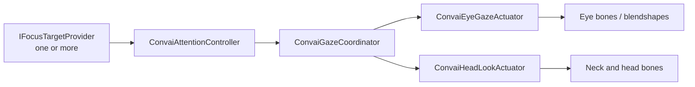

# Gaze & Attention

## Natural Eye Contact and Head Tracking for AI Characters

The Gaze & Attention utility adds natural eye contact and head tracking to AI characters. It runs entirely inside Unity — no data is sent to Convai — and operates independently of the session lifecycle.

The system is split into two cooperating layers:

* **Attention** — decides _what_ the character looks at, selecting from available focus candidates using priority, distance relevance, and an interest budget that prevents indefinite fixation
* **Gaze** — decides _how_ the character looks: translating the attention target into eye rotation, head movement, saccades, blinks, and eyelid follow, weighted by the current dialogue state

Each layer is independently configurable through ScriptableObject profiles. You can tune attention persistence, eye tracking sharpness, head range, saccade frequency, and per-dialogue-state gaze authority — all without code.

## Components

| Component                    | Responsibility                                                                         |
| ---------------------------- | -------------------------------------------------------------------------------------- |
| `ConvaiAttentionController`  | Selects the active focus target each frame                                             |
| `ConvaiGazeCoordinator`      | Blends attention output with dialogue state to produce `GazeIntent`                    |
| `ConvaiEyeGazeActuator`      | Rotates eye bones and drives blendshapes from `GazeIntent`                             |
| `ConvaiHeadLookActuator`     | Rotates neck and head bones from `GazeIntent`                                          |
| `AnimationRiggingGazeBridge` | Optional: drives Unity Animation Rigging constraints instead of procedural bone writes |

<table data-view="cards"><thead><tr><th></th><th data-hidden data-card-target data-type="content-ref"></th></tr></thead><tbody><tr><td><strong>Quick Start</strong> Add the three required components and see eye and head tracking working in Play Mode.</td><td><a href="/broken/pages/749579ca90c5642a521545ecfb8a38801312161b">Broken link</a></td></tr><tr><td><strong>Profiles &#x26; Tuning</strong> Field reference for all four gaze profile ScriptableObjects with defaults and tuning guidance.</td><td><a href="/broken/pages/9722cfa6182dd2fa68181a57974162e93b62e967">Broken link</a></td></tr><tr><td><strong>Usage Examples</strong> Training, medical, and negotiation scenarios with Inspector and scripted configuration patterns.</td><td><a href="/broken/pages/f25409bd4283cc496195d5926bf38c7f1f18fde4">Broken link</a></td></tr><tr><td><strong>Scripting API</strong> Complete reference for AttentionReading, IFocusTargetProvider, GazeIntent, and all runtime types.</td><td><a href="/broken/pages/5df0d73ec1bc7b8646a70cc77b28e455d37a7c36">Broken link</a></td></tr><tr><td><strong>Troubleshooting</strong> Fixes for static eyes, frozen head, eyelid clipping, and attention targeting failures.</td><td><a href="/broken/pages/33be83ff0bc50c3eca671d873c33036739e6e3ec">Broken link</a></td></tr></tbody></table>

## Next Steps

Follow the Quick Start to add eye and head tracking to your first character, then read Profiles & Tuning to understand how to adjust gaze behavior for your scenario.


[Broken link](/broken/pages/749579ca90c5642a521545ecfb8a38801312161b)

