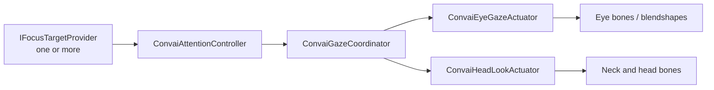

The Gaze & Attention utility adds natural eye contact and head tracking to AI characters. It runs entirely inside Unity — no data is sent to Convai — and operates independently of the session lifecycle. Two cooperating layers handle what the character looks at and how it looks there.

***

## Attention layer

The Attention layer decides **what** the character looks at. It evaluates all registered `IFocusTargetProvider` components each frame, selecting a winner using priority, distance-based relevance, and an interest budget that prevents indefinite fixation on a single target.

***

## Gaze layer

The Gaze layer decides **how** the character looks at the attention target. It translates the active attention reading into eye rotation, head movement, procedural saccades, blinks, and eyelid follow. Gaze authority is weighted by the current dialogue state — the character looks more assertively during speech and more softly during idle.

***

## Component pipeline

Each layer is independently configurable through ScriptableObject profiles. You can tune attention persistence, eye tracking sharpness, head range, saccade frequency, and per-dialogue-state gaze authority — all without code.

| Component                    | Responsibility                                                                         |
| ---------------------------- | -------------------------------------------------------------------------------------- |
| `ConvaiAttentionController`  | Selects the active focus target each frame                                             |
| `ConvaiGazeCoordinator`      | Blends attention output with dialogue state to produce `GazeIntent`                    |
| `ConvaiEyeGazeActuator`      | Rotates eye bones and drives blendshapes from `GazeIntent`                             |
| `ConvaiHeadLookActuator`     | Rotates neck and head bones from `GazeIntent`                                          |
| `AnimationRiggingGazeBridge` | Optional: drives Unity Animation Rigging constraints instead of procedural bone writes |

***

## Next steps


[Gaze and Attention quick start](quick-start.md)



[Attention and gaze profiles](profiles-and-tuning.md)

