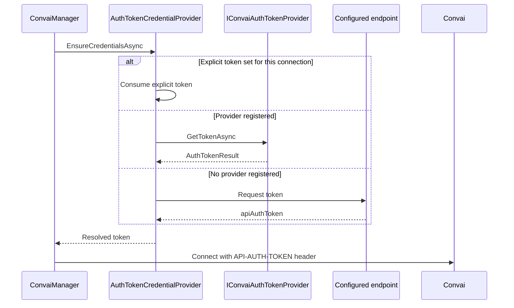

The Convai SDK for Unity resolves a credential fresh for every room connection attempt — it does not cache a token across connections. Understanding the resolution order helps you decide whether to register a provider, configure an endpoint, or pass a token explicitly.

## Credential resolution order

In Auth Token mode, `AuthTokenCredentialProvider.EnsureCredentialsAsync` runs once per connection attempt and checks three sources, in order:

1. **An explicit one-shot token.** If the current connection was started with `ConvaiManager.ConnectWithAuthTokenAsync`, the SDK consumes that token and skips the other two sources.
2. **A registered `IConvaiAuthTokenProvider`.** If no explicit token was supplied, the SDK checks `ConvaiAuthTokenProviderRegistry` for a provider and calls `GetTokenAsync` on it.
3. **The endpoint configured in Project Settings.** If no provider is registered, the SDK falls back to `EndpointAuthTokenProvider`, built from the **Token Endpoint URL**, **HTTP Method**, **Token Response Field**, and **Request Headers** saved under **Edit > Project Settings > Convai SDK**.

If none of the three sources yields a token, the connection fails with the error `Auth Token mode requires a registered IConvaiAuthTokenProvider or a configured endpoint URL.`

In API Key mode, resolution is simpler: `ProjectSettingsCredentialProvider` reads the account API key directly from the saved `ConvaiSettings` asset. No provider, endpoint, or per-connection network call is involved.

## Which source applies to your integration

| Your situation | Applicable source |
|---|---|
| Your login layer already holds a Convai auth token before connecting | Explicit one-shot token via `ConnectWithAuthTokenAsync` |
| You want per-player tokens tied to your own login system | A registered `IConvaiAuthTokenProvider` |
| Your token endpoint accepts unauthenticated requests, or you are prototyping | The endpoint configured in Project Settings |

An explicit token always wins when both an explicit token and a registered provider are present for the same connection attempt — the provider is not consulted in that case.

## Transport header per mode

The header the SDK sends to Convai differs by authentication mode, not by platform:

| Mode | Header name |
|---|---|
| API Key | `X-API-Key` |
| Auth Token | `API-AUTH-TOKEN` |

`TransportAuthenticationSupport.GetHeaderName` selects the header from the active `ITransportConfiguration`. The Native and WebGL room controllers call the same selection logic, so the header name and the authentication-mode handling are identical on both platforms — there is no WebGL-specific header variant to account for.

## Editor-only fallback

When Auth Token mode is selected, an API key is saved, and no endpoint or provider is configured, the Editor exchanges the saved API key for a token directly against Convai. This fallback exists only inside `ConvaiEditorApiKeyAuthTokenProvider`, an Editor-assembly type that is never compiled into a player build — a shipped build in Auth Token mode always relies on a real provider or endpoint, never on this fallback.

## Next steps

<table data-view="cards"><thead><tr><th></th><th data-hidden data-card-target data-type="content-ref"></th></tr></thead><tbody><tr><td><strong>Configure Auth Token mode</strong> Switch modes and configure the endpoint in Project Settings.</td><td><a href="configure-auth-token-mode.md">configure-auth-token-mode.md</a></td></tr><tr><td><strong>Write a custom token provider</strong> Register an IConvaiAuthTokenProvider for per-player tokens.</td><td><a href="custom-token-provider.md">custom-token-provider.md</a></td></tr><tr><td><strong>Connect with an existing auth token</strong> Use the one-shot ConnectWithAuthTokenAsync path.</td><td><a href="connect-with-auth-token.md">connect-with-auth-token.md</a></td></tr></tbody></table>
