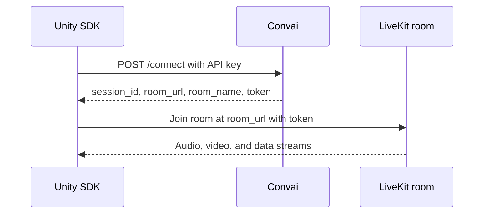

The Convai Unity SDK requires outbound internet access during runtime. Speech, language understanding, and text-to-speech run through Convai over HTTPS and LiveKit WebRTC — there is no offline or LAN mode. Use this page when preparing a corporate network, validating a firewall allowlist, or confirming that a Play mode session reached the correct LiveKit room.

## Required outbound access

Runtime sessions use two Convai endpoints plus LiveKit hosts returned in the connect response. Allow outbound traffic from the machine running Unity to the hosts below.

### Convai endpoints

| Host | Port | Protocol | Purpose |
| --- | --- | --- | --- |
| `<code class="expression">space.vars.live_server_url</code>` | `443` | HTTPS | Connect API — session setup and room credentials |
| `api.convai.com` | `443` | HTTPS | Character metadata, REST API, and WebGL emotion preflight |

The default connect URL is `<code class="expression">space.vars.live_server_url</code>/connect`. Override the base URL in **Edit > Project Settings > Convai SDK > Core Server Base URL** when your deployment uses a custom Convai endpoint.

### LiveKit minimum requirements

After Convai accepts the connect request, the SDK joins a LiveKit room using the `room_url` and `token` from the response. Minimum outbound rules for LiveKit Cloud connectivity:

| Host | Port | Protocol | Purpose |
| --- | --- | --- | --- |
| `convai-technologies-lfslae7c.livekit.cloud` | `443` | TCP | Convai LiveKit signaling endpoint |
| `*.livekit.cloud` | `443` | TCP | LiveKit WebSocket signaling |
| `*.turn.livekit.cloud` | `443` | TCP | TURN/TLS fallback when UDP is blocked |

### Recommended for best audio quality

Allow these rules when your network policy permits UDP. They reduce latency and improve voice quality in training simulations and interactive experiences.

| Host | Port | Protocol | Purpose |
| --- | --- | --- | --- |
| `*.host.livekit.cloud` | `3478` | UDP | TURN/UDP connectivity |
| All LiveKit hosts | `50000`–`60000` | UDP | WebRTC media transport |
| All LiveKit hosts | `7881` | TCP | WebRTC TCP fallback |

No inbound ports are required on the client machine. For the full LiveKit firewall reference, see [Configuring firewalls](https://docs.livekit.io/deploy/admin/firewall/) in the LiveKit documentation.

## How realtime sessions connect

Each character session follows this sequence:



| Connect response field | Runtime use |
| --- | --- |
| `session_id` | Convai session ID for the live session |
| `character_session_id` | Conversation continuity across reconnects |
| `room_url` | LiveKit WebSocket endpoint — for example `wss://convai-technologies-lfslae7c.livekit.cloud` |
| `room_name` | LiveKit room name the client joins |
| `token` | Temporary LiveKit room token used to join the room |

The SDK reads `room_url` from the connect response and passes it to the transport layer. It does not hardcode a LiveKit hostname. The example host `convai-technologies-lfslae7c.livekit.cloud` is one Convai deployment; your logs may show a different `room_url` for the same account over time.

## Authentication

Two credential types are involved in a runtime session.

### API key

Your project API key authenticates requests to Convai. Store it in **Edit > Project Settings > Convai SDK**.

| Request type | Header | Used for |
| --- | --- | --- |
| Connect (`/connect`) | `X-API-Key` | Starting a realtime session |
| REST (`api.convai.com`) | `CONVAI-API-KEY` | Character metadata, long-term memory, and other REST calls |

The SDK sends the API key automatically. You do not paste the key into connect payloads manually.

### LiveKit room token

Each successful connect response includes a temporary `token`. The SDK passes this token to LiveKit when joining the room. The token is short-lived and grants access only to that room. Treat it like a password — do not share it in public forums, support tickets, or version control.

## Find connection details in logs

When a session starts, the SDK logs room credentials at **Debug** level under the **Transport** category. Enable verbose transport logging before searching for these lines.

1. Open **Edit > Project Settings > Convai SDK > Diagnostics**.
2. Set **Global Log Level** to `Debug`, or expand **Category Overrides** and add an override with **Category** `Transport` and **Level** `Debug`.
3. Enter Play mode and start a character session.
4. Open the Unity Console and filter by `Transport`.

You should see one of these log forms:

```text
[Debug][Transport]: Room details received: {"token":"...","room_name":"...","session_id":"...","room_url":"..."}
```

If the JSON line is hard to read, search for `Token:` — the SDK also prints a readable summary:

```text
[Debug][Transport]: Token: ...; Room Name: ...; Room URL: ...; Session ID: ...; Character Session ID: ...
```

| Log field | Meaning |
| --- | --- |
| `token` | LiveKit room token |
| `room_name` | LiveKit room name / room ID |
| `room_url` | LiveKit URL / WebSocket endpoint |
| `session_id` | Convai session ID |
| `Character Session ID` | Convai character session ID for conversation continuity |


Do not share the room token publicly. It is temporary and grants access to the LiveKit room. Redact `token` values before posting logs to support channels or public issue trackers.


Debug log calls compile out of non-development builds unless `CONVAI_DEBUG_LOGGING` is defined. Debug transport lines appear in the Unity Editor and Development Builds by default. See [Debug tools reference](../troubleshooting/debug-tools-reference.md) for logging configuration.

## Firewall validation checklist

Work through this checklist with your network or IT team before deploying to a restricted environment.

1. Confirm outbound TCP `443` to `<code class="expression">space.vars.live_server_url</code>` and `api.convai.com`.
2. Confirm outbound TCP `443` to `convai-technologies-lfslae7c.livekit.cloud`, `*.livekit.cloud`, and `*.turn.livekit.cloud`.
3. When UDP is permitted, allow UDP `3478` to `*.host.livekit.cloud` and outbound UDP `50000`–`60000`.
4. Exclude Convai and LiveKit hostnames from TLS inspection if your proxy performs man-in-the-middle decryption on HTTPS or WSS traffic.
5. Enter Play mode, enable **Transport** logs at **Debug**, and confirm a `Room details received` or `Token:` line appears with a `wss://` `room_url`.
6. Confirm the character reaches **Connected** state and responds to voice or text input.

If steps 5 or 6 fail with `transport.ice_failed` or `transport.signal_disconnected`, see [Connection and API issues](../troubleshooting/connection-and-api-issues.md).

## Troubleshooting

| Symptom | Likely cause | Fix | Verify |
| --- | --- | --- | --- |
| `connection.network_error` or `connection.timeout` | Convai endpoints blocked on TCP `443` | Allow `<code class="expression">space.vars.live_server_url</code>` and `api.convai.com` | Session reaches `Connected` state |
| `transport.ice_failed` or `transport.peer_connection_failed` | LiveKit UDP or TURN hosts blocked | Add LiveKit minimum and recommended firewall rules from this page | `Room details received` log appears; character responds in Play mode |
| No `Room details received` log line | Transport logging below **Debug** | Open **Diagnostics** in Project Settings; set **Transport** category override to **Debug** | Readable `Token:` line appears in the Console |
| Connect succeeds but audio is choppy | UDP media range blocked | Allow UDP `50000`–`60000` and UDP `3478` to `*.host.livekit.cloud` | Voice quality improves on the same network |
| `connection.connect_invalid_api_key` | Invalid or revoked API key | Copy a fresh key from `<code class="expression">space.vars.dashboard_url</code>` into Project Settings | Connect error no longer fires |
| WebGL mic unavailable | Build served over HTTP | Serve the build over HTTPS or from `localhost` | Microphone permission prompt appears in the browser |


Proxy servers that perform TLS inspection on HTTPS or WSS traffic can break LiveKit signaling. Exclude Convai and LiveKit hostnames from TLS inspection when your environment uses a corporate proxy.


## WebGL deployments

WebGL builds must be served over HTTPS or from `localhost`. HTTP deployments block microphone access due to browser security policy. WebGL uses the same Convai and LiveKit endpoints as desktop builds. See [Platform support matrix](platform-support-matrix.md) and the [WebGL deployment guide](../platform-guides/webgl.md) for browser-specific constraints.

## Next steps

With network requirements confirmed, install the SDK or review connection error codes.


[Install the Convai Unity SDK](../getting-started/installation.md)



[Connection and API issues](../troubleshooting/connection-and-api-issues.md)

