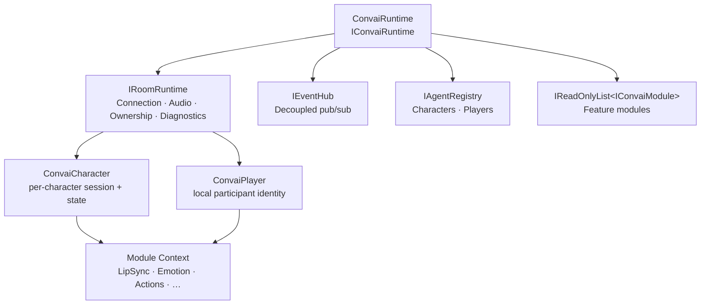
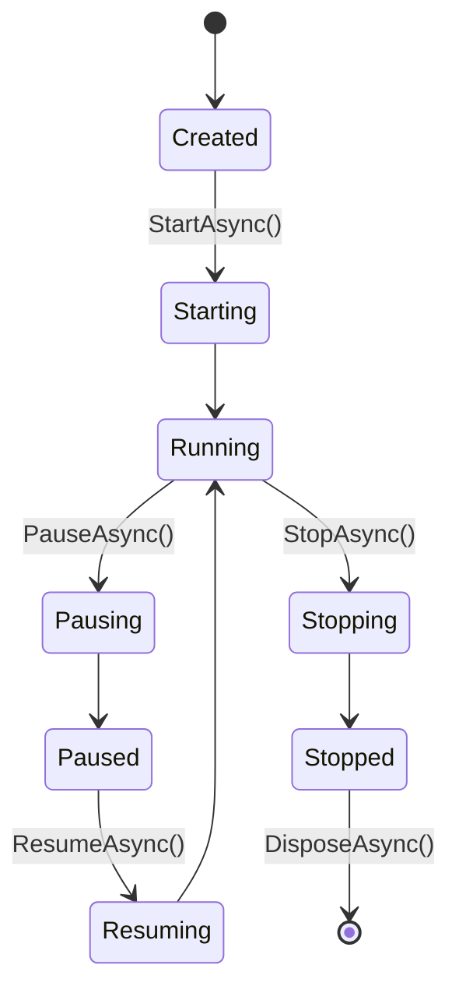

# architecture deep dive

The Convai Unity SDK is built in layers. Each layer has a defined responsibility and communicates inward — outer layers depend on inner ones, never the reverse. Understanding this structure tells you which parts of the SDK are developer-facing, which are replaceable, and which are internal implementation details you do not need to touch.

***

## System Layers

The diagram below shows the four main layers and how they relate.



**`ConvaiRuntime` (top layer)** — owns every sub-system. Created once per application lifetime via `ConvaiRuntimeBuilder`. Exposes start, pause, resume, and stop operations that propagate to all registered modules.

**`IRoomRuntime` (connection layer)** — manages the real-time room lifecycle: connecting, disconnecting, audio routing, character ownership, and session diagnostics.

**Character / Player layer** — `ConvaiCharacter` and `ConvaiPlayer` register with the `IAgentRegistry` and receive their per-session context from the room layer.

**Module layer** — opt-in feature modules (`IConvaiModule`) attach to the runtime and share a `IModuleContext`. Modules are isolated: they do not call each other directly.

***

## Runtime Interface Inventory

`IConvaiRuntime` exposes the following sub-systems as properties. Each property is the entry point for a specific domain of functionality.

| Property             | Type                            | What It Owns                                  |
| -------------------- | ------------------------------- | --------------------------------------------- |
| `State`              | `RuntimeState`                  | Current lifecycle state of the runtime        |
| `Room`               | `IRoomRuntime`                  | Connection, audio, ownership, and diagnostics |
| `Events`             | `IEventHub`                     | Decoupled publish/subscribe communication     |
| `Agents`             | `IAgentRegistry`                | Registry of all active characters and players |
| `Modules`            | `IReadOnlyList<IConvaiModule>`  | All registered feature modules                |
| `Transport`          | `ITransportProvider`            | Platform-specific real-time transport         |
| `Conversation`       | `IConversationProvider`         | AI backend communication                      |
| `Config`             | `ConvaiBootstrapConfigSnapshot` | Immutable bootstrap configuration             |
| `RuntimePreferences` | `IRuntimePreferences`           | Mutable runtime preferences                   |
| `FeatureVariants`    | `IFeatureVariantProvider`       | Feature variant / A-B selection               |
| `Persistence`        | `IPersistenceProvider`          | Runtime-owned data storage                    |
| `Telemetry`          | `ITelemetryProvider`            | Observability and analytics                   |

Most of these are internal implementations assembled at startup. Developers interact with `Room`, `Agents`, and `Events` most frequently. `Transport`, `Conversation`, `Persistence`, `Telemetry`, and `FeatureVariants` are replaceable via `ConvaiRuntimeBuilder`.

***

## What You Can Replace

`ConvaiRuntimeBuilder` is the fluent API for composing the runtime before it starts. Every method returns `this`, so calls chain.

```csharp
var runtime = new ConvaiRuntimeBuilder()
    .UsePersistence(myPersistenceProvider)
    .UseTelemetry(myTelemetryProvider)
    .WithEndUserIdentityProvider(myIdentityProvider)
    .AddModule<MyCustomModule>()
    .Build();
```

The table below lists what is replaceable vs. internal-only.

| Component                | Replaceable via Builder          | Default                                |
| ------------------------ | -------------------------------- | -------------------------------------- |
| Transport provider       | `UseTransport()`                 | Platform-default (WebSocket / LiveKit) |
| Conversation provider    | `UseConversation()`              | Convai RTVI conversation backend       |
| Persistence provider     | `UsePersistence()`               | `PlayerPrefs`-backed key-value store   |
| Telemetry provider       | `UseTelemetry()`                 | No-op telemetry                        |
| Feature variant provider | `WithFeatureVariants()`          | Static feature flags                   |
| Runtime preferences      | `WithRuntimePreferences()`       | Defaults from `ConvaiSettings`         |
| Event hub                | `UseEventHub()`                  | Default in-memory event hub            |
| Agent registry           | `UseAgentRegistry()`             | Default registry                       |
| End-user identity        | `WithEndUserIdentityProvider()`  | Device ID provider                     |
| End-user metadata        | `WithEndUserMetadataProvider()`  | None                                   |
| Modules                  | `AddModule()` / `AddModule<T>()` | SDK feature modules only               |
| Room runtime             | `UseRoomRuntime()`               | Internal LiveKit-backed room           |


`ConvaiRuntime` is created by the `ConvaiManager` MonoBehaviour automatically. Most projects never call `ConvaiRuntimeBuilder` directly. Use it only when you need to replace a default provider or add a custom module.


***

## `IRoomRuntime` Sub-Structure

The room layer is itself composed of four coordinators, all accessible via `IConvaiRuntime.Room`.

| Property      | Type                         | Responsibility                                |
| ------------- | ---------------------------- | --------------------------------------------- |
| `Connection`  | `IRoomConnectionCoordinator` | Connect, disconnect, session state            |
| `Audio`       | `IRoomAudioCoordinator`      | Microphone capture, remote audio playback     |
| `Ownership`   | `IRoomOwnershipCoordinator`  | Which characters this client owns and focuses |
| `Diagnostics` | `IRoomDiagnostics`           | Session metrics, health monitoring            |

Connection and audio are the coordinators you are most likely to call from scripting. Ownership is managed automatically when you have multiple characters in the scene. Diagnostics are used for performance monitoring and debugging.

***

## Module Layer

Modules are feature extensions that run inside the runtime lifecycle. They receive a shared `IModuleContext` and can register services that other modules or the presentation layer consume.

Add a module via the builder before `Build()` is called:

```csharp
new ConvaiRuntimeBuilder()
    .AddModule<LipSyncModule>()
    .AddModule(new MyCustomModule(someConfig))
    .Build();
```

Modules are started, paused, resumed, and stopped alongside the runtime. The `IConvaiModule` interface defines these lifecycle hooks.


Modules cannot depend on each other directly. If two modules need to share data, use the `IEventHub` or a shared service registered via `IModuleContext`.


***

## `RuntimeState` Lifecycle

The runtime moves through the following states from creation to disposal.

| State      | Meaning                                         |
| ---------- | ----------------------------------------------- |
| `Created`  | Runtime built but not yet started               |
| `Starting` | `StartAsync()` in progress                      |
| `Running`  | Fully operational                               |
| `Pausing`  | `PauseAsync()` in progress                      |
| `Paused`   | Paused; can be resumed                          |
| `Resuming` | `ResumeAsync()` in progress                     |
| `Stopping` | `StopAsync()` in progress                       |
| `Stopped`  | Shut down; cannot restart                       |
| `Disposed` | `DisposeAsync()` called; all resources released |



All state transitions are async operations wrapped in `IConvaiOperation<Unit>`. Check `Status` on the returned operation to confirm the transition completed before proceeding.

***

## Next Steps


[Broken link](/broken/pages/82de164a9d1d165bdfcf26455e65a0879dec0195)



[Broken link](/broken/pages/5cb0d97ef0cdd738767c98bede6b17082229d3a9)

