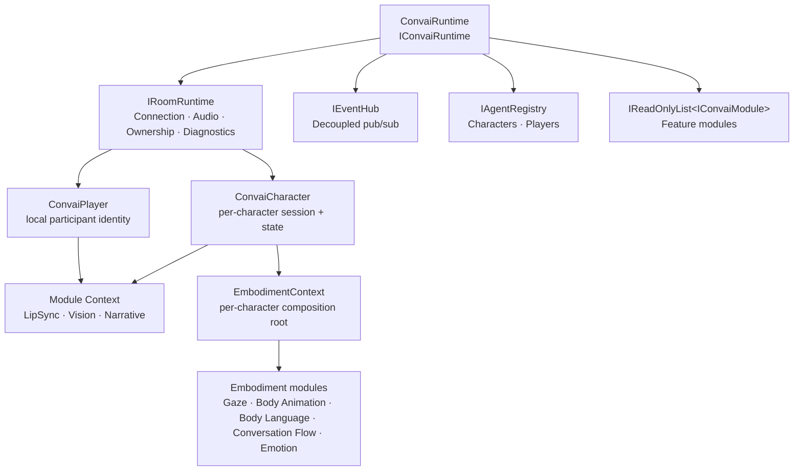
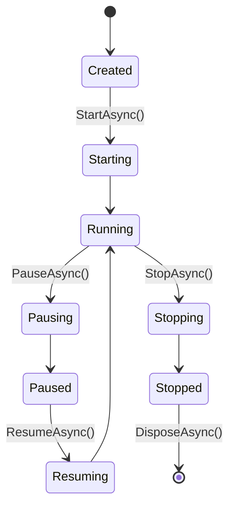

The Convai Unity SDK is built in layers. Each layer has a defined responsibility and communicates inward — outer layers depend on inner ones, never the reverse. Understanding this structure tells you which parts of the SDK are developer-facing, which are replaceable, and which are internal implementation details you do not need to touch.

***

## System layers

The diagram below shows the main layers and how they relate. `ConvaiRuntime` holds four direct sub-systems at the second tier — `IRoomRuntime`, `IEventHub`, `IAgentRegistry`, and the module list. Characters and players surface beneath `IRoomRuntime` and `IAgentRegistry`. Runtime-level feature modules share a common module context; a character that carries embodiment modules also gets its own per-character composition root.



**`ConvaiRuntime` (top layer)** — owns every sub-system and coordinates the full lifecycle. Created once per application lifetime via `ConvaiRuntimeBuilder`. Exposes start, pause, resume, and stop operations that propagate to all registered modules. It holds four direct sub-systems:

* **`IRoomRuntime`** — manages the real-time session: connecting, disconnecting, audio routing, character ownership, and diagnostics. Characters and the local player surface beneath this layer.
* **`IEventHub`** — decoupled publish/subscribe bus used throughout the SDK for cross-system communication.
* **`IAgentRegistry`** — registry of all active `ConvaiCharacter` and `ConvaiPlayer` instances.
* **`IReadOnlyList<IConvaiModule>`** — the set of registered feature modules.

**Character / Player layer** — `ConvaiCharacter` and `ConvaiPlayer` register with `IAgentRegistry` and receive their per-session context through `IRoomRuntime`. Each character maintains its own session state. A character that carries embodiment modules — Gaze, Body Animation, Body Language, Conversation Flow, or Emotion — also gets its own `EmbodimentContext`; see Embodiment layer below.

**Module context layer** — runtime-level feature modules (`IConvaiModule`, such as LipSync, Vision, and Narrative) share an `IModuleContext` that provides access to runtime services. Modules can declare dependencies on each other's module IDs and services, but interact through `IEventHub` or a service registered on `IModuleContext` rather than holding direct references to each other's concrete types.

***

## Runtime interface inventory

`IConvaiRuntime` exposes the following sub-systems as properties. Each property is the entry point for a specific domain of functionality.

| Property             | Type                            | What It Owns                                  |
| -------------------- | ------------------------------- | --------------------------------------------- |
| `State`              | `RuntimeState`                  | Current lifecycle state of the runtime        |
| `Room`               | `IRoomRuntime`                  | Connection, audio, ownership, and diagnostics |
| `Events`             | `IEventHub`                     | Decoupled publish/subscribe communication     |
| `Agents`             | `IAgentRegistry`                | Registry of all active characters and players |
| `Modules`            | `IReadOnlyList<IConvaiModule>`  | All registered feature modules                |
| `Transport`          | `ITransportProvider`            | Platform-specific real-time transport         |
| `Conversation`       | `IConversationProvider`         | Communication with Convai                     |
| `Config`             | `ConvaiBootstrapConfigSnapshot` | Immutable bootstrap configuration             |
| `RuntimePreferences` | `IRuntimePreferences`           | Mutable runtime preferences                   |
| `FeatureVariants`    | `IFeatureVariantProvider`       | Feature variant / A-B selection               |
| `Persistence`        | `IPersistenceProvider`          | Runtime-owned data storage                    |
| `Telemetry`          | `ITelemetryProvider`            | Observability and analytics                   |

Developers interact with `Room`, `Agents`, and `Events` most frequently. `Transport`, `Conversation`, `Persistence`, `Telemetry`, and `FeatureVariants` are replaceable via `ConvaiRuntimeBuilder`.

***

## What you can replace

`ConvaiRuntimeBuilder` is the fluent API for composing the runtime before it starts. Every method returns `this`, so calls chain.

```csharp
var runtime = new ConvaiRuntimeBuilder()
    .UsePersistence(myPersistenceProvider)
    .UseTelemetry(myTelemetryProvider)
    .WithEndUserIdentityProvider(myIdentityProvider)
    .AddModule<MyCustomModule>()
    .Build();
```

The table below lists what is replaceable vs. internal-only.

| Component                | Replaceable via Builder          | Default                                |
| ------------------------ | -------------------------------- | -------------------------------------- |
| Transport provider       | `UseTransport()`                 | Platform-default (WebSocket / LiveKit) |
| Conversation provider    | `UseConversation()`              | Convai RTVI conversation provider      |
| Persistence provider     | `UsePersistence()`               | `PlayerPrefs`-backed key-value store   |
| Telemetry provider       | `UseTelemetry()`                 | No-op telemetry                        |
| Feature variant provider | `WithFeatureVariants()`          | Static feature flags                   |
| Runtime preferences      | `WithRuntimePreferences()`       | Defaults from `ConvaiSettings`         |
| Event hub                | `UseEventHub()`                  | Default in-memory event hub            |
| Agent registry           | `UseAgentRegistry()`             | Default registry                       |
| End-user identity        | `WithEndUserIdentityProvider()`  | Device ID provider                     |
| End-user metadata        | `WithEndUserMetadataProvider()`  | None                                   |
| Modules                  | `AddModule()` / `AddModule<T>()` | SDK feature modules only               |
| Room runtime             | `UseRoomRuntime()`               | Internal LiveKit-backed room           |


`ConvaiRuntime` is created by the `ConvaiManager` MonoBehaviour automatically. Most projects never call `ConvaiRuntimeBuilder` directly. Use it only when you need to replace a default provider or add a custom module.


***

## `IRoomRuntime` sub-structure

The room layer is itself composed of four coordinators, all accessible via `IConvaiRuntime.Room`.

| Property      | Type                         | Responsibility                                |
| ------------- | ---------------------------- | --------------------------------------------- |
| `Connection`  | `IRoomConnectionCoordinator` | Connect, disconnect, session state            |
| `Audio`       | `IRoomAudioCoordinator`      | Microphone capture, remote audio playback     |
| `Ownership`   | `IRoomOwnershipCoordinator`  | Which characters this client owns and focuses |
| `Diagnostics` | `IRoomDiagnostics`           | Session metrics, health monitoring            |

Connection and audio are the coordinators you are most likely to call from scripting. Ownership is managed automatically when you have multiple characters in the scene. Diagnostics are used for performance monitoring and debugging.

***

## Module layer

Modules are feature extensions that run inside the runtime lifecycle. They receive a shared `IModuleContext` and can register services that other modules or the presentation layer consume.

Add a module via the builder before `Build()` is called:

```csharp
new ConvaiRuntimeBuilder()
    .AddModule<LipSyncModule>()
    .AddModule(new MyCustomModule(someConfig))
    .Build();
```

Modules are started, paused, resumed, and stopped alongside the runtime. The `IConvaiModule` interface defines these lifecycle hooks. Declare a dependency with `RequiredModules`, and the runtime starts modules in dependency order and stops them in reverse — but a module still reaches another module's data through `IEventHub` or `IModuleContext.TryGetModuleService`, never through a direct reference to the other module's concrete type. See [Extending the SDK](../advanced-topics/extending-the-sdk.md) for the full module authoring reference.

***

## Embodiment layer

A `ConvaiCharacter` that carries an embodiment module — Gaze, Body Animation, Body Language, Conversation Flow, or Emotion — gets its own `EmbodimentContext`. Convai adds this component automatically the first time an embodiment module resolves it on that character; you never add it from the Add Component menu, and it carries no menu entry of its own.

`EmbodimentContext` is a per-character composition root, not a feature module registered with `ConvaiRuntimeBuilder`. It exposes the shared infrastructure every embodiment module plugs into:

| Property | Type | What it owns |
| -------- | ---- | ------------- |
| `CharacterRoot` | `Transform` | The character's root transform |
| `EventHub` | `IEventHub` | The same event bus exposed by `IConvaiRuntime.Events` |
| `Logger` | `ILogger` | Structured diagnostics for embodiment modules |
| `RigBinding` | `IStandardRigBinding` | Semantic bone and blendshape lookup for the detected rig |
| `Character` | `ConvaiCharacter` | The owning character |

Embodiment modules — `ConvaiGazeController`, `ConvaiBodyAnimationController`, `ConvaiBodyLanguageController`, `ConvaiConversationFlowController`, and `ConvaiEmotionController` — resolve the context on `OnEnable` and publish their own contract to it instead of holding direct references to each other. `EmbodimentContext` raises `RigBindingChanged`, `EmbodimentConfigurationChanged`, and `DependenciesPopulated` so a module can react when the rig is rebuilt, a preset is swapped, or runtime dependencies first become available. A project's own component can join the same tick as these modules through `RegisterTickable`/`UnregisterTickable`.

### Deterministic tick

Embodiment modules do not run on Unity's per-component `Update()` order. Each one registers with the context's tick scheduler, which ticks every registered module exactly once per frame in a declared `cognition → expression → finalize` order — ties within a phase are broken by registration order, not by hierarchy position or which module happened to enable first. The scheduler itself ticks from `Update`; the animator conductor and the facial compositor that consume its output run afterward from `LateUpdate`, once the Animator has posed the skeleton for the frame.

### Single-writer Animator and facial blendshapes

Two infrastructure components enforce single-writer access so two embodiment modules can never fight over the same output:

* The **animator conductor** is the only component that calls `Animator.SetFloat` and related methods for embodiment-driven parameters. Modules submit named parameter writes through it instead of touching the `Animator` directly, and a second module registering an already-owned parameter is rejected rather than silently overwriting the first.
* The **facial blendshape compositor** is the only component that writes to `SkinnedMeshRenderer` blendshapes for embodiment output. Modules submit per-region layer weights during the frame, and the compositor composes and writes the final result once, from `LateUpdate`.

Both components are auto-provisioned by `EmbodimentContext` alongside it — treat them, and `EmbodimentContext` itself, as infrastructure Convai adds for a character rather than something you configure directly.

***

## `RuntimeState` lifecycle

The runtime moves through the following states from creation to disposal.

| State      | Meaning                                         |
| ---------- | ----------------------------------------------- |
| `Created`  | Runtime built but not yet started               |
| `Starting` | `StartAsync()` in progress                      |
| `Running`  | Fully operational                               |
| `Pausing`  | `PauseAsync()` in progress                      |
| `Paused`   | Paused; can be resumed                          |
| `Resuming` | `ResumeAsync()` in progress                     |
| `Stopping` | `StopAsync()` in progress                       |
| `Stopped`  | Shut down; cannot restart                       |
| `Disposed` | `DisposeAsync()` called; all resources released |



All state transitions are async operations wrapped in `IConvaiOperation<Unit>`. Check `Status` on the returned operation to confirm the transition completed before proceeding.


`ConvaiManager` handles `DisposeAsync()` automatically on destroy. If you build a custom host using `ConvaiRuntimeBuilder` directly, call `DisposeAsync()` after `StopAsync()` to release all resources.


***

## Next steps

You now understand how the Convai runtime is composed and which parts are replaceable at each layer. Read Session lifecycle next to understand how each character's session is created, persisted, and recovered, then continue through Turn-taking modes and Event system.


[Session lifecycle](session-lifecycle.md)



[Turn-taking modes](turn-taking-modes.md)

