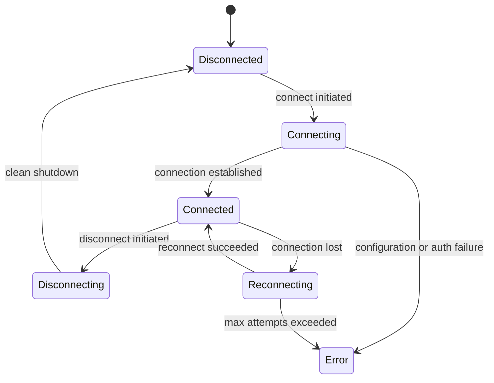

# session lifecycle and state management

Every `ConvaiCharacter` in your scene maintains an independent session with Convai. That session tracks whether the character is connected, what its current state is, and — when persistence is enabled — what conversation it was in the last time you connected. This page explains the session state machine, how session data is stored and recovered, and how to tune reconnection behavior.

***

## Session State Machine

Each character session moves through the following states.



| State           | Value | Meaning                                                                       |
| --------------- | ----- | ----------------------------------------------------------------------------- |
| `Disconnected`  | 0     | No active session. Initial state and final state after a clean disconnect.    |
| `Connecting`    | 1     | Connection attempt in progress. Transitioning from Disconnected to Connected. |
| `Connected`     | 2     | Session is active. Audio streams and conversations are live.                  |
| `Reconnecting`  | 3     | Connection was lost. SDK is attempting to re-establish it automatically.      |
| `Disconnecting` | 4     | Graceful shutdown in progress. Transitioning from Connected to Disconnected.  |
| `Error`         | 5     | Unrecoverable error. Manual intervention required to reconnect.               |

You receive state transitions as `SessionStateChangedRelayData` events via `ConvaiSessionEventRelay`. See [Event System](/broken/pages/5cb0d97ef0cdd738767c98bede6b17082229d3a9) for how to subscribe.

***

## Per-Character Sessions

Each `ConvaiCharacter` has its own independent session. Sessions are not shared between characters, even in multi-character scenes.

`ConvaiSessionData` is the in-memory registry that maps each character to its current session identifier.

| Method                                   | Description                                                                 |
| ---------------------------------------- | --------------------------------------------------------------------------- |
| `GetSessionId(characterId)`              | Returns the current session ID for the character, or `null` if none exists. |
| `StoreSessionId(characterId, sessionId)` | Stores a session ID for the character.                                      |
| `ClearSessionId(characterId)`            | Removes the session ID for one character.                                   |
| `ClearAllSessionIds()`                   | Removes all stored session IDs.                                             |
| `GetAllSessionIds()`                     | Returns a read-only snapshot of all current character→sessionId mappings.   |

`ConvaiSessionData` holds the runtime-active session. It is reset on application restart. For session IDs to survive app restarts, they are also written to the persistence layer (see below).

***

## Session Persistence

When a session ID is persisted, the SDK can resume a previous conversation on the next connect — the character remembers context from prior interactions.

### What Persists vs. What Resets

| On Reconnect                 | Behavior                                             |
| ---------------------------- | ---------------------------------------------------- |
| Session ID                   | Persisted via `ISessionPersistence` — enables resume |
| Conversation history         | Managed by Convai; resumed when session ID is valid  |
| In-flight audio              | Reset — any audio mid-stream is discarded            |
| Active turn state            | Reset — the turn restarts clean                      |
| Module state (e.g., emotion) | Reset — modules reinitialize on reconnect            |

### Default Persistence Stack

```
ISessionPersistence
  └─ KeyValueStoreSessionPersistence        ← maps characterId → sessionId with prefix "convai.session."
       └─ PlayerPrefsKeyValueStore           ← wraps Unity PlayerPrefs, marshals to main thread
            └─ UnityEngine.PlayerPrefs       ← persisted to disk
```

Session IDs are stored under keys formatted as `convai.session.<characterId>`.

### Replacing the Persistence Store

Implement `IKeyValueStore` to use any backing store — a database, encrypted storage, a cloud save system.

```csharp
public sealed class SecureKeyValueStore : IKeyValueStore
{
    public string GetString(string key, string defaultValue = null)
    {
        return SecureStorage.GetValue(key) ?? defaultValue;
    }

    public void SetString(string key, string value)
    {
        SecureStorage.SetValue(key, value);
    }

    public bool HasKey(string key) => SecureStorage.HasKey(key);

    public void DeleteKey(string key) => SecureStorage.DeleteKey(key);

    public void Save() => SecureStorage.Flush();
}
```

Register it via `ConvaiRuntimeBuilder`:

```csharp
var runtime = new ConvaiRuntimeBuilder()
    .UsePersistence(new MyPersistenceProvider(new SecureKeyValueStore()))
    .Build();
```


`PlayerPrefsKeyValueStore` marshals all reads and writes to the Unity main thread internally. If you implement a custom store, apply the same thread-safety pattern if your backing store has thread restrictions.


***

## Reconnect Policy

`ReconnectPolicy` controls what the SDK does when a connection drops unexpectedly.

| Field                      | Type           | Default            | Description                                                                                                                        |
| -------------------------- | -------------- | ------------------ | ---------------------------------------------------------------------------------------------------------------------------------- |
| `RoomRejoinTtlSeconds`     | `double`       | `60`               | Window in seconds during which the SDK can rejoin an existing room after a drop. After this window, a new room is created instead. |
| `ResumePolicy`             | `ResumePolicy` | `ResumeIfPossible` | Controls whether the SDK attempts to resume the previous conversation via `character_session_id`.                                  |
| `MaxReconnectAttempts`     | `int`          | `3`                | Maximum number of automatic reconnect attempts before the session moves to `Error` state.                                          |
| `SpawnAgentOnRejoin`       | `bool`         | `true`             | Whether to re-spawn the AI agent when rejoining an existing room.                                                                  |
| `StartWaitTimeoutMs`       | `int`          | `5000`             | Timeout in milliseconds for the connection `Start()` phase before the attempt is considered failed.                                |
| `AutoMicStartDelaySeconds` | `float`        | `0.5`              | Seconds to wait after connection before starting the microphone. Prevents audio capture before the session is fully ready.         |

### `ResumePolicy` Options

| Value              | Behavior                                                                                                               |
| ------------------ | ---------------------------------------------------------------------------------------------------------------------- |
| `AlwaysFresh`      | Always start a new conversation. The character has no memory of the previous session.                                  |
| `ResumeIfPossible` | Attempt to resume the previous conversation. If the session has expired or resume fails, fall back to a fresh session. |
| `AlwaysResume`     | Always resume. If resume fails, the connection fails — no fallback to a fresh session.                                 |

### Preset Policies

| Preset                            | Description                                                     |
| --------------------------------- | --------------------------------------------------------------- |
| `ReconnectPolicy.Default`         | 60 s TTL, `ResumeIfPossible`, 3 attempts, mic delay 0.5 s       |
| `ReconnectPolicy.AlwaysCreateNew` | No rejoin attempt. Always creates a new room and fresh session. |

```csharp
var policy = new ReconnectPolicy(
    roomRejoinTtlSeconds: 120,
    resumePolicy: ResumePolicy.AlwaysFresh,
    maxReconnectAttempts: 5,
    autoMicStartDelaySeconds: 1.0f
);
```


`AlwaysResume` will put the session into `Error` state if Convai cannot resume the session (e.g., if the session expired on the backend). Use `ResumeIfPossible` unless your training simulation requires strict continuity and you have handled the error state explicitly.


***

## Multi-Character Sessions

In scenes with multiple `ConvaiCharacter` components, each character has a completely independent session. There is no shared state between characters at the session level.

* Each character connects and disconnects independently.
* Session IDs are stored per `characterId` — the key is the character's ID string set in the Inspector, not the scene name or object name.
* Reconnect policy applies independently per character.
* A session error on one character does not affect others.

For scenarios where characters share a room (multi-participant conversations), see [Multi-Character Scenarios](/broken/pages/37f22457a61a3c212296b58e4ce7689ae833827e).

***

## Next Steps


[Broken link](/broken/pages/bcabab554f8cb726a0caba36d1ea1f57f12aa682)



[Broken link](/broken/pages/5cb0d97ef0cdd738767c98bede6b17082229d3a9)

