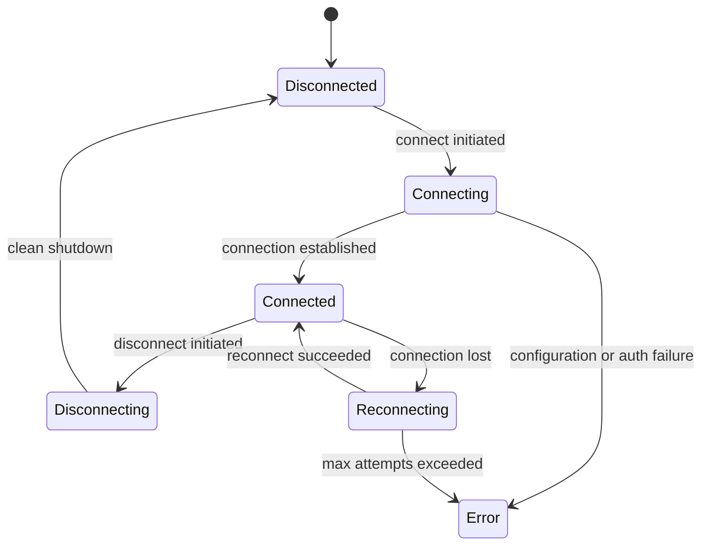

Every `ConvaiCharacter` in your scene maintains an independent session with Convai. That session tracks whether the character is connected, what its current state is, and — when persistence is enabled — what conversation it was in the last time you connected. Understanding how sessions are created, persisted, and recovered lets you build reliable, resumable character interactions across training simulations, interactive experiences, and games.

***

## Session state machine

Each character session moves through the following states.



| State           | Value | Meaning                                                                       |
| --------------- | ----- | ----------------------------------------------------------------------------- |
| `Disconnected`  | 0     | No active session. Initial state and final state after a clean disconnect.    |
| `Connecting`    | 1     | Connection attempt in progress. Transitioning from Disconnected to Connected. |
| `Connected`     | 2     | Session is active. Audio streams and conversations are live.                  |
| `Reconnecting`  | 3     | Connection was lost. SDK is attempting to re-establish it automatically.      |
| `Disconnecting` | 4     | Graceful shutdown in progress. Transitioning from Connected to Disconnected.  |
| `Error`         | 5     | Unrecoverable error. Manual intervention required to reconnect.               |

You receive state transitions as `SessionStateChangedRelayData` events via `ConvaiSessionEventRelay`. See [Event system](event-system.md) for how to subscribe.

***

## Per-character sessions

Each `ConvaiCharacter` has its own independent session. Sessions are not shared between characters. In multi-character scenes, each character connects and disconnects independently — session IDs are keyed to the character's ID string set in the Inspector (not the scene or object name), reconnect policy applies per character, and a session error on one character does not affect others.

This describes the connection each `ConvaiCharacter` tracks locally. When a scene registers two or more characters, the SDK builds one shared multi-character room around them at connect, with its own roster and readiness model layered on top of these per-character sessions. See [How multi-character sessions work](../features/multi-character-sessions/how-multi-character-sessions-work.md) for that layer.

`ConvaiSessionData` is the persistent session store that maps each character to its current session identifier. It loads from disk automatically at startup and writes to `{Application.persistentDataPath}/Convai/sessions.json` on every change — session IDs survive application restarts without any additional setup.

| Method                                   | Description                                                                 |
| ---------------------------------------- | --------------------------------------------------------------------------- |
| `GetSessionId(characterId)`              | Returns the current session ID for the character, or `null` if none exists. |
| `StoreSessionId(characterId, sessionId)` | Stores a session ID for the character and saves it to disk immediately.     |
| `ClearSessionId(characterId)`            | Removes the session ID for one character and saves.                         |
| `ClearAllSessionIds()`                   | Removes all stored session IDs and saves.                                   |
| `GetAllSessionIds()`                     | Returns a read-only snapshot of all current character→sessionId mappings.   |


`ConvaiSessionData` is a singleton. Data is stored at `{Application.persistentDataPath}/Convai/sessions.json` and persists across application restarts. Call `ClearAllSessionIds()` explicitly if you need a clean slate.


***

## Session persistence

When a session ID is persisted, the SDK can resume a previous conversation on the next connect — the character remembers context from prior interactions.

### What persists vs. what resets

| On Reconnect                 | Behavior                                            |
| ---------------------------- | --------------------------------------------------- |
| Session ID                   | Persisted via `ConvaiSessionData` — enables resume  |
| Conversation history         | Managed by Convai; resumed when session ID is valid |
| In-flight audio              | Reset — any audio mid-stream is discarded           |
| Active turn state            | Reset — the turn restarts clean                     |
| Module state (e.g., emotion) | Reset — modules reinitialize on reconnect           |

### Default persistence stack

The SDK exposes a pluggable persistence layer via `ISessionPersistence` for projects that need a custom backing store (encrypted storage, cloud saves, a database). The default stack is:

```text
ISessionPersistence
  └─ KeyValueStoreSessionPersistence        ← maps characterId → sessionId with prefix "convai.session."
       └─ PlayerPrefsKeyValueStore           ← default IKeyValueStore implementation; wraps Unity PlayerPrefs
            └─ UnityEngine.PlayerPrefs       ← persisted to disk
```

Session IDs are stored under keys formatted as `convai.session.<characterId>`.

### Replacing the persistence store

Implement `IKeyValueStore` to use any backing store — a database, encrypted storage, a cloud save system. `PlayerPrefsKeyValueStore` marshals all reads and writes to the Unity main thread internally; apply the same thread-safety pattern if your backing store has thread restrictions.

```csharp
public sealed class SecureKeyValueStore : IKeyValueStore
{
    public string GetString(string key, string defaultValue = null)
    {
        return SecureStorage.GetValue(key) ?? defaultValue;
    }

    public void SetString(string key, string value)
    {
        SecureStorage.SetValue(key, value);
    }

    public bool HasKey(string key) => SecureStorage.HasKey(key);

    public void DeleteKey(string key) => SecureStorage.DeleteKey(key);

    public void Save() => SecureStorage.Flush();
}
```

Register it via `ConvaiRuntimeBuilder`:

```csharp
var runtime = new ConvaiRuntimeBuilder()
    .UsePersistence(new MyPersistenceProvider(new SecureKeyValueStore()))
    .Build();
```

***

## Reconnect policy

`ReconnectPolicy` controls what the SDK does when a connection drops unexpectedly.

| Field                      | Type           | Default            | Description                                                                                                                        |
| -------------------------- | -------------- | ------------------ | ---------------------------------------------------------------------------------------------------------------------------------- |
| `RoomRejoinTtlSeconds`     | `double`       | `60`               | Window in seconds during which the SDK can rejoin an existing room after a drop. After this window, a new room is created instead. |
| `ResumePolicy`             | `ResumePolicy` | `ResumeIfPossible` | Controls whether the SDK attempts to resume the previous conversation via `character_session_id`.                                  |
| `MaxReconnectAttempts`     | `int`          | `3`                | Maximum number of automatic reconnect attempts before the session moves to `Error` state.                                          |
| `SpawnAgentOnRejoin`       | `bool`         | `true`             | Whether to re-spawn the AI agent when rejoining an existing room.                                                                  |
| `StartWaitTimeoutMs`       | `int`          | `5000`             | Timeout in milliseconds for the connection `Start()` phase before the attempt is considered failed.                                |
| `AutoMicStartDelaySeconds` | `float`        | `0.5`              | Seconds to wait after connection before starting the microphone. Prevents audio capture before the session is fully ready.         |

### `ResumePolicy` options

| Value              | Behavior                                                                                                               |
| ------------------ | ---------------------------------------------------------------------------------------------------------------------- |
| `AlwaysFresh`      | Always start a new conversation. The character has no memory of the previous session.                                  |
| `ResumeIfPossible` | Attempt to resume the previous conversation. If the session has expired or resume fails, fall back to a fresh session. |
| `AlwaysResume`     | Always resume. If resume fails, the connection fails — no fallback to a fresh session.                                 |

### Preset policies

| Preset                            | Description                                                     |
| --------------------------------- | --------------------------------------------------------------- |
| `ReconnectPolicy.Default`         | 60 s TTL, `ResumeIfPossible`, 3 attempts, mic delay 0.5 s       |
| `ReconnectPolicy.AlwaysCreateNew` | No rejoin attempt. Always creates a new room and fresh session. |

```csharp
var policy = new ReconnectPolicy(
    roomRejoinTtlSeconds: 120,
    resumePolicy: ResumePolicy.AlwaysFresh,
    maxReconnectAttempts: 5,
    autoMicStartDelaySeconds: 1.0f
);
```


`AlwaysResume` will put the session into `Error` state if Convai cannot resume the session (for example, if the session already expired). Use `ResumeIfPossible` unless your training simulation requires strict continuity and you have handled the error state explicitly.


***

## Explicit session controls

`ConvaiManager` exposes three async methods for controlling a session outside of automatic reconnect: `PauseAsync()`, `ResumeAsync()`, and `ReconnectAsync()`. Use these when your application needs to pause presentation without disconnecting, or force a fresh connection on demand — for example, a training simulation that pauses for a facilitator break, or a menu screen that interrupts play.

| Method | What it does |
| ------ | ------------- |
| `PauseAsync()` | Pauses Convai character audio, shipped transcript presentation, and runtime modules while leaving the room connected. |
| `ResumeAsync()` | Removes only the manual pause reason set by `PauseAsync()`. A simultaneous application-background pause (see below) remains active until Unity reports foreground state. |
| `ReconnectAsync()` | Performs an explicit disconnect/connect cycle using the `ReconnectPolicy` and session-resume behavior described above. Calling it while `SessionState` is already `Connecting` or `Disconnecting` throws an `InvalidOperationException`. |

```csharp
await manager.PauseAsync();
// ... facilitator break ...
await manager.ResumeAsync();
```

***

## Application background policy

`RuntimeBackgroundPolicy` controls what keeps running while the Unity application is backgrounded — for example, when a player alt-tabs or a mobile app moves to the background. Set the project default under **Edit > Project Settings > Convai SDK > Runtime Defaults > Background Policy**, or change the active manager at runtime:

```csharp
await manager.SetBackgroundPolicyAsync(RuntimeBackgroundPolicy.MuteButCatchUp);
```

| Value | Character audio | Canonical transcript history | Shipped transcript presentation | LipSync |
| ----- | ---------------- | ----------------------------- | -------------------------------- | ------- |
| `ContinueAudibly` | Continues; background execution is requested | Continues | Continues | Continues against the live audio clock |
| `PauseTimeline` | The Convai `AudioSource` pauses; unrelated game audio is untouched | Continues ingesting room events | Hidden while paused, then replays current state on resume | Presentation ticks pause; ingress stays bounded, and resume re-anchors to available audio so expired buffered data can be skipped |
| `MuteButCatchUp` | Muted locally while playback advances | Continues | Continues | Continues; returning to foreground resumes at live time rather than replaying missed presentation |

`ContinueAudibly` and `MuteButCatchUp` set `Application.runInBackground` while active, but the operating system or browser can still suspend or mute the process. WebGL audio is browser-routed rather than owned by a Unity `AudioSource`, so `PauseTimeline` falls back to `MuteButCatchUp` on that platform — the state-change event reports both the requested and effective value. `PauseTimeline` only pauses local presentation; it does not stop Convai from generating a response or the SDK from ingesting the transcript.

Subscribe to `OnRuntimeBackgroundStateChanged` to observe the requested and effective policy, since they can differ when a platform cannot implement the requested behavior. The manager applies the selected policy on both `OnApplicationPause` and focus-loss transitions, without double-pausing when Unity reports both callbacks.

```csharp
[SerializeField] private ConvaiSessionEventRelay _relay;

private void OnEnable() =>
    _relay.OnRuntimeBackgroundStateChanged.AddListener(HandleBackgroundStateChanged);

private void HandleBackgroundStateChanged(RuntimeBackgroundStateRelayData data)
{
    if (data.RequestedPolicy != data.EffectivePolicy)
        Debug.LogWarning($"Background policy fell back from {data.RequestedPolicy} to {data.EffectivePolicy}.");
}
```

***

## Idle warnings and timeouts

Convai sends a `user-idle-warning` message with `remaining_seconds` before it disconnects an idle session. The SDK exposes it as `ConvaiManager.Events.OnUserIdleWarningReceived` and, for Inspector-driven listeners, `ConvaiSessionEventRelay.OnUserIdleWarning`.

The manager also derives a one-shot local deadline from that countdown and exposes it as `ConvaiManager.Events.OnUserIdleTimeoutElapsed` and `ConvaiSessionEventRelay.OnUserIdleTimeout`. `OnUserIdleTimeoutElapsed` is a client-side deadline signal for timeout UI and recovery workflows — it does not confirm that Convai closed the room, since Convai does not currently send a separate timeout packet. Use `OnSessionStateChanged` or `OnDisconnected` as the authoritative transport state.

Voice, text, trigger, and dynamic-context activity already reset Convai's idle tracking. For UI-only activity after a warning, call `ResetIdleTimer()` (or its UI-oriented alias `ExtendIdleTimeout()`) to push the deadline back; both return `false` when no connected room can accept the reset.

```csharp
private void HandleIdleWarning(UserIdleWarningRelayData warning)
{
    ShowIdlePrompt(warning.RemainingSeconds);
}

public void ContinueSession()
{
    if (!manager.ExtendIdleTimeout())
        ShowReconnectPrompt();
}
```

***

## Usage examples

### Example 1: Medical training simulation — resume after network drop

A learner is mid-assessment when the network drops. When connection is restored, the patient character resumes the same conversation — no context is lost.

```csharp
var policy = new ReconnectPolicy(
    roomRejoinTtlSeconds: 120,          // 2-minute window to rejoin the existing room
    resumePolicy: ResumePolicy.ResumeIfPossible,
    maxReconnectAttempts: 5,
    autoMicStartDelaySeconds: 1.0f      // extra delay for slow mobile networks
);
```

**Expected outcome:** The SDK automatically retries up to 5 times within the 2-minute window. If the session is still valid on Convai's side, the conversation resumes from where it left off. If the session expired, the character starts a fresh conversation rather than blocking.

***

### Example 2: Corporate onboarding kiosk — always-fresh conversations

Each new employee who approaches the kiosk should start from the beginning with no memory of previous users. `AlwaysFresh` and `AlwaysCreateNew` ensure a clean slate every time.

```csharp
// Apply policy in the ConvaiRoomManager's reconnect settings
var policy = ReconnectPolicy.AlwaysCreateNew;
// ResumePolicy defaults to AlwaysFresh in AlwaysCreateNew — no prior session carried over
```

To guarantee previous user data is removed before the next session starts:

```csharp
public class KioskSessionReset : MonoBehaviour
{
    [SerializeField] private string _characterId;

    public void OnUserLogOut()
    {
        ConvaiSessionData.Instance.ClearSessionId(_characterId);
    }
}
```

**Expected outcome:** Every new user starts a completely fresh conversation. The character has no memory of previous interactions, which is correct for a shared kiosk deployment.

***

### Example 3: Handling the error state in a training simulation

When all reconnect attempts are exhausted, the session enters `Error` state. Surface this to the facilitator and allow manual retry rather than silently hanging.

```csharp
public class SessionErrorHandler : MonoBehaviour
{
    [SerializeField] private ConvaiSessionEventRelay _relay;
    [SerializeField] private GameObject _errorPanel;
    [SerializeField] private ConvaiManager _manager;

    private void OnEnable()  => _relay.OnSessionStateChanged.AddListener(HandleStateChange);
    private void OnDisable() => _relay.OnSessionStateChanged.RemoveListener(HandleStateChange);

    private void HandleStateChange(SessionStateChangedRelayData data)
    {
        _errorPanel.SetActive(data.IsError);
    }

    // Called by the facilitator's "Retry" button
    public async void RetryConnection()
    {
        _errorPanel.SetActive(false);
        await _manager.ConnectAsync();
    }
}
```

**Expected outcome:** The error panel appears when the session enters `Error` state. The facilitator clicks "Retry" to attempt a fresh connection without restarting the simulation.

***

## Troubleshooting

| Symptom                                                                          | Likely Cause                                                                                            | Fix                                                                                                                                                 |
| -------------------------------------------------------------------------------- | ------------------------------------------------------------------------------------------------------- | --------------------------------------------------------------------------------------------------------------------------------------------------- |
| Session stays in `Error` state after a drop                                      | `AlwaysResume` could not resume the session because it already expired                                  | Switch to `ResumeIfPossible`; call `ClearSessionId(characterId)` to remove the stale session ID, then reconnect                                     |
| Character starts a fresh conversation on every launch despite `ResumeIfPossible` | A previous `ClearAllSessionIds()` call wiped the session file, or the character ID changed between runs | Verify the `characterId` string is stable across runs; check `{persistentDataPath}/Convai/sessions.json`                                            |
| Session stuck in `Connecting` forever                                            | `StartWaitTimeoutMs` not configured for slow network; or firewall blocking the transport                | Increase `StartWaitTimeoutMs` in `ReconnectPolicy`; verify network access to Convai endpoints                                                       |
| Reconnect loop never succeeds; session eventually reaches `Error`                | `MaxReconnectAttempts` exhausted                                                                        | Subscribe to `ConvaiSessionEventRelay.OnSessionStateChanged` and surface the error to the user; call reconnect manually after the user acknowledges |
| Two characters share a session ID                                                | Character ID strings are identical in the Inspector                                                     | Assign unique character IDs to each `ConvaiCharacter` in the scene                                                                                  |
| `ResumeAsync()` does not restore audio                                           | The application is still backgrounded, so the background policy keeps the manual pause reason active    | Wait for the application to return to the foreground, or check `IsBackgrounded` on the latest `OnRuntimeBackgroundStateChanged` payload             |
| `ReconnectAsync()` throws `InvalidOperationException`                            | Called while `SessionState` was already `Connecting` or `Disconnecting`                                  | Check `SessionState` before calling, or wait for the in-flight transition to finish                                                                 |
| Idle warning never fires                                                         | No listener is subscribed, or activity keeps resetting Convai's idle tracking                             | Subscribe to `OnUserIdleWarningReceived` or `OnUserIdleWarning`; note that voice, text, trigger, and dynamic-context activity all reset idle tracking |

***

## Next steps

You now know how character sessions are created, how state transitions work, how session IDs are persisted across restarts, and how to configure reconnection behavior. Read Turn-taking modes next to configure how the SDK detects speech input, then Event system to learn how to subscribe to session and character events from your scene scripts.


[Turn-taking modes](turn-taking-modes.md)



[Event system](event-system.md)

