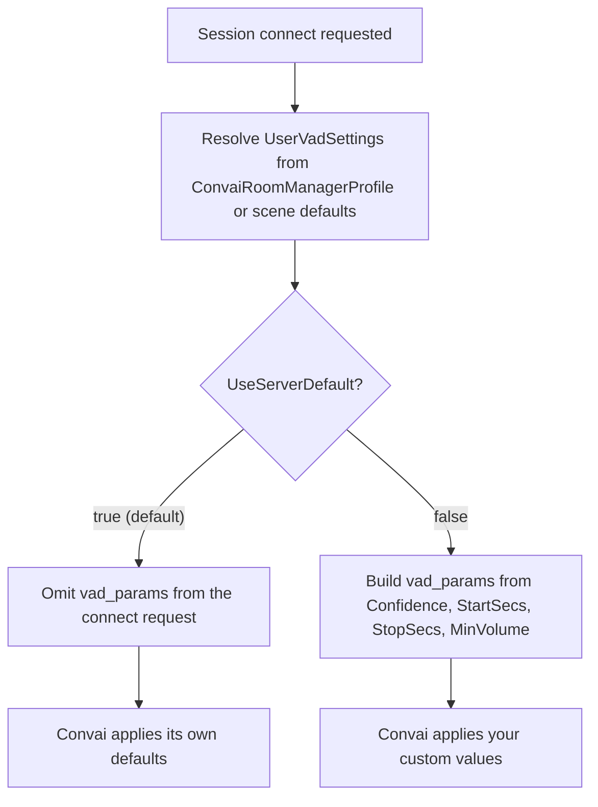

Voice activity detection (VAD) is how Convai decides whether the audio arriving from a user's microphone contains speech. The Convai Unity SDK exposes `UserVadSettings` so a scene can tune that decision — confidence, timing, and volume thresholds — instead of always relying on Convai's built-in defaults. The SDK resolves these settings once, at the moment a session connects, and sends them as part of the connect request.

`UserVadSettings` applies to Convai's discrete LLM/STT processing path. It does not affect a realtime provider's own voice activity detection or how push-to-talk decides when a turn ends — those paths use their own turn-ending logic, covered in [Turn-taking modes](turn-taking-modes.md).

***

## Why voice activity detection is a connect-time setting

`UserVadSettings` tunes Convai's audio pipeline rather than a value a scene needs to change moment-to-moment. A factory-floor training simulation with background noise needs a higher `MinVolume` and `Confidence` threshold than a quiet home-office scene, but neither scenario needs to change that threshold while a conversation is already in progress. The SDK reflects this: it reads `UserVadSettings` once, immediately before it builds the connect request for a session, and does not expose any API to push updated values into a session that is already `Connected`.

This also means `UserVadSettings` behaves differently from `TurnTakingOptions`. `RoomSessionConnectOptions` — the per-invocation override object passed to a connect call — carries a `TurnTaking` field, so turn-taking behavior can be overridden per connection attempt. It has no equivalent field for `UserVadSettings`. The only sources the SDK reads from are the `ConvaiRoomManagerProfile` asset or the equivalent inline field on `ConvaiRoomManager` — there is no per-connect override.

***

## `UserVadSettings` field reference

| Field | Type | Default | Valid range | Description |
| --- | --- | --- | --- | --- |
| `UseServerDefault` | `bool` | `true` | — | When enabled, the SDK omits `vad_params` from the connect request entirely and Convai applies its own defaults. Disable it to send the four fields below instead. |
| `Confidence` | `float` | `0.7` | `0`–`1` | Confidence threshold Convai's voice activity detector requires before treating incoming audio as speech. |
| `StartSecs` | `float` | `0.2` | `≥ 0` seconds | Duration of continuous speech required before Convai treats the user's speech as started. |
| `StopSecs` | `float` | `0.2` | `≥ 0` seconds | Duration of silence required before Convai treats the user's speech as stopped. Convai may clamp this to `0.2` seconds when hands-free smart-turn detection is active. |
| `MinVolume` | `float` | `0.6` | `0`–`1` | Minimum input volume Convai's voice activity detector requires before considering audio a speech candidate. |

The four numeric defaults mirror the defaults Convai itself applies server-side, so leaving `UseServerDefault` enabled and omitting `vad_params` produces the same detection behavior as sending these exact values explicitly.

***

## Server default vs. custom values at connect

Each time a session connects, the SDK resolves `UserVadSettings` from its configured source and decides what to send.

When `UseServerDefault` is `true`, the connect request's `vad_params` field is left `null`, and the SDK's request serializer omits `null` fields entirely — `vad_params` does not appear in the payload sent to Convai at all. When `UseServerDefault` is `false`, the SDK sends `vad_params` as an object with `confidence`, `start_secs`, `stop_secs`, and `min_volume`.

The SDK logs the resolved decision on every connect attempt:

- Server default: `Using server default vad_params (field omitted from connect payload).`
- Custom values: `Sending custom vad_params: confidence=<value>, start_secs=<value>, stop_secs=<value>, min_volume=<value>`


These log lines come from the SDK's internal logger and only appear if your project's log level surfaces `Debug`- and `Info`-severity messages.


***

## Author custom values with `ConvaiRoomManagerProfile`

`ConvaiRoomManagerProfile` is a `ScriptableObject` asset that stores a serialized `UserVadSettings` field, defaulting to `UseServerDefault = true`. Its public `UserVadSettings` property returns a clone of that field, so reading it never lets a caller mutate the asset's stored values by reference.

To send custom detection thresholds instead of Convai's defaults, open the `ConvaiRoomManagerProfile` asset in the Inspector, disable `Use Server Default`, and set `Confidence`, `Start Secs`, `Stop Secs`, and `Min Volume` to the values your scene needs. Any `ConvaiRoomManager` that references this profile as its configuration source sends those values on its next connect. The same fields also exist inline on `ConvaiRoomManager` itself, for scenes that configure room settings directly on the component instead of through a shared profile asset.


`UserVadSettings` has no public setter and no per-connect override on `RoomSessionConnectOptions`. Set it on the `ConvaiRoomManagerProfile` asset or the inline field on `ConvaiRoomManager` before the scene connects — changes made while a session is already `Connected` do not apply until the next connect attempt.


***

## Next steps

You now know what `UserVadSettings` controls, how the SDK decides between Convai's defaults and your custom values, and where to configure it. Read Turn-taking modes to see how voice activity detection relates to hands-free turn-ending behavior, then Event system to subscribe to session and character events at runtime.


[Turn-taking modes](turn-taking-modes.md)



[Event system](event-system.md)

