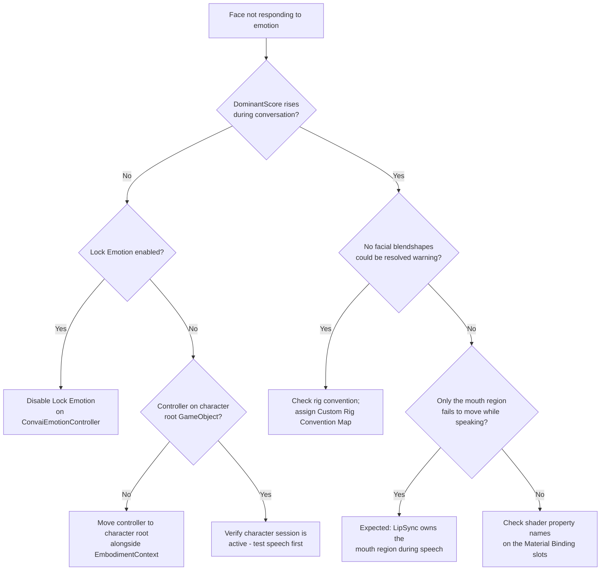

Most emotion problems fall into one of three categories: no visual output at all, scores updating but no face movement, or event and scripting callbacks not firing. Start by watching `Current.DominantScore` in Play Mode — this one signal identifies whether the issue is in the signal path or in facial output.

## Inspecting live state

`ConvaiEmotionController` exposes the full pipeline state in the Inspector during Play Mode without any additional tooling.

| What to watch | Where to find it | What it tells you |
| --- | --- | --- |
| **Current → Dominant Label** | `ConvaiEmotionController` Inspector in Play Mode | Which canonical emotion is currently dominant. `"neutral"` means no active transient signal. |
| **Current → Dominant Score** | `ConvaiEmotionController` Inspector in Play Mode | Smoothed intensity \[0–1] of the dominant emotion. A value above 0 confirms the pipeline is receiving and processing server signals. |
| **Lock Emotion** checkbox | `ConvaiEmotionController` Inspector (any mode) | When ticked, server signals are ignored. The character holds the locked expression. |

To preview an expression without entering Play Mode, enable **Lock Emotion**, set **Locked Emotion Label** to a canonical label, and set **Locked Intensity** to `1.0`. Because `ConvaiEmotionController` inherits `[ExecuteAlways]` from its base class, the expression updates immediately in the Scene view. The [Emotion editor windows](emotion-editor.md) give the same preview across every character in the open scenes at once.


**Lock Emotion** is a serialized field. Its value is saved with the scene or prefab. Always disable it before building for production — a serialized `true` silently disables all live emotion response in the shipped build.


## First-line investigation

Work through this checklist in order when emotion is not behaving as expected. Most issues resolve at step 1 or 2.



### Check the Profile field

Select your NPC's root GameObject. On the `ConvaiEmotionController` component, confirm the **Profile** field is not empty.

- **Empty** → The pipeline runs on the SDK's runtime-default profile, which drives a face for every supported rig. If you expect a specific character type, assign a `ConvaiEmotionProfile` asset.
- **Assigned** → Continue to the next step.



### Watch DominantScore in Play Mode

Press **Play**, speak to the character, and observe **Current → Dominant Score** on the `ConvaiEmotionController` Inspector.

- **Score rises above 0** → The pipeline is receiving server signals. The problem is downstream, in facial output. Skip to step 4.
- **Score stays at 0** → The controller is not receiving emotion signals. Continue to step 3.



### Check Lock Emotion and component placement

Two quick causes prevent signals from reaching the accumulator:

1. **Lock Emotion is ticked** → Disable it. The controller discards all server events while locked.
2. **Component is on the wrong GameObject** → `ConvaiEmotionController` must be on the character's root GameObject alongside its `EmbodimentContext`. On a child object or a different NPC, it does not receive emotion events for the correct character session.

If neither applies, verify the character is actively connected — it should respond to speech in the Console before emotion signals can arrive.



### Check for a "no facial output" warning

Open the Console. If nothing on the character's face could be resolved, the controller logs one warning: `[ConvaiEmotionController] No facial blendshapes could be resolved on '<name>', so emotion state will update but the face will not move.` This means the rig itself is the problem, not the profile.

- Confirm the character has a skinned facial mesh with blendshapes.
- Confirm the mesh's blendshape names follow a supported convention (ARKit, Reallusion CC3/CC4, or MetaHuman).
- For a rig matching none of those, assign a `CustomRigConventionMap` — see [Character rig setup](../character-rig-setup.md).




After completing the checklist, if **Current → Dominant Score** rises above 0 during conversation and the expression visibly moves, the pipeline is healthy.


## Common issues quick reference

| Symptom | Likely cause | Fix |
| --- | --- | --- |
| **Face does not move; DominantScore stays at 0** | Lock Emotion is enabled | Disable **Lock Emotion** on `ConvaiEmotionController` |
| **Face does not move; DominantScore stays at 0** | Component on wrong GameObject | Move `ConvaiEmotionController` to the character's root GameObject, alongside `EmbodimentContext` |
| **DominantScore updates but face unchanged** | No facial mesh resolved, or unsupported blendshape convention | Check the Console for the "no facial blendshapes could be resolved" warning; assign a `CustomRigConventionMap` for an unsupported rig |
| **Shader effect (blush, tears, sweat) never appears** | `propertyName` in a `materialBinding` slot does not match the shader's exposed property | Verify the property name against the material — see [Emotion output bindings](output-bindings.md) |
| **Specific emotion never appears; character stays neutral** | Server label not in the taxonomy; silent fallback to neutral | Add the server label as an alias to the nearest canonical entry in a custom taxonomy |
| **Character holds one expression throughout the session** | `lockEmotion` serialized as `true` in scene or prefab | Disable **Lock Emotion**; save the scene (**Ctrl+S** / **Cmd+S**) |
| **No emotion response in production build** | `lockEmotion` left enabled before building | Disable **Lock Emotion** before building; verify per-prefab-instance in the Inspector |
| **Profile changes revert after reopening the project** | Editing the package-shipped, read-only profile asset | Use the Inspector's **Create A Project Copy** button, or manually copy the asset into `Assets/` and assign the copy — see [Asset ownership and copy-on-write](../../core-concepts/asset-ownership.md) |
| **`OnEmotionChanged` on `ConvaiCharacterEventRelay` never fires** | Character reference not resolved | Enable **Auto Resolve Character**, or assign `ConvaiCharacter` in the **Character** field |
| **`SetMood`/`SetEmotionOverride` silently falls back to neutral** | The label passed does not resolve in this character's taxonomy | Validate with `TryResolveEmotionLabel` before calling either method — see [Emotion scripting API](scripting-api.md) |
| **`[EmotionTaxonomyAsset]` warning in Console** | Custom taxonomy has no neutral entry, or multiple neutral entries | Set `isNeutral = true` on exactly one taxonomy entry |

## Unknown server labels — silent neutral fallback

**Symptom:** An emotion Convai sends never appears on the character. The face returns to neutral as if no signal arrived.

**Cause:** When Convai sends a label that does not match any canonical label or alias in the active taxonomy, `TryResolve` returns `false` and the controller silently uses the neutral descriptor. Unlike an unmatched shader property name, this failure **produces no console warning** — the pipeline continues normally, writing neutral scores every frame.

**How to detect it:**

1. In Play Mode, expand **Current → All Scores** on the `ConvaiEmotionController` Inspector. If an emotion you expect to see has a score of exactly 0.0 while the conversation clearly calls for it, the server label is likely not resolving.
2. Enable **Lock Emotion**, set **Locked Emotion Label** to the canonical label you expect (e.g. `"anticipation"`), and confirm the expression activates. If it does, the resolution path from server label to taxonomy is the problem — the signal never arrives under a label your taxonomy recognizes.

**Fix:** Open your custom taxonomy asset (or create one if using the built-in default), and add the server label as an alias to the nearest semantic match. For example, if Convai sends `"excited"` and it should map to `"anticipation"`, add `"excited"` to the **Aliases** list of the `anticipation` entry. See [Emotion taxonomy](emotion-taxonomy.md) for how to create and assign a custom taxonomy.

**Verify:** In Play Mode, watch **Current → Dominant Label** and **Current → All Scores** — the expected emotion should now score above 0 when Convai sends the previously unresolved label.

## Facial expression conflicts with LipSync

**Symptom:** While the character is speaking, mouth movement follows phonemes correctly, but the emotional expression on the mouth region disappears until the character stops talking.

**Cause:** This is expected behavior, not a bug. The shared facial compositor applies a fixed priority — LipSync over Emotion over any custom output — for the mouth region only, so lip sync never fights an emotional mouth pose during active speech. Outside of speech, `MouthInfluence` blends the emotional pose back in. See [Facial composition](../facial-composition.md) for the compositor's layer model and blend modes.

**If the upper face (brows, eyes, cheeks) also stops moving during speech**, that is not the expected priority rule — those regions are never routed through the mouth layer. Confirm the character's rig resolved separate mouth and general-face blendshape targets by checking for the "no facial blendshapes could be resolved" warning in the Console; a rig where brow and mouth shapes share the same blendshape name can cause this cross-talk.

## Expressions frozen — character ignores conversation

**Symptom:** The NPC holds a single expression throughout the session and never reacts to AI emotion signals.

**Cause:** `lockEmotion` is serialized as `true` in the scene or prefab — a common authoring artifact left over from Inspector preview.

**Fix:**

1. Select the NPC's root GameObject.
2. On `ConvaiEmotionController`, disable **Lock Emotion**.
3. Save the scene (**Ctrl+S** / **Cmd+S**).

If you have multiple NPC prefabs, check each one individually — the field persists per-prefab-instance unless explicitly overridden.

**Verify:** In Play Mode, **Current → Dominant Label** should change as the conversation develops.

## Profile changes are not saving

**Symptom:** You edit settings on the Emotion Profile asset, but the changes revert on reopening the project or returning to the Inspector.

**Cause:** You are editing a profile asset that ships inside the Convai package. Package assets cannot be modified in place.

**Fix:** Select the profile asset and use the Inspector's **Create A Project Copy** button. The copy lands under `Assets/Convai/`, is selected automatically, and the character is re-pointed at it. See [Asset ownership and copy-on-write](../../core-concepts/asset-ownership.md) for why editing in place is refused.

**Verify:** Edit a value on the copy and reopen the Inspector — the change should persist.

## ConvaiCharacterEventRelay OnEmotionChanged does not fire

**Symptom:** You wired a Unity Event to **On Emotion Changed** on `ConvaiCharacterEventRelay`, but it never fires in Play Mode.

**Checklist:**

1. **Character reference:** Either **Auto Resolve Character** is enabled and a `ConvaiCharacter` is on the same GameObject, or you have manually assigned a `ConvaiCharacter` in the **Character** field. If neither is true, the relay logs a configuration warning and stays inactive.
2. **Component enabled:** Confirm the `ConvaiCharacterEventRelay` component is enabled (the checkbox in the Inspector header is ticked).
3. **Subscription timing:** The relay fires only after the Convai session is established. Subscribe in `OnEnable` and unsubscribe in `OnDisable` to catch all events from the moment the component activates.
4. **Session active:** Confirm the character responds to speech normally before testing emotion callbacks.

**Verify:** Speak to the character in Play Mode — the UI or callback target should update as each new emotion signal arrives.

## Console log reference

The following messages appear in the Unity Console from the Emotion system.

| Log message | Component | Meaning |
| --- | --- | --- |
| `[ConvaiEmotionController] No facial blendshapes could be resolved on '<name>', so emotion state will update but the face will not move. Check that the character has a skinned facial mesh with blendshapes, and that its blendshape names follow a supported convention (ARKit, Reallusion CC3/CC4, or MetaHuman). For a rig using none of those, assign a Custom Rig Convention Map.` | `ConvaiEmotionController` | No mesh or blendshape on the character's rig matched a supported convention. Facial output cannot resolve. |
| `[MaterialPropertyEmotionBinding] '<name>' has authored material-property slot(s) but none of the authored shader properties (<names>) were found on any target material. Verify the property name(s) (e.g. "_EmotionBlush") match a property exposed by the character's assigned material(s).` | `MaterialPropertyEmotionBinding` | Every authored `propertyName` in the profile's Material Binding list missed on every target material — likely a typo. |
| `[ConvaiEmotionController] SetEmotionOverride was given '<label>', which this character's emotion vocabulary does not define, so the face stays neutral.` | `ConvaiEmotionController` | `SetEmotionOverride` was called with a label the active taxonomy cannot resolve. Validate with `TryResolveEmotionLabel` first. |
| `[ConvaiEmotionController] SetMood was given '<label>', which this character's emotion vocabulary does not define, so the character rests at no mood.` | `ConvaiEmotionController` | `SetMood` was called with a label the active taxonomy cannot resolve. |
| `[EmotionTaxonomyAsset] This emotion vocabulary marks no emotion as the neutral one, so a stand-in is being used.` | `EmotionTaxonomyAsset` | A custom taxonomy asset has no entry with `isNeutral = true`. The system synthesizes a fallback neutral so the pipeline runs. |
| `[EmotionTaxonomyAsset] N emotions in this vocabulary are ticked 'Is Neutral' and only the first is used.` | `EmotionTaxonomyAsset` | Multiple taxonomy entries have `isNeutral = true`. Only the first is used. |

There is **no console warning** when Convai sends an unrecognized emotion label — `TryResolve` silently falls back to the neutral descriptor. If an expected emotion never appears on the character, see [Unknown server labels — silent neutral fallback](#unknown-server-labels-silent-neutral-fallback) above.

## Expressions not responding — decision tree


[Emotion output bindings](output-bindings.md)



[Emotion taxonomy](emotion-taxonomy.md)

