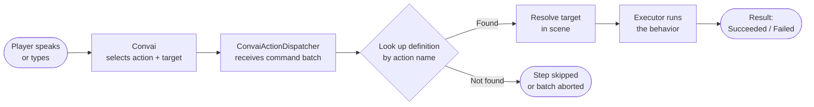

# Actions

## What Are Actions?

Convai Actions give your AI characters the ability to **do things**, not just talk. When a player says "Go to the crate" or "Wave hello," the Convai backend selects the right behavior and target from a menu you define. The SDK then runs that behavior directly in your Unity scene — no scripting required for common use cases.

Actions are the bridge between conversation and gameplay. Instead of writing keyword-detection logic or scripting every possible NPC response, you declare a set of possible behaviors once. The AI handles the rest.

## How It Works

When a player speaks to a Convai character, the following happens automatically:

The entire pipeline — from receiving the command to executing the behavior — is handled by the SDK. You only need to define which actions are available and assign the right executor component to each one.

## Key Concepts

| Concept        | What It Is                                                                                                                                              |
| -------------- | ------------------------------------------------------------------------------------------------------------------------------------------------------- |
| **Action**     | A named behavior the character can perform (e.g., `Move To`, `Wave`, `Pick Up`)                                                                         |
| **Target**     | A scene object or character the action is directed at (e.g., `Crate`, `Guard`)                                                                          |
| **Executor**   | A MonoBehaviour component that carries out the behavior in your Unity scene                                                                             |
| **Dispatcher** | `ConvaiActionDispatcher` — receives action commands and calls the right executor                                                                        |
| **Batch**      | A list of actions returned in one backend response (e.g., walk to shelf, then pick up helmet)                                                           |
| **Definition** | The Inspector entry that maps an action name to an executor and a target requirement                                                                    |
| **Grounding**  | The process by which the backend resolves vague references ("it", "that") to specific scene objects using descriptions and the current attention object |

## What Goes Where

Two components work together on your NPC's GameObject:

| Component                  | Purpose                                                           |
| -------------------------- | ----------------------------------------------------------------- |
| `ConvaiActionConfigSource` | Where you define available actions, objects, and characters       |
| `ConvaiActionDispatcher`   | Receives commands from the backend and runs the matching executor |

Both components must live on the **same GameObject** as `ConvaiCharacter`.

## In This Section

<table data-view="cards"><thead><tr><th></th><th></th></tr></thead><tbody><tr><td><strong>Quick Start</strong></td><td>Get your first action working in minutes with a step-by-step walkthrough.</td></tr><tr><td><strong>Configuring Actions</strong></td><td>Define actions, register targets, and fine-tune behavior from the Inspector.</td></tr><tr><td><strong>Action Executors</strong></td><td>Explore every executor that ships with the SDK and learn when to use each one.</td></tr><tr><td><strong>Dispatcher &#x26; Batch Policies</strong></td><td>Control how the dispatcher sequences and handles action batches at runtime.</td></tr><tr><td><strong>Writing Custom Executors</strong></td><td>Build your own executor in C# to create any game behavior you need.</td></tr><tr><td><strong>Attention &#x26; Reference Grounding</strong></td><td>Understand how object descriptions and attention objects help the AI resolve vague player references.</td></tr><tr><td><strong>Scripting Reference</strong></td><td>Full C# reference for dispatcher events,
 invocation context, executor results, and
 config source methods.</td></tr><tr><td><strong>Usage Examples</strong></td><td>Four end-to-end scenarios — Inspector-only
 setup, batch completion hooks, navigation
 fallbacks, and scripted sequence injection.</td></tr><tr><td><strong>Debugging &#x26; Troubleshooting</strong></td><td>Diagnose issues with the built-in debug probe and a step-by-step checklist.</td></tr></tbody></table>

## Conclusion

Convai Actions connect natural conversation to in-game behavior. You define what the character _can_ do — the AI decides _when_ and _why_ to do it. The pages in this section walk you through everything from your first working action to writing fully custom executors in C#.
