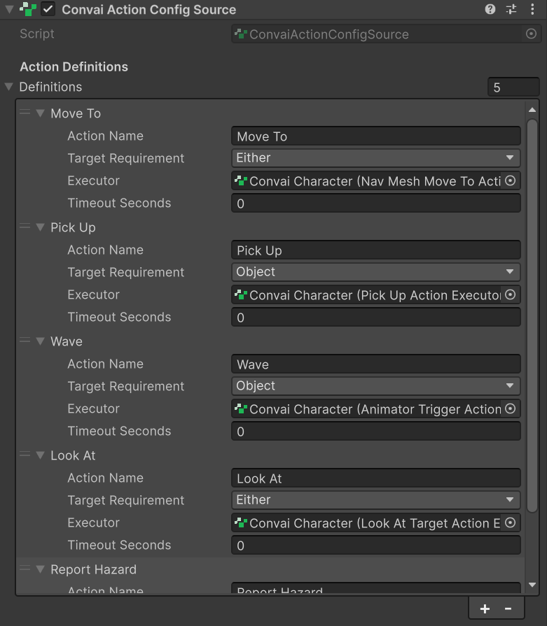
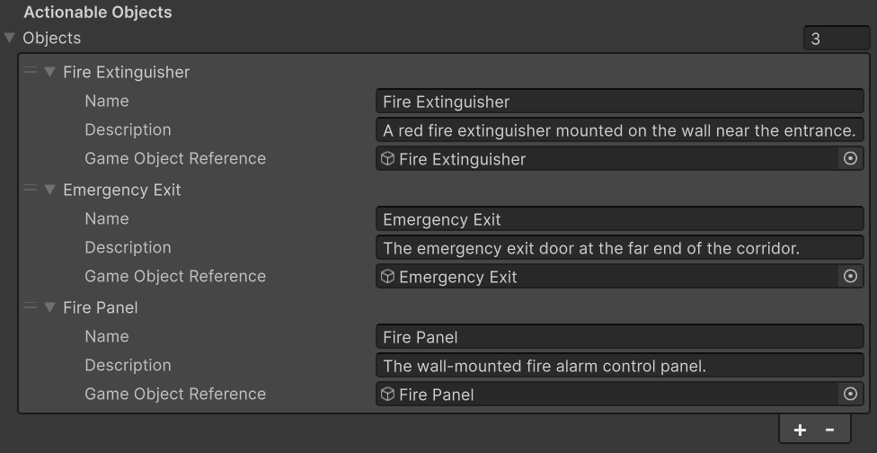
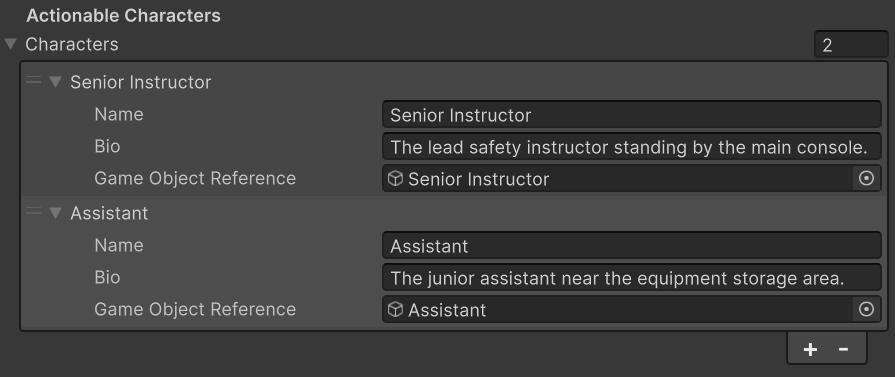

# Configuring Actions

## The ConvaiActionConfigSource Component

`ConvaiActionConfigSource` is the Inspector panel where you define everything the AI character is allowed to do — which actions exist, what scene objects or characters can be targeted, and how each action maps to a behavior.

Add it by selecting your NPC's GameObject and clicking **Add Component → Convai Action Config Source**.


`ConvaiActionConfigSource` requires a `ConvaiCharacter` component on the same GameObject. It will not work if placed on a different object.


The component has four sections:

| Section                   | Purpose                                                       |
| ------------------------- | ------------------------------------------------------------- |
| **Action Definitions**    | Maps action names to executor components                      |
| **Actionable Objects**    | Scene objects the AI can target                               |
| **Actionable Characters** | Other characters in the scene the AI can target               |
| **Initial Attention**     | The object the AI focuses on by default when a session starts |

<figure><figcaption></figcaption></figure>

***

## Action Definitions

Each entry in the **Action Definitions** list connects a backend action name to the Unity component that executes it.

### Adding a Definition

Click the **+** button under **Action Definitions** to add a new entry. Fill in the following fields:

#### Action Name

The name string the Convai backend will send when this action is triggered.

```
Move To
Pick Up
Wave
Look At
Report Hazard
```


Action names are **case-insensitive** at runtime — `Move To`, `move to`, and `MOVE TO` all match the same definition. However, keep names consistent and human-readable, as the AI backend uses them for intent matching.



Duplicate action names in the list are silently deduplicated — only the **first** entry is kept. If an action appears to do nothing, check for duplicates.


#### Target Requirement

Specifies whether this action requires a target object or character, and what type.

| Value       | Behavior                                                                                                                                                       |
| ----------- | -------------------------------------------------------------------------------------------------------------------------------------------------------------- |
| `None`      | No target needed. The executor receives `null` for `ResolvedTarget`. Use for actions like "Wave" or "Sit Down" that don't involve a specific object or person. |
| `Object`    | Requires a target that resolves to an entry in **Actionable Objects**. The step fails if no object target is resolved.                                         |
| `Character` | Requires a target that resolves to an entry in **Actionable Characters**. The step fails if no character target is resolved.                                   |
| `Either`    | Accepts either an object or a character target. Resolves to whichever matches first.                                                                           |

#### Executor

Drag any MonoBehaviour component that implements `IConvaiActionExecutor` into this field. The component can be anywhere on the same GameObject.

See Action Executors for all available executors that ship with the SDK.

#### Timeout Seconds

The maximum time in seconds this action is allowed to run. If the executor does not return within this limit, the step is automatically canceled and marked as `TimedOut`.

Set to `0` to disable the timeout (the executor runs until it returns on its own).

```
0    → No timeout (default)
5    → 5 second limit
30   → 30 second limit
```


Timeouts are useful for actions that involve movement or animations. If an NPC gets stuck navigating to a target, a timeout prevents the entire conversation from hanging.


<figure><figcaption></figcaption></figure>

***

## Actionable Objects

Objects in your scene that the AI can target. The Convai backend uses this list to understand which objects exist and what they are, so it can decide when to direct an action at them.

### Adding an Object

Click the **+** button under **Actionable Objects** to add a new entry:

| Field                     | Description                                                                                                                                                                                                                                 |
| ------------------------- | ------------------------------------------------------------------------------------------------------------------------------------------------------------------------------------------------------------------------------------------- |
| **Name**                  | The identifier the backend uses to refer to this object (e.g., `Fire Extinguisher`, `Crate`, `Exit Door`). Target names are matched case-insensitively at runtime.                                                                          |
| **Description**           | A plain-language sentence describing the object and its context. The backend uses this for grounding — understanding what the object is and when to use it. See Attention & Reference Grounding for tips on writing effective descriptions. |
| **Game Object Reference** | The actual GameObject in the scene. This is what the executor receives as `invocation.ResolvedTarget.GameObjectReference`.                                                                                                                  |

#### Writing a Good Description

The description helps the AI understand what the object is. Write it in plain English, as if describing the object to someone who hasn't seen your scene.

| Object            | Example Description                                              |
| ----------------- | ---------------------------------------------------------------- |
| Fire Extinguisher | `A red fire extinguisher mounted on the wall near the entrance.` |
| Emergency Exit    | `The emergency exit door at the far end of the corridor.`        |
| Crate             | `A wooden crate sitting on the warehouse floor.`                 |
| Safety Helmet     | `A yellow hard hat hanging on the equipment rack.`               |


**Description is sent to the backend.** It directly influences how the AI reasons about what to target. A vague description ("object") produces worse results than a specific one ("a red fire extinguisher near the entrance").


### Example: Training Simulation Setup

A fire safety training simulation might register the following objects:

| Name                | Description                                                   | Game Object Reference         |
| ------------------- | ------------------------------------------------------------- | ----------------------------- |
| `Fire Extinguisher` | A red fire extinguisher on the wall near the emergency panel. | `FireExtinguisher` GameObject |
| `Emergency Exit`    | The emergency exit door at the far end of the corridor.       | `ExitDoor` GameObject         |
| `Fire Panel`        | The wall-mounted fire alarm control panel.                    | `AlarmPanel` GameObject       |

<figure><figcaption></figcaption></figure>

***

## Actionable Characters

Other NPCs or characters in the scene that can be targeted by actions.

### Adding a Character

Click the **+** button under **Actionable Characters**:

| Field                     | Description                                                                                                           |
| ------------------------- | --------------------------------------------------------------------------------------------------------------------- |
| **Name**                  | The identifier used to refer to this character (e.g., `Guard`, `Instructor`, `Patient`).                              |
| **Bio**                   | A short description of who this character is. The backend uses this to understand when to direct actions toward them. |
| **Game Object Reference** | The character's GameObject in the scene.                                                                              |

#### Example: Multi-NPC Scene

In a learning simulation with two instructors:

| Name                | Bio                                                      | Game Object Reference         |
| ------------------- | -------------------------------------------------------- | ----------------------------- |
| `Senior Instructor` | The lead safety instructor standing by the main console. | `SeniorInstructor` GameObject |
| `Assistant`         | The junior assistant near the equipment storage area.    | `Assistant` GameObject        |

<figure><figcaption></figcaption></figure>

***

## Initial Attention Object

The **Initial Attention** field sets which object the AI is focused on at the start of the session — used to resolve vague player references like "it" or "that thing."

* Enter the **Name** of one of your registered objects (case-insensitive).
* Leave empty if no initial focus is needed.
* If the name does not match any **Actionable Objects** entry, a warning is logged and the field is ignored.


For a full explanation of how grounding works — including runtime attention updates and writing effective descriptions — see [Attention & Reference Grounding](../../../unity-plugin-beta-overview/features/actions/attention-and-reference-grounding.md).


***

## Important Notes


**Reconnection required for changes.** The action configuration is sent to the Convai backend once when the session starts. If you add, rename, or remove actions or targets while in Play Mode, you must end and restart the session for changes to take effect.



**Object and character names are matched case-insensitively.** `Fire Extinguisher`, `fire extinguisher`, and `FIRE EXTINGUISHER` all resolve to the same object. Spaces are preserved, so `FireExtinguisher` and `Fire Extinguisher` are **different** names.



**Executor components can be shared.** Multiple action definitions can point to the same executor component. You do not need separate components per action.


***

## Advanced: Connect-Time Overrides

By default the SDK reads configuration from `ConvaiActionConfigSource`. If your scene is procedurally generated, per-player, or built at runtime, you can supply a `RoomSessionConnectOptions` when calling `ConvaiManager.ConnectAsync` to replace that config for the session — without touching the Inspector.

There are two independent overrides on `RoomSessionConnectOptions`:

| Property                    | Type                           | What It Replaces                                                                     |
| --------------------------- | ------------------------------ | ------------------------------------------------------------------------------------ |
| `ActionConfigOverride`      | `ConvaiActionConfig`           | The config sent to the backend (action names, objects, characters, attention object) |
| `ActionDefinitionsOverride` | `List<ConvaiActionDefinition>` | The executor bindings used by the dispatcher at runtime                              |


Overrides apply **per session only**. The Inspector configuration is never modified. The next session uses Inspector values again unless you provide another override.


### Example: Procedurally Generated Scene

```csharp
using Convai.Runtime.Actions;
using Convai.Runtime.Components;
using Convai.Runtime.Room;
using Convai.Shared.Actions;
using System.Collections.Generic;

public sealed class DynamicSessionStarter : MonoBehaviour
{
    [SerializeField] private ConvaiManager _convaiManager;

    public async void StartSession(List<SpawnedProp> spawnedProps)
    {
        var config = new ConvaiActionConfig();
        config.Actions.Add("Move To");
        config.Actions.Add("Inspect");

        foreach (SpawnedProp prop in spawnedProps)
        {
            config.Objects.Add(new ConvaiActionObjectDefinition
            {
                Name = prop.DisplayName,
                Description = prop.Description,
                GameObjectReference = prop.SceneObject
            });
        }

        if (spawnedProps.Count > 0)
            config.CurrentAttentionObject = spawnedProps[0].DisplayName;

        var options = new RoomSessionConnectOptions
        {
            ActionConfigOverride = config
        };

        await _convaiManager.ConnectAsync(options).AsTask();
    }
}
```

You can also override executor bindings independently — useful when you want to swap locomotion systems at runtime without touching the Inspector:

```csharp
var options = new RoomSessionConnectOptions
{
    ActionDefinitionsOverride = new List<ConvaiActionDefinition>
    {
        new ConvaiActionDefinition
        {
            ActionName = "Move To",
            TargetRequirement = ConvaiActionTargetRequirement.Object,
            Executor = GetComponent<MyCustomMoveExecutor>(),
            TimeoutSeconds = 10f
        }
    }
};
```


When you set `ActionConfigOverride`, the entire `ConvaiActionConfigSource` backend config is ignored for that session — you must include all actions, objects, and characters you want the AI to know about.



`ActionDefinitionsOverride` entries are automatically **filtered** against the resolved action config's `Actions` list. Definitions whose `ActionName` does not appear in that list are silently ignored. This means if you set `ActionConfigOverride` with only `["Move To"]`, an override definition for `"Wave"` will be dropped even if you include it.


***

## Conclusion

`ConvaiActionConfigSource` is the single Inspector panel that controls everything the AI character is allowed to do. Carefully written object descriptions improve how the AI reasons about your scene, and proper target requirements prevent executors from running when no valid target is available. For dynamic scenes, connect-time overrides let you replace the configuration entirely at runtime.

Next: Action Executors — explore every executor that ships with the SDK.
