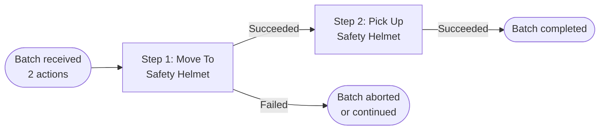

# Dispatcher & Batch Policies

## The ConvaiActionDispatcher Component

`ConvaiActionDispatcher` is the runtime engine of the Action system. It sits on your NPC's GameObject, listens for action commands from the Convai backend, and runs the right executor for each one — in order, with the policies you configure.

Add it by selecting your NPC's GameObject and clicking **Add Component → Convai Action Dispatcher**.


`ConvaiActionDispatcher` requires a `ConvaiCharacter` component on the same GameObject. It subscribes to `ConvaiCharacter.OnActionsReceived` automatically on enable.


<figure><figcaption></figcaption></figure>

***

## Understanding Batches

The Convai backend may return **multiple actions in a single response**. This group is called a **batch**.

For example, if a player says:

> _"Pick up the safety helmet and bring it to me."_

The backend might return a batch containing two actions:

1. `Move To` → target: `Safety Helmet`
2. `Pick Up` → target: `Safety Helmet`

The dispatcher runs actions within a batch **sequentially** — one at a time, in order. It waits for each executor to finish before starting the next step.



***

## Batch Policy

The **Batch Policy** determines what happens when a new batch of actions arrives while the dispatcher is still executing a previous batch.

Configure it in the **Dispatch** section of the `ConvaiActionDispatcher` Inspector.

| Policy                | Behavior                                                                          | Best For                                                                       |
| --------------------- | --------------------------------------------------------------------------------- | ------------------------------------------------------------------------------ |
| **Queue** _(default)_ | The new batch waits in the queue. Batches execute in the order they are received. | Turn-based experiences, training simulations, sequential narratives            |
| **Replace Current**   | The running batch is canceled immediately. The new batch starts right away.       | Real-time games where the player should be able to redirect the NPC mid-action |
| **Drop Incoming**     | The new batch is discarded. The current batch finishes uninterrupted.             | Cutscenes, scripted sequences, uninterruptible behavior                        |


**Queue** is the safest default for most applications. The NPC completes each task before starting the next, which produces predictable behavior.



**Replace Current** makes the NPC feel more responsive and reactive in real-time scenarios. Use it when player commands should always take immediate effect.


<figure><figcaption></figcaption></figure>

***

## Failure Policy

The **Failure Policy** determines what happens when one action in a batch fails — for example, if the executor cannot find the target, or the NavMesh path is invalid.

| Policy                     | Behavior                                                                                                                |
| -------------------------- | ----------------------------------------------------------------------------------------------------------------------- |
| **Stop Batch** _(default)_ | The remaining actions in the batch are skipped. `OnBatchAborted` fires.                                                 |
| **Continue Batch**         | The dispatcher moves on to the next action regardless of the failure. `OnBatchCompleted` fires when all steps are done. |

**Example with Stop Batch** — batch: `[Move To Crate, Pick Up Crate]`

If `Move To Crate` fails (e.g., NavMesh path not found), `Pick Up Crate` is skipped and `OnBatchAborted` fires. The character does not attempt to pick up an object it never reached.

**Example with Continue Batch** — batch: `[Wave, Move To Crate, Nod]`

If `Move To Crate` fails, the dispatcher still executes `Nod`. Useful when actions are independent of each other.

<figure><figcaption></figcaption></figure>

***

## UnityEvents

`ConvaiActionDispatcher` exposes a full set of UnityEvents in the **Events** section of its Inspector. Wire these to any method in your scene to respond to action lifecycle events.

### Batch Events

| Event                  | When It Fires                                                             | Signature |
| ---------------------- | ------------------------------------------------------------------------- | --------- |
| **On Batch Started**   | A new batch begins executing                                              | `()`      |
| **On Batch Completed** | All steps in a batch finished (including steps that returned `Unhandled`) | `()`      |
| **On Batch Aborted**   | A batch was stopped early due to a failure (Stop Batch policy)            | `()`      |

### Step Events

| Event                 | When It Fires                                                                                   | Signature                  |
| --------------------- | ----------------------------------------------------------------------------------------------- | -------------------------- |
| **On Step Started**   | An individual action step begins                                                                | `(ConvaiActionInvocation)` |
| **On Step Succeeded** | The executor returned `Succeeded`                                                               | `(ConvaiActionInvocation)` |
| **On Step Failed**    | The executor returned `Failed`, `TimedOut`, or `Canceled`; or the definition/target was missing | `(ConvaiActionInvocation)` |
| **On Step Unhandled** | The executor returned `Unhandled`                                                               | `(ConvaiActionInvocation)` |


Step events receive a `ConvaiActionInvocation` parameter. This gives you access to the action command, the definition, the resolved target, and which step in the batch this is. Use it to build context-aware UI, logging, or gameplay reactions.


<figure><figcaption></figcaption></figure>

### Example: Wiring Events

**Show a loading indicator while a batch runs:**

* `On Batch Started` → `LoadingSpinner.SetActive(true)`
* `On Batch Completed` → `LoadingSpinner.SetActive(false)`
* `On Batch Aborted` → `LoadingSpinner.SetActive(false)`

**Update a quest tracker when an action succeeds:**

* `On Step Succeeded` → `QuestTracker.OnActionCompleted(ConvaiActionInvocation)`

**Log failures to a training score system:**

* `On Step Failed` → `ScoreManager.OnActionFailed(ConvaiActionInvocation)`

***

## Scripting API

If you need to trigger actions from your own code rather than waiting for a backend response, you can call `EnqueueActions` directly:

```csharp
using Convai.Runtime.Actions;
using Convai.Shared.Types;
using System.Collections.Generic;

// Inject a "Wave" action with no target
dispatcher.EnqueueActions(new List<ConvaiActionCommand>
{
    new ConvaiActionCommand("Wave")
});

// Inject a "Move To" action targeting "Crate"
dispatcher.EnqueueActions(new List<ConvaiActionCommand>
{
    new ConvaiActionCommand("Move To", "Crate")
});
```


`EnqueueActions` follows the same **Batch Policy** as backend-received commands. If the policy is `Queue`, the injected batch waits its turn.


***

## Advanced: Receiving Actions Without the Dispatcher

`ConvaiActionDispatcher` handles the full action pipeline and is the right choice for most projects. If you need a completely custom pipeline, you can subscribe directly to `ConvaiCharacter.OnActionsReceived` instead.

```csharp
public event Action<IReadOnlyList<ConvaiActionCommand>> OnActionsReceived;
```

Each `ConvaiActionCommand` carries two fields:

| Property    | Type   | Description                                                 |
| ----------- | ------ | ----------------------------------------------------------- |
| `Name`      | string | The action name selected by the backend (e.g., `"Move To"`) |
| `Target`    | string | The raw target name string. Null or empty if no target.     |
| `HasTarget` | bool   | `true` if `Target` is non-null and non-empty                |


Subscribing directly means you lose all dispatcher features — batch policies, failure policies, automatic target resolution, and the UnityEvent surface. You handle everything yourself.


### Subscribing Correctly

Always unsubscribe in `OnDisable`. Failing to do so causes stale handlers that fire after the component is destroyed.

```csharp
private void OnEnable()
{
    if (_character != null)
        _character.OnActionsReceived += HandleActionsReceived;
}

private void OnDisable()
{
    if (_character != null)
        _character.OnActionsReceived -= HandleActionsReceived;
}

private void HandleActionsReceived(IReadOnlyList<ConvaiActionCommand> actions)
{
    foreach (ConvaiActionCommand command in actions)
    {
        switch (command.Name)
        {
            case "Wave":
                PlayWaveAnimation();
                break;
            case "Move To" when command.HasTarget:
                StartCoroutine(MoveToTarget(command.Target));
                break;
        }
    }
}
```

### Room-Level Subscription

If your listener lives at the session or manager level — for example, a training assessment manager that observes actions from multiple characters simultaneously — subscribe to the room-wide event on `ConvaiManager` instead:

```csharp
_convaiManager.Events.OnCharacterActionReceived += (characterId, actions) =>
{
    Debug.Log($"Character {characterId} received {actions.Count} action(s).");
};
```

`ConvaiManager.Events.OnCharacterActionReceived` fires for **all characters in the room** and includes the `characterId`. Use character-level `OnActionsReceived` when your component is already attached to the NPC's GameObject. Use the room-level event when your logic is centralized and needs to observe multiple characters.

### Using Both Together

`ConvaiActionDispatcher` and a custom subscriber can coexist on the same character — both receive the same batch. This is useful for analytics or logging alongside normal execution:

```csharp
// Subscribe for logging only — dispatcher handles execution
_character.OnActionsReceived += batch =>
{
    foreach (var cmd in batch)
        analyticsService.Track("action_received", cmd.Name, cmd.Target);
};
```

***

## Conclusion

`ConvaiActionDispatcher` gives you precise control over how action batches are sequenced, what happens when they conflict, and how failures are handled. The UnityEvent surface lets you react to every stage of execution — from batch start to individual step outcomes — without writing a dispatcher subclass. For testing or scripted sequences, `EnqueueActions` lets you inject batches directly from code. For fully custom pipelines, `OnActionsReceived` provides raw access to every incoming command.

Next: Writing Custom Executors — build any behavior the built-in executors don't cover.
