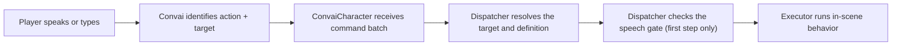

The Convai character actions system lets NPC characters respond to player requests by performing physical behaviors in your scene. When a trainee says "retrieve the fire extinguisher," the character navigates to it. When a student says "point at the diagram," the character turns and faces it. Convai identifies what to do and who to target; Unity executes the behavior through a simple, extensible pipeline.

## How the action pipeline works

Every action request travels through six stages:

Convai selects the action name and optional target from the current action affordances — the actions, objects, and characters registered at connect time or changed mid-session. `ConvaiActionDispatcher` resolves the target to a scene `GameObject` and looks up the matching action definition first. Before the first step of a fresh batch runs, it then checks whether that step opts in to the speech gate. If it does, the dispatcher waits for the character to start speaking, stop speaking, or complete its turn — whichever happens first — so the physical action does not run ahead of the character's voice line. Only after the gate releases does the bound executor component run.

The speech gate applies only to the first step of a batch, and only when `WaitForBotSpeech` is set on the command or its action definition. The dispatcher's `_speechGateTimeoutSeconds` field caps how long it waits — 2 seconds by default — so a batch never stalls indefinitely if no speech event fires. An optional `DelayAfterBotSpeechSeconds` value holds the step for a further fixed interval after the gate releases.

Action affordances and targets are not fixed for the whole session. Changes sent mid-session through `ConvaiCharacter.DynamicContext` are confirmed by Convai: Unity queues the change and applies it locally only after Convai acknowledges it, committing queued changes in the order they were sent. An update that Convai never acknowledges, or acknowledges with an error, is discarded without a retry. If an acknowledgment reports that the change requires a fresh connection, `ConvaiCharacter` logs a warning instead of reconnecting automatically — your code is responsible for triggering the reconnect.

## Key concepts

| Concept | What it means |
| --- | --- |
| **Action affordances** | Which action names Convai is allowed to request. Authored in `ConvaiActionConfigSource` or overridden at connect time. |
| **Action targets** | Which objects and characters Convai is allowed to reference. Also authored in `ConvaiActionConfigSource`. |
| **Action events** | The ordered command batch Convai returns for a turn. Exposed via `ConvaiCharacter.OnActionsReceived`. |
| **Local execution** | Optional Unity-side execution through `ConvaiActionDispatcher` and `IConvaiActionExecutor`. You can receive raw action events without the dispatcher if you want to handle them yourself. |
| **Action Sets** | Reusable `ConvaiActionSet` assets that let several characters share the same authored action definitions instead of repeating them per character. |

## Required components

| Component | Inspector name | Required | Purpose |
| --- | --- | --- | --- |
| `ConvaiCharacter` | Convai Character | Always | Receives action command batches from Convai |
| `ConvaiActionConfigSource` | Convai Actions | Yes | Authors the character's action definitions and scene knowledge |
| `ConvaiActionDispatcher` | Convai Action Runner | Optional | Executes received batches automatically through bound executors |
| One or more executor components | Varies by executor | If using the dispatcher | Performs the actual in-scene behavior; several depend on an embodiment module such as Gaze or Body Animation |

The class names are unchanged from earlier SDK versions; only the Inspector labels changed, so existing scripts, scenes, and prefabs need no migration.


`ConvaiActionDispatcher` is optional. If you want to handle action batches in your own gameplay code, subscribe to `ConvaiCharacter.OnActionsReceived` directly and skip the dispatcher entirely.


## Executors

21 built-in executor components ship with the Convai SDK, organized into six packs by what they need on the character:

| Pack | Covers | Needs on the character |
| --- | --- | --- |
| Flow & Utility | Raise Unity Event, Wait, Run In Order, Show Or Hide Object, Play Animator State, Play Sound | Nothing beyond the base actions components — works on any character |
| Observation | Count Target Group, Measure Distance | Nothing on the character; Count Target Group requires a `ConvaiActionTargetGroup` on the target |
| Attention (Gaze module) | Look At Target, Watch The Player, Scan Environment | `ConvaiGazeController` |
| Expression | Set Mood, React, Nod Or Shake Head | `ConvaiEmotionController` (Set Mood, React) or `ConvaiBodyLanguageController` (Nod Or Shake Head) |
| Gesture | Play Gesture, Point At Target | `ConvaiBodyAnimationController` (Body Animation module) |
| Movement | Walk To Target, Lead Player To Target, Turn To Face Target, Follow The Player, Return To Start | `ConvaiBodyAnimationController`, and `ConvaiNavMeshLocomotion` for every executor except Turn To Face Target |

The Attention, Gesture, and Movement packs run through the Gaze and Body Animation embodiment modules — see [Embodiment](../../embodiment/README.md) — so a character needs the matching module installed before those actions work. Adding an executor through the Actions Editor's catalog adds the required module component automatically when it is missing; see [Actions Editor](actions-editor.md).

See [Action executors](action-executors.md) for every executor's Inspector fields and failure modes.

## Next steps

To get a working action set up in your scene, start with the quick-start guide. Once your first action runs end-to-end, read the configuration reference to understand the full `ConvaiActionConfigSource` options, then choose or build the right executor for your project.


[Character actions quick start](quick-start.md)



[Actions Editor](actions-editor.md)



[Action executors](action-executors.md)



[Troubleshoot character actions](debugging-and-troubleshooting.md)

