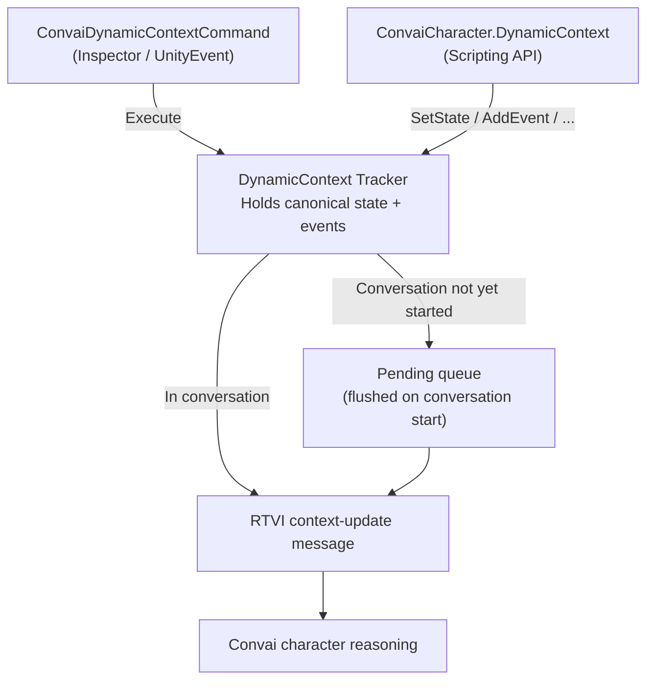

# Dynamic Context

## Dynamic Context

Dynamic Context is the mechanism by which you feed live runtime information — player status, environment conditions, simulation events — directly into a Convai character's awareness during a conversation. Without it, a character knows only what was written into its system prompt at configuration time. With Dynamic Context, it can acknowledge and respond to the world as it changes around it in real time.

This section covers every aspect of Dynamic Context: how to set it up without writing a single line of code, how to drive it from scripts when your game logic demands it, and the precise rules that govern when and how updates reach the character.

## How It Works

Dynamic Context is built on two concepts:

**States** are persistent key-value facts that describe the current condition of something. A state has a name and a value — for example, `"Hazard Level"` is `"High"`, or `"Active Station"` is `"Control Room B"`. When a state changes, the old value is replaced. The character always knows the current value of each state.

**Events** are chronological, one-time occurrences appended in order — for example, `"Trainee bypassed emergency lockout"` or `"Visitor asked about reactor containment"`. Events are never replaced or deduplicated; they accumulate as a timeline the character can reference.

When the character receives context, it sees states first (in the order they were first introduced), followed by events in chronological order:

```
Active Station is Control Room B
Hazard Level is High
Trainee bypassed emergency lockout
Visitor asked about reactor containment
```

This canonical format is assembled automatically by the SDK. You only supply the names, values, and event text.

## Two Entry Points

Dynamic Context can be driven from the Inspector or from C# scripts. Both paths feed the same underlying tracker.



The **Inspector path** uses `ConvaiDynamicContextCommand`, a no-code component you add to any GameObject. You configure a command type and its parameters directly in the Inspector, then call `Execute()` from any `UnityEvent`, animation timeline, trigger collider, or button click.

The **scripting path** accesses `ConvaiCharacter.DynamicContext`, which returns an `IConvaiDynamicContext` interface with seven methods covering every operation from setting a single state to sending raw typed updates.

Both paths share the same tracker, the same pre-conversation queue, and the same transport.

## Example: Safety Training Context Mid-Simulation

To make this concrete, here is what a safety training character's context might look like partway through a fire emergency drill:

```
Station is Fire Suppression Bay
Hazard Level is Extreme
Active Suppressant is CO2
Trainee activated water suppressor on electrical fire
Trainee bypassed the manual lockout
```

The character can reference any of this naturally: _"I can see you're at the Fire Suppression Bay — with an extreme hazard rating, bypassing the manual lockout is a critical error. Let's walk through what should have happened first."_

## Key Concepts at a Glance

<table><thead><tr><th width="259.00006103515625">Concept</th><th>Description</th></tr></thead><tbody><tr><td><strong>State</strong></td><td>A named, persistent key-value fact. Updated in-place when the value changes.</td></tr><tr><td><strong>Event</strong></td><td>A chronological, append-only occurrence. Never deduplicated.</td></tr><tr><td><strong>Canonical context</strong></td><td>The full assembled context string: states (insertion order) then events (chronological).</td></tr><tr><td><strong>Reaction mode</strong></td><td>Controls whether a context update immediately triggers an LLM response from the character.</td></tr><tr><td><strong>Pre-conversation queue</strong></td><td>Updates made before a conversation starts are queued and flushed automatically when the conversation begins.</td></tr><tr><td><strong>Initial context</strong></td><td>A fixed text block set on <code>ConvaiCharacter</code> and sent once at connection time, separate from runtime updates.</td></tr></tbody></table>

## What Goes Where

<table><thead><tr><th width="283.00006103515625">Entry Point</th><th>Where / How</th><th>Best For</th></tr></thead><tbody><tr><td><code>ConvaiDynamicContextCommand</code></td><td><strong>Add Component</strong> on any GameObject; fires via <code>Execute()</code> from any <code>UnityEvent</code></td><td>Designers and technical artists; inspector-driven workflows, buttons, timelines, triggers</td></tr><tr><td><code>ConvaiCharacter.DynamicContext</code></td><td>Accessed in C# as <code>character.DynamicContext</code></td><td>Programmers; game systems, inventory managers, event buses</td></tr><tr><td>Initial context (<code>ConvaiCharacter</code>)</td><td><strong>Dynamic Info (Connection Request)</strong> header on the <code>ConvaiCharacter</code> Inspector</td><td>Fixed scenario facts sent once at session start, before the first conversational turn</td></tr></tbody></table>

## In This Section

<table data-view="cards"><thead><tr><th></th><th></th></tr></thead><tbody><tr><td><strong>Quick Start</strong></td><td>Configure your first Dynamic Context update from the Inspector, wire it to a UnityEvent, and watch your character reference live game state in conversation.</td></tr><tr><td><strong>Command Component Reference</strong></td><td>Complete field-by-field reference for all six command types on <code>ConvaiDynamicContextCommand</code>.</td></tr><tr><td><strong>Static Context at Connection Time</strong></td><td>Set a fixed context block sent once when a conversation starts, before any runtime updates.</td></tr><tr><td><strong>Usage Examples</strong></td><td>Realistic examples across four simulation scenarios covering the full command surface.</td></tr><tr><td><strong>Scripting API Reference</strong></td><td>All seven <code>IConvaiDynamicContext</code> methods with exact signatures and parameter semantics.</td></tr><tr><td><strong>Sync Behavior and Timing</strong></td><td>When and how updates are sent; canonical rebuild; pre-conversation queueing; transport details.</td></tr><tr><td><strong>Troubleshooting &#x26; Diagnostics</strong></td><td>Diagnose silent updates, unexpected character responses, and pre-conversation timing problems.</td></tr></tbody></table>

## Conclusion

Dynamic Context gives your Convai characters awareness of everything that matters in your simulation — from a trainee's current station to the mistakes they made moments ago. The [Quick Start](../../../unity-plugin-beta-overview/features/dynamic-context/quick-start.md) is the fastest way to see it working.
