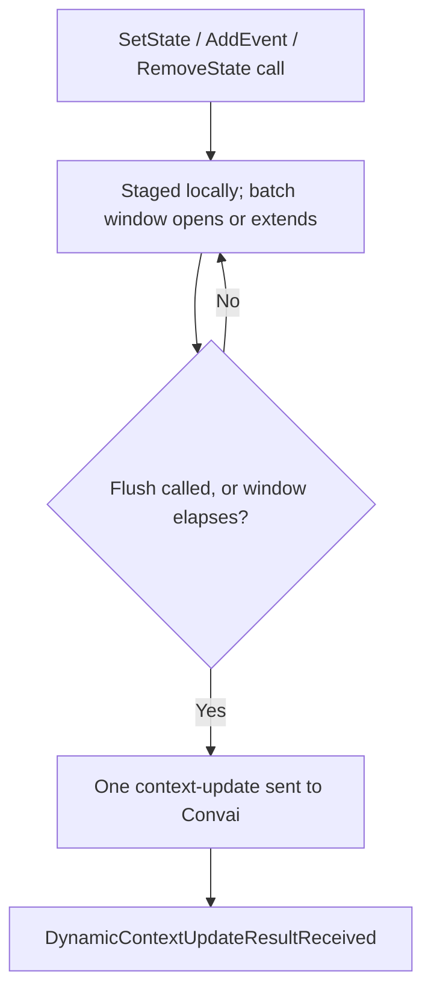

Dynamic Context gives characters a live, structured view of what is happening in the scene. Instead of relying only on the static system prompt configured on the Convai dashboard, a character can reference a trainee's current location, the equipment they have collected, or an alarm that recently triggered — because that information was injected directly into the session as it occurred. This page explains the underlying model: the two primitives the SDK tracks, how they assemble into a canonical context string, how updates batch and flush, and how the SDK reports back what happened to each update.

## States and events

Dynamic Context is built on two primitive types.

**States** are persistent, named key-value pairs. Each state has a name and a value. When you set a state, any previous value for that name is replaced. States are suitable for facts that change over time but have exactly one current value: the operator's current station, the hazard level in a zone, or whether a checklist item has been completed.

**Events** are chronological, one-time occurrences. Unlike states, events accumulate in sequence and are never replaced or deduplicated. Each call to `AddEvent` appends a new line to the character's context. Events are suitable for things that happened during a session and that the character should be able to reference in order: "Trainee bypassed the manual lockout procedure", "Chemical alarm triggered at Bay 7".

Both primitives feed into the character's awareness simultaneously. States provide a stable, queryable snapshot of current conditions; events provide a chronological record of what has happened.

## Canonical context format

Before an update reaches Convai, the SDK assembles a canonical context string from all tracked states and events:

```text
{StateName} is {Value}
{AnotherState} is {Value}
Event text line one
Event text line two
```

States appear first, in the order they were **first set** — updating a state's value does not change its position. Events follow in call order after all states.

The reason states preserve insertion order across updates is to give the character a stable, predictable view of the world. If `Station` was the first thing set, it always appears first in the character's context, regardless of how many times the value has changed. This makes the context easier for the model to interpret consistently.

**Example:**

```csharp
context.SetState("Station", "Bay 3");       // position 1
context.SetState("HazardLevel", "High");    // position 2
context.AddEvent("Operator bypassed interlock");
context.SetState("Station", "Bay 7");       // updates value; position stays at 1
```

Canonical context after all four calls:

```text
Station is Bay 7
HazardLevel is High
Operator bypassed interlock
```

You supply only names, values, and event text. The SDK assembles and delivers the canonical string automatically.

## Two entry points to the same tracker

Dynamic Context has two entry points that write to the same underlying tracker and produce identical network behavior.

**Inspector — `ConvaiDynamicContextRelay`**

`ConvaiDynamicContextRelay` is the Inspector entry point. It replaces the retired `ConvaiDynamicContextCommand` component. Add it via **Convai → Dynamic Context → Convai Dynamic Context Relay**, either on the same GameObject as `ConvaiCharacter` or on any GameObject with an explicit **Character** reference assigned. If **Character** is empty and **Auto Resolve Character** is enabled (the default), the relay looks for a `ConvaiCharacter` on its own GameObject at call time.

Unlike `ConvaiDynamicContextCommand`, one relay does not encapsulate a single preconfigured operation, so you no longer need a child GameObject per command. The relay exposes public methods that call directly into `character.DynamicContext`: `SetState(name, value)`, `AddEvent(text)`, `SetCurrentAttentionObject(objectName)`, `ClearCurrentAttentionObject()`, `ResetContext()` / `ResetContext(removeStatic)`, and `Flush()`. Bind any of these to a `UnityEvent` — a trigger collider, a timeline marker, or a UI button — the same way you would bind any other public `MonoBehaviour` method. One relay component can serve several different `UnityEvent` callbacks on the same character.

Two Inspector fields apply as defaults to every call made through that relay instance: **Reaction Mode** sets the `ConvaiRespondMode` passed with each call (default `Silent`), and **Flush Immediately**, when enabled, calls `Flush()` right after the operation so the update bypasses the batch delay. Because the relay always passes its configured **Reaction Mode** explicitly, a method's own scripting default does not apply when the call is routed through the relay — for example, `AddEvent`'s scripting default of `Auto` is overridden by whatever **Reaction Mode** the relay is set to.

The relay's **Events** section exposes `OnQueued` and `OnSkipped`. `OnSkipped` fires when the relay cannot resolve a `ConvaiCharacter`. `OnQueued` fires once the relay resolves a character and dispatches the call — it confirms dispatch, not that the value was accepted. An empty state name or a null value still logs a Console warning even when `OnQueued` fires.

**Scripting — `IConvaiDynamicContext`**

Access `character.DynamicContext` to get the `IConvaiDynamicContext` interface and call methods directly from C#. This gives full control over timing, batching, and respond mode.

```csharp
IConvaiDynamicContext context = _character.DynamicContext;
context.SetState("Station", "Bay 7");
context.AddEvent("Operator bypassed interlock");
```

Use this entry point when:
- Context updates depend on runtime logic or data that cannot be expressed as static Inspector fields
- Multiple states must change atomically (use `SetStates`)
- You need to read state values back (`TryGetStateValue`)
- The update source is an external system such as a state machine or analytics pipeline

## Batching and delivery timing

Tracked calls — `SetState`, `SetStates`, `AddEvent`, `RemoveState`, `SetCurrentAttentionObject`, `ClearCurrentAttentionObject`, and `Reset` — never send a network message immediately. Each call updates the local tracked state right away, then stages a pending batch for delivery. This exists so that a burst of related changes fired within the same frame collapses into one canonical update, rather than one network message and one potential LLM turn per call.



While a conversation is active, the first staged change opens a batch window. Every subsequent staged change resets a countdown of `ConvaiCharacter.DynamicContextBatchDelaySeconds` — 0.5 seconds by default. The SDK also enforces an internal ceiling of 3 seconds measured from the first staged change in the window, so a steady stream of changes cannot postpone delivery indefinitely. Calling `Flush()` sends the pending batch immediately, bypassing whatever remains of the countdown.

If a call happens before the character is in conversation, it stages locally only — no countdown starts. When the session's character-ready signal arrives, the SDK flushes the staged batch immediately, so calls made in `Awake` or `Start` are delivered without any extra timing code:

```csharp
void Start()
{
    // Safe — stages locally, then flushes as soon as the character is ready
    _character.DynamicContext.SetState("Facility", "Offshore Platform Alpha");
    _character.DynamicContext.SetState("Scenario", "Fire Drill");
    _character.DynamicContext.AddEvent("Session initialized");
}
```

When the session disconnects, the SDK marks the tracked context for a full canonical resync, so the next reconnect rebuilds the same context even if nothing changed locally while offline.

When multiple staged changes carry different respond modes, the strongest one wins for the whole batch: `MustRespond` outranks `Auto`, which outranks `Silent`.


**Renamed in SDK 4.4.0.** `ConvaiContextReactionMode` is removed. Dynamic context and dynamic vision context now share one respond-mode vocabulary, `ConvaiRespondMode` (namespace `Convai.Runtime`): `SyncOnly` maps to `Silent`, `ReactImmediately` maps to `MustRespond`, and `Auto` is unchanged.



`Apply()` is the one exception: it does not stage or queue. Calling it while the character is not in conversation discards the update. Use `SetState`, `AddEvent`, or the other tracked methods for context that must survive until a conversation starts.


## Acknowledgement and token feedback

Every dynamic context update the SDK sends — whether from a tracked batch, an explicit `Flush()`, or a raw `Apply()` call — is confirmed by `DynamicContextUpdateResultReceived`, delivered through `ConvaiManager.ActiveManager.Events.OnDynamicContextUpdateResultReceived`. Match an acknowledgement to the update you sent using `UpdateId`. Tracked batches always receive an SDK-generated ID; only `Apply()` lets you supply your own `updateId` for correlation.

```csharp
using Convai.Domain.DomainEvents.Runtime;
using Convai.Runtime.Components;

ConvaiManager.ActiveManager.Events.OnDynamicContextUpdateResultReceived += result =>
{
    Debug.Log($"{result.Status}: revision {result.ContextRevision}, {result.RemainingTokens} tokens remaining");
};
```

| Property | Type | Meaning |
|---|---|---|
| `Status` | `string` | `"success"` when the update was applied; any other value means it was rejected. |
| `Message` | `string` | Human-readable detail accompanying the status. |
| `UpdateId` | `string` | Matches the ID assigned when the update was sent. |
| `ContextRevision` | `int` | The backend's revision counter for this character's context. |
| `TokenCount`, `StaticTokenCount`, `RuntimeTokenCount`, `RemainingTokens` | `int` | Token accounting for the character's context window after this update. |
| `RequestedRunLlm`, `ActualRunLlm` | `string` | The respond mode requested versus what the backend actually honored. |
| `DowngradeReason` | `string` | Explains why `ActualRunLlm` differs from `RequestedRunLlm`, when it does. |
| `Interrupted` | `bool` | Whether this update interrupted an in-flight character turn. |
| `LlmTriggered` | `bool` | Whether this update triggered a new character turn. |
| `PromptRebuild`, `PromptRebuildStatus` | `bool`, `string` | Whether the backend rebuilt the character's prompt to include this update, and the outcome. |

The same event also carries action-specific fields — `ActionConfigUpdated`, `ActionsCount`, `CurrentAttentionObject`, and related properties — when the update includes an action configuration patch. See [Update character actions at runtime](../character-actions/update-actions-at-runtime.md) for that acknowledgement flow.

## Next steps


[Dynamic context quick start](dynamic-context-quick-start.md)



[Relay component reference](relay-component-reference.md)



[Sync behavior and timing](sync-behavior-and-timing.md)

