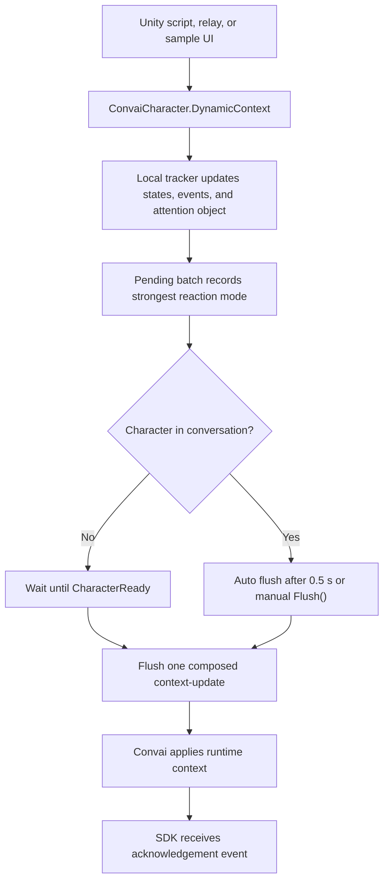

Dynamic Context is the Unity runtime layer for facts that change during a session. Static character setup still belongs in the system prompt or connection-time context. Dynamic Context is for live state: where the player is, what phase a simulation is in, what event happened, or which authored object the character should focus on.

## Runtime model

Dynamic Context has two tracked text primitives.

| Primitive | Meaning | Example |
|---|---|---|
| State | A named value where the latest value wins. | `Station is Fire Suppression Bay` |
| Event | A chronological line that records something that happened. | `Trainee bypassed manual lockout procedure` |

States are stored by name. Calling `SetState("Station", "Bay 7")` again replaces the previous value for `Station`. Events are stored in call order. Duplicate event text inside the same pending batch is ignored so one accidental double-click does not create duplicate lines.

## Canonical context text

When a text change flushes, the SDK builds a canonical context string from the local tracker. States normally appear as `{Name} is {Value}`. Events appear as their text.

```text
Station is Bay 7
HazardLevel is High
Operator bypassed interlock
```

For updates that can trigger a character response (`Auto` or `ReactImmediately`), the SDK can add delta lines into the same payload so the character can reference what changed naturally.

```text
Station is Bay 7
HazardLevel is High
Station changed from Bay 3 to Bay 7
```

The SDK sends that as one composed update, not as separate "replace then append" messages.

## Entry points

Use the entry point that matches where the scene data originates.

| Entry point | Use when |
|---|---|
| `ConvaiCharacter.DynamicContext` | Runtime logic or gameplay systems already have the values in C#. |
| `ConvaiDynamicContextRelay` | Scene events, triggers, interactables, or wrapper scripts need to call into one character's context. |
| `SampleDynamicContextUI.prefab` | You want to test delivery before writing integration code. |

All tracked entry points feed the same character-owned tracker.

## Update flow



Tracked calls do not send immediately. They stage a pending batch. During an active conversation, the SDK auto-flushes after a short batching delay. Calling `Flush()` sends the pending batch immediately.

If calls happen before the character is ready, the SDK keeps the tracked state locally. When `CharacterReady` arrives, it sends one composed `context-update` with the latest state.

## Reaction modes

Reaction mode controls the `run_llm` value in the outgoing message.

| Reaction mode | `run_llm` value | Behavior |
|---|---|---|
| `SyncOnly` | `false` | Update context silently. The character can use it on a later turn. |
| `Auto` | `auto` | Let Convai decide whether the update should trigger a response. |
| `ReactImmediately` | `true` | Request an immediate character response after the update. |

When several changes share one batch, the strongest reaction wins: `ReactImmediately`, then `Auto`, then `SyncOnly`.

## Attention object

`SetCurrentAttentionObject` updates the `current_attention_object` field in the `context-update` payload. Use it when the character should resolve phrases like "this valve" or "that lever" against a specific authored object.

If the active action config includes an object list, string attention-object names must match one of those objects. If there is no object list, the SDK allows the name.

## Raw updates

`Apply()` is the escape hatch. It sends a `ConvaiDynamicContextUpdate` directly and does not mutate the local tracker. It also does not queue before conversation start. Use tracked methods for normal gameplay state.

## Next steps


[Sync behavior and timing](sync-behavior-and-timing.md)



[Dynamic context scripting API](dynamic-context-scripting-api.md)



[Relay component reference](relay-component-reference.md)

