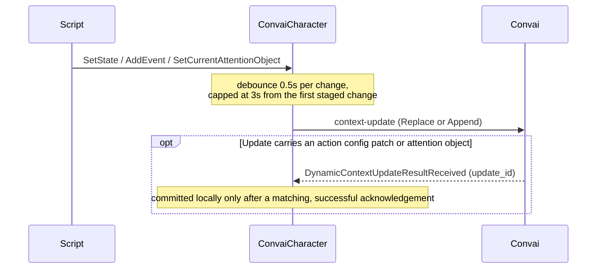

Dynamic Context updates do not reach Convai the instant you call `SetState`, `AddEvent`, or any other tracked method. The SDK stages every call into a short-lived batch and sends one `context-update` message per batch, not one per call. This page explains why the SDK batches, exactly when a batch is sent, and how updates that carry an action config patch or an attention object are acknowledged before the SDK trusts them locally.

## Why dynamic context batches updates

A single gameplay frame can call several tracked methods at once — a hazard state, a location change, and an event firing together in one physics update. Sending an individual `context-update` message per call would multiply network traffic and could let Convai react to an intermediate state before the rest of the frame's changes land. Instead, `ConvaiCharacter` stages every call to `SetState`, `SetStates`, `AddEvent`, `RemoveState`, `SetCurrentAttentionObject`, and `ClearCurrentAttentionObject` into one pending batch and flushes that batch as a single message.

The reason a shared batch also needs a shared reaction decision is that Convai only sees one message, so it can only apply one respond mode. When several calls in the same window request different `ConvaiRespondMode` values, the strongest request wins for the whole batch: `MustRespond` beats `Auto`, and `Auto` beats `Silent`. A single `MustRespond` call in a batch of otherwise-silent updates is enough to make the character react.

```csharp
using Convai.Runtime;
using Convai.Runtime.Components;
using Convai.Runtime.DynamicContext;
using UnityEngine;

public sealed class HazardZoneContext : MonoBehaviour
{
    [SerializeField] private ConvaiCharacter character;

    public void OnHazardTriggered()
    {
        character.DynamicContext.SetState("Station", "Bay 7");
        character.DynamicContext.SetState("HazardLevel", "Extreme", ConvaiRespondMode.MustRespond);
        character.DynamicContext.AddEvent("Operator bypassed interlock");
    }
}
```

**Expected outcome:** all three calls land in the same batch and produce one `context-update` message. Because `HazardLevel` requested `MustRespond`, the whole batch is sent with `MustRespond`, even though `SetState("Station", ...)` and `AddEvent(...)` default to weaker modes.

## The batch window and its ceiling

The SDK debounces staged changes for `ConvaiCharacter.DynamicContextBatchDelaySeconds` — a fixed `0.5` seconds. Every additional staged change during that window pushes the flush out by another `0.5` seconds from the moment it was staged, measured from when Unity last processed a change.

A continuous stream of changes could in theory push the flush out indefinitely, so the SDK also enforces a ceiling: the wait can never exceed 3 seconds measured from the first staged change in the window. Whichever limit is reached first — the 0.5-second debounce settling, or the 3-second ceiling — triggers the flush.

| Timing behavior | Value | Effect |
|---|---|---|
| Per-change debounce | 0.5 seconds (`DynamicContextBatchDelaySeconds`) | Each staged change resets the flush countdown |
| Maximum wait per window | 3 seconds | The flush fires even while changes keep arriving |



`Reset()` goes through the same debounce window rather than sending immediately — calling `Reset()` does not bypass the 0.5-second wait.


A pending reset is not guaranteed to reach Convai as a reset. If `SetState`, `SetStates`, `AddEvent`, `RemoveState`, `SetCurrentAttentionObject`, or `ClearCurrentAttentionObject` is staged after `Reset()` but before the batch window flushes, the pending reset is dropped and replaced by a normal batch containing only the new call. Call `Flush()` immediately after `Reset()` if the reset must reach Convai before anything else can supersede it.


## What one flush sends

A flush sends exactly one message, and its mode depends on what changed during the window. If any tracked state text changed — a new state, an updated value, or a removed state — the message mode is Replace, carrying the full canonical context plus a short delta tail describing what changed. If the only staged change in the window was an attention-object update with no state text change, the message mode is Append instead.

This mirrors the single-call behavior documented on the [dynamic context scripting API](dynamic-context-scripting-api.md) page, with one difference: the SDK now coalesces every call in the window into that one message rather than sending a message per call.

## Forcing a flush before the window closes

Call `Flush()` on `IConvaiDynamicContext` to send the pending batch immediately instead of waiting out the debounce window. Use it when a change must reach Convai before the next line of scripted dialogue plays, rather than trusting the up-to-3-second window to settle in time.

```csharp
character.DynamicContext.SetState("Player location", "market square");
character.DynamicContext.Flush();
```

`Flush()` only sends when the character `IsInConversation`. If the character is not connected, the staged batch remains pending and is not force-sent — see the next section for what happens to it.

## Timing around connect, reconnect, and disconnect

A flush only sends while the character `IsInConversation`. Calls staged before a conversation starts, or while reconnecting after a drop, stay queued in the tracker rather than being discarded.

When a session moves to `Disconnected` or `Error`, the SDK stages a canonical resync of whatever content the tracker is currently holding, rather than replaying the individual calls that produced it. The reason a disconnect resyncs the full canonical context instead of replaying history is that Convai only needs the character's current state, not the sequence of intermediate values it passed through while offline.

When the character receives its ready signal — on initial connect or after a reconnect — the SDK flushes any pending batch immediately, without waiting for the debounce window. This is what delivers context staged before a conversation existed: it is not discarded, and it does not wait out a fresh 0.5-second timer once the character is ready.

## Acknowledgement timing for action and attention updates

Plain state and event updates are fire-and-forget once flushed — the SDK does not wait for Convai to confirm them, because a text update only needs to reflect the latest value. Updates that carry an action config patch or an attention object are different: they change what the character can actually reference and act on, so the SDK does not commit them to `ConvaiCharacter`'s resolved action state until Convai confirms them.

Each such update is sent with an `update_id` and tracked while waiting for a matching `DynamicContextUpdateResultReceived` event. The SDK checks for a match once per second and gives up on any single update after 30 seconds without a matching acknowledgement, discarding the pending mutation and logging a warning rather than retrying it. Pending updates are committed in the order they were sent — an older update waiting on its acknowledgement blocks newer ones from committing, even if a newer update's acknowledgement arrives first.

An acknowledgement only commits when its status is `success` and its reported action, object, and character counts and current attention object match what the SDK expected. A mismatched or malformed acknowledgement is discarded the same way a timeout is, with a warning logged instead of an update applied.

Subscribe to the event to observe acknowledgement outcomes directly:

```csharp
using Convai.Domain.DomainEvents.Runtime;
using Convai.Runtime.Components;
using UnityEngine;

ConvaiManager.ActiveManager.Events.OnDynamicContextUpdateResultReceived += result =>
{
    Debug.Log($"Dynamic context {result.Status}: revision {result.ContextRevision}");
};
```

If an acknowledgement reports its action generation strategy status as `requires_reconnect`, the SDK surfaces that status but does not reconnect automatically — the calling code decides whether and when to reconnect.

## Apply() bypasses batching

`Apply()` sends its update directly to the transport, skipping the tracker and the debounce window described above. It does not bypass acknowledgement tracking: an `Apply()` call that carries an action-config patch or a current attention object still joins the same pending-update queue, with the same 30-second timeout and 1-second poll interval described in "Acknowledgement timing" above.


If the character is not in an active conversation when `Apply()` is called, the update is discarded immediately — it is not staged, and it does not flush later when the character becomes ready. Use `SetState`, `SetStates`, `AddEvent`, `RemoveState`, `SetCurrentAttentionObject`, or `ClearCurrentAttentionObject` for anything that must survive being called before a conversation starts.


`Apply()` exists for callers that already generate their own canonical context text — an external state machine, for example — and need direct control over exactly what is sent and when, without the SDK reshaping it into a batch.

## Next steps


[Dynamic context scripting API](dynamic-context-scripting-api.md)



[Troubleshoot dynamic context](troubleshoot-dynamic-context.md)

