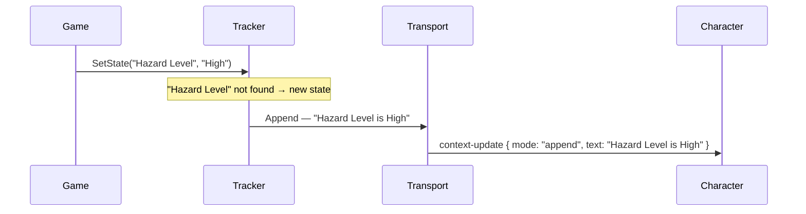
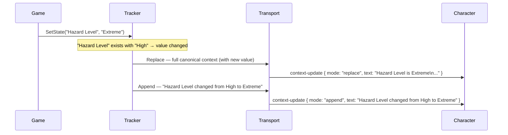
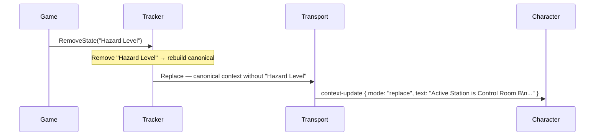
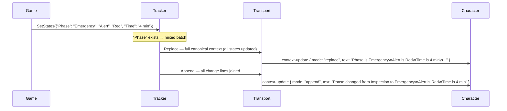

# Sync Behavior and Timing

## How Dynamic Context Updates Are Transmitted and When

Understanding when Dynamic Context updates are transmitted — and in what form — prevents the most common integration surprises. The SDK does not send every update as a single Append message. Depending on what state already exists in the tracker, it may send two messages, or it may queue the update until a conversation starts. This page specifies all four sync scenarios, the pre-conversation queue, and the canonical context format in detail.


This page is intended for developers who are debugging integration behavior, optimizing update frequency, or integrating Dynamic Context with external systems. Beginners can skip it until they encounter unexpected character behavior.


## The Four Sync Scenarios

The sync behavior depends on whether the states being updated already exist in the tracker. These scenarios apply during an active conversation. Pre-conversation behavior is covered in the next section.

### Scenario 1 — New State Added

When `SetState("Name", "Value")` is called and `"Name"` does not yet exist in the tracker:



A single Append message is sent. The character receives the new fact and adds it to its awareness.

### Scenario 2 — Existing State Changed

When `SetState("Name", "NewValue")` is called and `"Name"` already exists with a **different** value:



**Two messages are sent:** a Replace carrying the full canonical context (with the updated value in place), followed by an Append carrying a human-readable delta. The Replace gives the character an authoritative, complete picture; the Append gives it a legible description of what specifically changed so it can reference the transition naturally in dialogue.


This two-message pattern is intentional and non-configurable. If you are monitoring network traffic during debugging, expect two `context-update` messages whenever an existing state is modified.


### Scenario 3 — State Removed

When `RemoveState("Name")` is called:



A single Replace message is sent carrying the full canonical context with the removed state excluded. There is no delta Append — the absence of the state is self-evident from the Replace payload.

### Scenario 4 — Batch SetStates with Mixed New and Existing States

When `SetStates(dict)` is called and the dictionary contains at least one state that already exists in the tracker (with any value):



Replace + Append, identical in structure to Scenario 2, but the Append summarises all changes from the batch in a single message. If all states in the dictionary are new (none exist in the tracker yet), only a single Append is sent.

## Pre-Conversation Queue

All tracked methods — `SetState`, `SetStates`, `AddEvent`, `RemoveState`, and `Reset` — queue their effects automatically when the character is not in an active conversation. The queue is flushed when the conversation starts.

### Queue Mechanics

Whenever a tracked state or event update is made before a conversation starts, the SDK records a pending sync. On conversation start, a single Replace message is sent with the full canonical context as it stands at that moment — not a series of individual updates.

When `Reset()` is called before a conversation starts, a pending reset is recorded instead, which overrides any pending sync. On conversation start, the character receives a Reset message rather than a Replace.

**Priority rules:**

* Calling `Reset()` cancels any pending sync. A subsequent `SetState()` after `Reset()` reverts the queue back to pending sync.
* Only the final state of the tracker at conversation-start time is sent. Multiple `SetState` calls before conversation start result in a single Replace containing the final values — not a series of incremental messages.

**`Apply()` does not queue.** If `Apply()` is called before a conversation starts, the update is silently discarded. Use the tracked methods if you need pre-conversation setup to survive until the session begins.

## The Canonical Context Format

The canonical context string is the complete, authoritative text representation of all tracked states and events at a given point in time. It is used for Replace messages and for the pre-conversation flush.

**Format:**

```
{State1Name} is {State1Value}
{State2Name} is {State2Value}
...
{Event1 text}
{Event2 text}
...
```

**Rules:**

* States appear first, in **insertion order** — the order in which each state name was first introduced. Updating an existing state in-place preserves its position.
* Events appear after all states, in **chronological order** — the order in which `AddEvent` was called.
* Each state is formatted as `"{Name} is {Value}"`, one per line.
* Each event is its own line, with no prefix.

**Worked example:**

After the following sequence of calls:

```csharp
context.SetState("Station", "Fire Suppression Bay");
context.SetState("Hazard Level", "Extreme");
context.AddEvent("Trainee bypassed manual lockout");
context.SetState("Hazard Level", "High");  // existing state — value changes
context.AddEvent("Trainee activated correct suppressor");
```

The canonical context is:

```
Station is Fire Suppression Bay
Hazard Level is High
Trainee bypassed manual lockout
Trainee activated correct suppressor
```

`"Station"` retains its insertion position even though `"Hazard Level"` was updated after it. Events remain in the order they were added.

## Apply() and the Tracker Boundary

`Apply(ConvaiDynamicContextUpdate update)` is the one method that bypasses the tracker entirely. It sends whatever is in the update directly to transport with no canonical rebuild and no local state record.

Consequences:

* `TryGetStateValue` is never updated by `Apply()` calls. If you send `Apply(new ConvaiDynamicContextUpdate("Score is 95", ConvaiContextUpdateMode.Append))`, querying `TryGetStateValue("Score", out _)` returns `false`.
* The canonical sync triggered by subsequent `SetState` calls does not include anything sent via `Apply()`.
* `Apply()` is a silent no-op if the character is not in conversation — it does not queue.

Use `Apply()` only when you have a specific need to bypass the tracker, such as sending a backend-formatted text block from an external scoring system or forcing a mode-`Reset` update independently of the tracked state.

## Transport Layer Reference

Dynamic Context updates are transmitted as RTVI messages over the WebRTC data channel.

<table><thead><tr><th width="149.99993896484375">JSON field</th><th width="263">Values</th><th>Description</th></tr></thead><tbody><tr><td><code>type</code></td><td><code>"context-update"</code></td><td>Fixed message type identifier.</td></tr><tr><td><code>data.text</code></td><td>Any string, or omitted</td><td>Context text payload. Omitted when mode is <code>reset</code>.</td></tr><tr><td><code>data.mode</code></td><td><code>"append"</code>, <code>"replace"</code>, <code>"reset"</code></td><td>Corresponds to <code>ConvaiContextUpdateMode</code>.</td></tr><tr><td><code>data.run_llm</code></td><td><code>"auto"</code>, <code>"true"</code>, <code>"false"</code></td><td>Corresponds to <code>ConvaiContextReactionMode</code>. <code>Auto</code> → <code>"auto"</code>, <code>ReactImmediately</code> → <code>"true"</code>, <code>SyncOnly</code> → <code>"false"</code>.</td></tr></tbody></table>

This information is provided for developers inspecting network traffic or building custom transport integrations. No action is required in normal SDK usage — the mapping from typed C# values to JSON is handled automatically by the SDK.

## What's Next

* [Troubleshooting & Diagnostics](../../../unity-plugin-beta-overview/features/dynamic-context/troubleshooting-and-diagnostics.md) — diagnose unexpected behavior when updates do not produce the expected character response.

## Conclusion

The SDK's sync logic — Append for new states, Replace-then-Append for changed states, Replace for removals — ensures the character always receives an authoritative picture of the world. Understanding these patterns makes integration behavior predictable and debugging straightforward. If you encounter unexpected behavior, see [Troubleshooting & Diagnostics](../../../unity-plugin-beta-overview/features/dynamic-context/troubleshooting-and-diagnostics.md).
