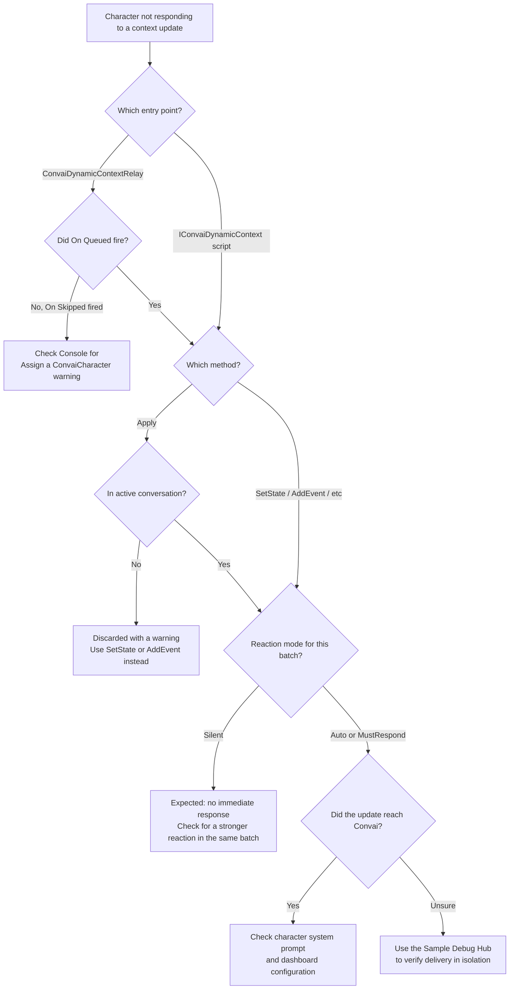

Most Dynamic Context problems in the relay and tracker flow come from one of three categories: a call made before the character entered a conversation, a reaction mode that produced an unexpected response, or a `ConvaiDynamicContextRelay` that cannot resolve a `ConvaiCharacter`. Work through the first-line investigation checklist below — most issues resolve within the first two or three steps.

## First-line investigation



### Check the Unity Console for warnings

Dynamic Context warnings are logged by `ConvaiCharacter` — prefixed with the character's name — and by `ConvaiDynamicContextRelay`. Open the Console (**Window → General → Console**) and look for a warning mentioning `Dynamic context` or `Assign a ConvaiCharacter`.

If you see a warning, find the exact message in the [Console log reference](#console-log-reference) table below and follow the listed fix.



### Isolate the issue with the Sample Debug Hub

Before debugging your own integration, confirm that Dynamic Context itself is working. Import the **LipSync Sample** from Package Manager and open its scene — the sample includes a **Sample Debug Hub** with a **Context** drawer that sends state, event, and attention-object updates to the scene's `ConvaiCharacter` without wiring your own UI.

If the character responds correctly through the Debug Hub, the issue is in your own relay or scripting setup — not in Dynamic Context itself.



### Verify the character reference is resolved

Select the `ConvaiDynamicContextRelay` component in the Inspector.

* **Auto Resolve Character enabled:** confirm that `ConvaiDynamicContextRelay` and `ConvaiCharacter` are on the **same GameObject**.
* **Auto Resolve Character disabled:** confirm that the **Character** field has a reference assigned.

If neither resolves a character, every call fires **On Skipped** and logs `Assign a ConvaiCharacter or enable Auto Resolve Character.`



### Check whether the character was in a conversation

Tracked calls — `SetState`, `SetStates`, `AddEvent`, `RemoveState`, `Reset`, `SetCurrentAttentionObject`, and `ClearCurrentAttentionObject` — stage locally right away, even before a conversation starts. The staged batch reaches Convai automatically once the character becomes ready, so a call made in `Awake()` or `Start()` needs no extra handling.

`Apply()` is the exception: it does not stage. A call made while the character is not in conversation is discarded, and Convai logs `Cannot apply raw dynamic context update: not in conversation`.



### Check the batch window and reaction mode

After a tracked change is staged, the SDK waits `ConvaiCharacter.DynamicContextBatchDelaySeconds` — 0.5 seconds by default — before sending it, so multiple rapid changes collapse into one update. Call `Flush()` on `IConvaiDynamicContext`, or enable **Flush Immediately** on the relay, to send staged changes without waiting.

If the character responded when you expected `Silent` to suppress a reply, another change staged in the same batch window likely requested a stronger reaction — `MustRespond` outranks `Auto`, which outranks `Silent`, for the whole batch.



## Common issues

| Symptom | Likely cause | Fix | Verify |
|---|---|---|---|
| Character never references a state sent via `SetState` | The new value equals the state's current value — `SetState` is a no-op when nothing changed | Confirm the value actually changed; read the current value with `TryGetStateValue` first | `TryGetStateValue` returns the new value after a call with a genuinely different value |
| A call made in `Awake()` or `Start()` seems to have no effect | Expected behavior — tracked calls stage locally and flush automatically once the character becomes ready | No action needed for tracked methods; avoid `Apply()` before a conversation starts, since it does not stage | The state or event appears in the character's response shortly after the conversation begins |
| `ConvaiDynamicContextRelay` fires **On Skipped** instead of **On Queued** | No `ConvaiCharacter` resolved — **Auto Resolve Character** is disabled with no **Character** assigned, or the relay is on the wrong GameObject | Enable **Auto Resolve Character** and place the relay on the NPC's GameObject, or assign **Character** explicitly | **On Queued** fires and the Console shows no `Assign a ConvaiCharacter` warning |
| **On Queued** fires but the character never references the update | An empty state name or a `null` value failed validation after dispatch — **On Queued** confirms dispatch, not that the value was accepted | Check the Console for a validation warning; see the [Console log reference](#console-log-reference) | The update appears in the character's context with no validation warning logged |
| Character does not respond immediately after an update | The reaction requested for that call resolved to `Silent` | Use `Auto` or `MustRespond` — on the relay's **Reaction Mode** field, or as the `reaction` argument on the scripting call | Character references the update in its next turn (`Auto`/`Silent`) or responds immediately (`MustRespond`) |
| `AddEvent` sent through the relay does not use its scripting default of `Auto` | The relay always passes its own **Reaction Mode** field explicitly for every call, overriding the method's scripting default | Set the relay's **Reaction Mode** field to `Auto` or `MustRespond` if the event should trigger a reply | Character reaction matches the relay's configured **Reaction Mode**, not `AddEvent`'s scripting default |
| Character responds even though the call used `Silent` | Another call staged in the same batch window requested `Auto` or `MustRespond` — the strongest reaction in a batch wins for the whole batch | Separate calls that need independent reactions by more than the batch window, or call `Flush()` between them | The batch sends with the reaction you expect |
| `Apply()` appears to have no effect | `Apply()` bypasses the local tracker and does not stage; a call made outside an active conversation is discarded with a warning | Use `SetState`, `AddEvent`, or another tracked method — they stage automatically | The update appears in the character's next response |
| `TryGetStateValue` returns `false` after `Apply()` | `Apply()` never updates the local tracker | Use `SetState` if the value must be readable via `TryGetStateValue` | `TryGetStateValue` returns `true` after switching to `SetState` |
| Character still references initial scenario facts after `Reset()` | Default `Reset()` clears the runtime tracker only — Initial Dynamic Info Text, system prompt facts, and in-session LLM memory are untouched | Call `Reset(removeStatic: true)` to also ask Convai to remove the static initial context for the session | Character no longer references facts that were only present in the static initial context |
| Cannot add a second `ConvaiDynamicContextRelay` to the same GameObject | `[DisallowMultipleComponent]` restriction | Place additional relays on child GameObjects, disable **Auto Resolve Character**, and assign **Character** explicitly | Each relay operates independently on its assigned character |

## `Apply()` discarded my update

`Apply()` is the one Dynamic Context entry point that does not stage. Unlike `SetState`, `AddEvent`, and the other tracked methods, a call made while the character is not in an active conversation is dropped immediately — Convai logs `Cannot apply raw dynamic context update: not in conversation` and does not queue the update for delivery once the conversation starts.


Use `Apply()` only for advanced cases that construct context text externally or combine a context update with an action-config patch. For anything that might run before a conversation starts, use `SetState`, `AddEvent`, or another tracked method — they stage automatically.


`Apply()` also bypasses the local tracker entirely: a value sent through `Apply()` does not update state that `TryGetStateValue` can read. See [`Apply`](dynamic-context-scripting-api.md#apply) in the scripting API reference for the full set of validation warnings.

## `Reset()` left facts in place

Calling `Reset()` with no arguments clears only the runtime Dynamic Context tracker — every tracked state and event. It does not touch three other sources of character knowledge:

* **Initial Dynamic Info Text**, sent once at connection time on `ConvaiCharacter`.
* **System prompt facts** configured on the Convai dashboard.
* **In-session LLM memory** retained by the model across turns.

Call `Reset(removeStatic: true)` to also ask Convai to remove the character's static initial dynamic context for the current session. System prompt facts and in-session memory are still unaffected — no runtime call clears either. See [Static context at connection time](static-context-at-connection-time.md) for how the static initial context is configured.

## Character not responding

The following decision tree covers the full troubleshooting surface for context updates that appear to have no effect.

## Console log reference

The following messages appear in the Unity Console during Dynamic Context operations.

| Message | Source | Meaning | Fix | Verify |
|---|---|---|---|---|
| `Assign a ConvaiCharacter or enable Auto Resolve Character.` | `ConvaiDynamicContextRelay` | No `ConvaiCharacter` resolved for this call. | Enable **Auto Resolve Character** and place the relay on the character's GameObject, or assign **Character** explicitly. | The warning stops appearing and `On Queued` fires instead of `On Skipped`. |
| `Dynamic context state name cannot be empty` | `ConvaiCharacter.DynamicContext` — `SetState`, `SetStates`, `RemoveState` | The state name is blank or whitespace. | Pass a non-empty, non-whitespace state name. | The call no longer logs a warning and the state appears in the character's context. |
| `Dynamic context state '{name}' cannot use a null value` | `ConvaiCharacter.DynamicContext` — `SetState`, `SetStates` | The value passed for `{name}` is `null`. An empty string is allowed; `null` is not. | Pass an empty string instead of `null`, or supply an actual value. | The call no longer logs a warning and `{name}` updates to the intended value. |
| `Cannot set empty dynamic context states` | `ConvaiCharacter.DynamicContext` — `SetStates` | The dictionary passed to `SetStates` is `null` or has no entries. | Pass a dictionary with at least one name/value pair. | The call no longer logs a warning and every passed state appears in the character's context. |
| `Dynamic context event text cannot be empty` | `ConvaiCharacter.DynamicContext` — `AddEvent` | The event text is blank or whitespace. | Pass non-empty event text. | The call no longer logs a warning and the event line appears in the character's context. |
| `Dynamic context attention object cannot be null` | `ConvaiCharacter.DynamicContext` — `SetCurrentAttentionObject` | The attention object argument is `null`. | Pass a `string` object name or a `ConvaiActionObjectDefinition` reference, or call `ClearCurrentAttentionObject` instead. | The call no longer logs a warning and the character references the intended object. |
| `Cannot apply raw dynamic context update: not in conversation` | `ConvaiCharacter.DynamicContext` — `Apply` | The character was not in an active conversation when `Apply` was called. | Use `SetState`, `AddEvent`, or another tracked method for updates that may happen before a conversation starts. | The tracked method call succeeds and the update reaches the character once the conversation is ready. |
| `Connection not ready for {purpose}` | `ConvaiCharacter.DynamicContext` — internal send path | The transport exists, but the connection was not ready when a staged batch, a `Reset`, or an `Apply` call tried to send. `{purpose}` names what was being sent, for example `dynamic context batch`. | Confirm the character is fully connected (`IsInConversation`) before relying on immediate delivery; retry after the connection stabilizes. | The message stops appearing and the batch, reset, or `Apply` call reaches Convai on the next attempt. |

## Scene metadata not sending (fixed in SDK 4.3.0)


SDK 4.3.0 fixed a bug in which pending scene metadata could fail to reach Convai — the CHANGELOG records it as "Fixed pending scene metadata not being flushed." If your project is on SDK 4.3.0 or later, this is not a live symptom. If scene metadata still appears not to reach a character, confirm the SDK package version before treating it as a new issue.


## Next steps


[Relay component reference](relay-component-reference.md)



[Dynamic context scripting API](dynamic-context-scripting-api.md)



[Sync behavior and timing](sync-behavior-and-timing.md)

