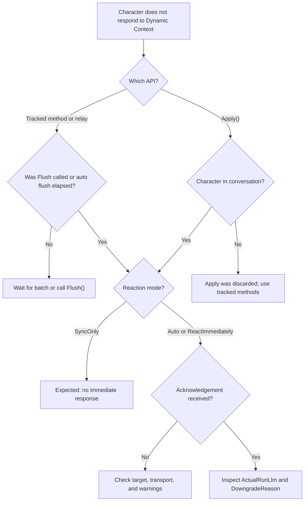

Most Dynamic Context issues come from target resolution, batching expectations, reaction mode, or using raw updates where tracked updates are required. Start with the sample UI, then inspect warnings and acknowledgement events.

## First checks



### Test with the sample UI

Add Packages/<code class="expression">space.vars.sdk_package_id</code>/Prefabs/SampleDynamicContextUI.prefab to the scene, assign the target `ConvaiCharacter`, enter Play mode, and send a known state.

If the character can reference the sample state, Dynamic Context delivery is working and the issue is in your integration code.



### Check target resolution

For `ConvaiDynamicContextRelay`, assign **Character** explicitly or keep **Auto Resolve Character** enabled with the relay on the same GameObject as `ConvaiCharacter`.

If resolution fails, the relay logs:

```text
[ConvaiDynamicContextRelay] Assign a ConvaiCharacter or enable Auto Resolve Character.
```



### Confirm conversation readiness

Tracked methods such as `SetState`, `SetStates`, `AddEvent`, `RemoveState`, and `Reset` can be called before the character is ready. They flush when `CharacterReady` arrives.

`Apply()` is different. It is discarded if the character is not already in conversation.



### Account for batching

Tracked changes do not send immediately. Wait for the automatic batch flush, or call `Flush()` when the character needs the update now.



### Inspect the acknowledgement

Subscribe to `OnDynamicContextUpdateResultReceived` and inspect `Status`, `UpdateId`, `RequestedRunLlm`, `ActualRunLlm`, `DowngradeReason`, token counts, and `RawExtras`.



## Common issues

| Symptom | Likely cause | Fix |
|---|---|---|
| Relay **On Skipped** fires | No target `ConvaiCharacter` resolved | Assign **Character**, or place relay and character on the same GameObject with **Auto Resolve Character** enabled. |
| Character does not reference context at all | Update has not flushed yet, or raw `Apply()` ran before conversation start | Wait for auto flush, call `Flush()`, or replace `Apply()` with tracked methods. |
| Character references context later but not immediately | Reaction mode is `SyncOnly`, or `Auto` did not trigger a response | Use `ReactImmediately` when acknowledgement is required. |
| `TryGetStateValue` returns `false` | State was never tracked, was removed, or was sent through `Apply()` | Use `SetState` or `SetStates` for queryable state. |
| Duplicate event text appears only once | Same event text was added twice inside one pending batch | This is expected. Add distinct event text or send the repeated event in a later batch. |
| Attention object update is ignored | Name does not match active `action_config` objects | Use an authored object name from the active action config, or clear the object list if unrestricted names are intended. |
| Context still contains initial scenario facts after `Reset()` | `Reset()` cleared runtime context only | Use `Reset(removeStatic: true)` for the current session, and check dashboard prompt text separately. |
| Immediate response was requested but did not happen | Convai downgraded or declined the LLM trigger | Inspect `ActualRunLlm`, `DowngradeReason`, `Interrupted`, and `LlmTriggered` in the acknowledgement event. |

## `Apply()` has no effect

`Apply()` bypasses the local tracker and sends directly to transport. It has three consequences:

* It requires an active conversation.
* It does not queue before `CharacterReady`.
* It does not update values returned by `TryGetStateValue`.

Use `Apply()` only when an external system owns the full context text. Use `SetState`, `SetStates`, `AddEvent`, `RemoveState`, and `Reset` for normal Unity state.

## Delayed or missing response

Dynamic Context delivery and character response are separate decisions. A successful context update can still produce no immediate speech when `run_llm` is `false` or when Convai decides not to respond for `auto`.

Use this check:

```csharp
manager.Events.OnDynamicContextUpdateResultReceived += result =>
{
    Debug.Log(
        $"status={result.Status}, " +
        $"requested={result.RequestedRunLlm}, " +
        $"actual={result.ActualRunLlm}, " +
        $"downgrade={result.DowngradeReason}, " +
        $"llm={result.LlmTriggered}");
};
```

If `Status` is successful but `LlmTriggered` is `false`, the context update was applied but did not produce an immediate response.

## Reset did not clear everything

`Reset()` clears the runtime tracker and sends a reset update. It does not edit:

* Serialized initial context fields on `ConvaiCharacter`
* Character prompt text configured on the Convai dashboard
* In-session conversational memory already built during the current session

`Reset(removeStatic: true)` requests removal of static connect-time context for the current session. A later reconnect can still send initial context again if **Keep Initial Dynamic Context** remains enabled.

## Character not responding decision tree



## Warning messages

| Message | Source | Meaning | Fix |
|---|---|---|---|
| `[ConvaiDynamicContextRelay] Assign a ConvaiCharacter or enable Auto Resolve Character.` | `ConvaiDynamicContextRelay` | Relay could not resolve a target character. | Assign **Character** or enable **Auto Resolve Character** on the same GameObject. |
| `[ConvaiCharacter] [name] Dynamic context state name cannot be empty` | `SetState`, `SetStates`, `RemoveState` | State name is blank or whitespace. | Provide a non-empty state name. |
| `[ConvaiCharacter] [name] Dynamic context state '{state}' cannot use a null value` | `SetState`, `SetStates` | State value is `null`. | Use an empty string if the state should be blank. |
| `[ConvaiCharacter] [name] Dynamic context event text cannot be empty` | `AddEvent` | Event text is blank or whitespace. | Provide an event sentence. |
| `[ConvaiCharacter] [name] Cannot apply raw dynamic context update: not in conversation` | `Apply()` | Raw update was called before active conversation. | Use tracked methods or call `Apply()` only after conversation start. |
| `[ConvaiCharacter] [name] Raw dynamic context updates require text unless mode is Reset` | `Apply()` | Raw update has no text and is not a reset. | Provide text, or use `ConvaiDynamicContextUpdateMode.Reset`. |
| `[ConvaiCharacter] [name] Cannot set attention object '{object}': it is not present in the active action_config objects.` | `SetCurrentAttentionObject` | Object name is not in the active action config. | Use a configured object name or update the action config. |

## Next steps


[Sync behavior and timing](sync-behavior-and-timing.md)



[Dynamic context scripting API](dynamic-context-scripting-api.md)

