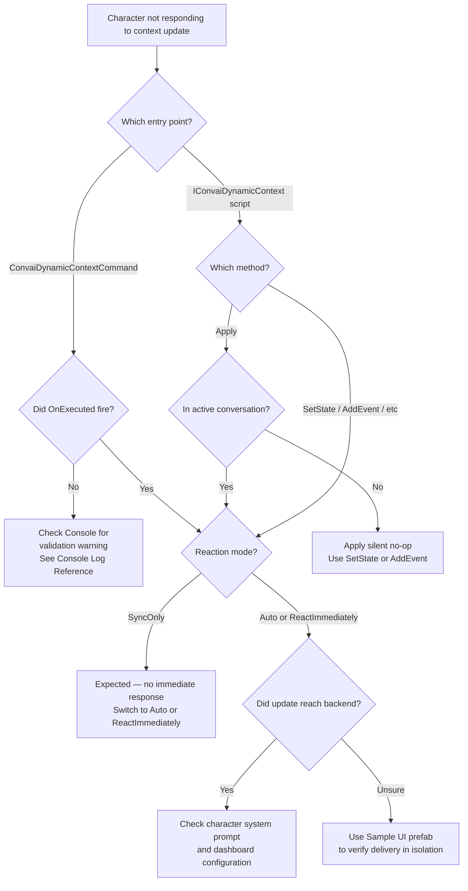

# Troubleshooting & Diagnostics

## Diagnosing Dynamic Context Issues

Most Dynamic Context problems fall into one of three categories: incorrect timing (calling `Apply()` before a conversation starts), a misconfigured component (missing `ConvaiCharacter` reference or empty required field), or a misunderstanding of what `Reset()` clears. This page walks through a first-line investigation checklist, a consolidated symptom table, and detailed guidance for each common issue.

## First-Line Investigation

Work through these steps in order when context updates are not producing the expected character behavior. Most issues resolve at step 2 or 3.



#### Check the Unity Console for warnings

`ConvaiDynamicContextCommand` logs a warning with the full validation message every time `Execute()` is skipped. Open the Console (**Window > General > Console**) and look for messages tagged `[ConvaiDynamicContextCommand]`.

If you see a warning, find the exact message in the Console Log Reference table below and follow the listed fix.



#### Use the Sample UI to isolate the issue

Before debugging your own integration, verify that the Dynamic Context system itself is working by using the SDK's built-in test UI:

**Prefab path:** `Packages/com.convai.convai-sdk-for-unity/Prefabs/SampleDynamicContextUI.prefab`

Drop it into your scene, assign the `ConvaiCharacter`, enter Play Mode, and use the **Set State** button to send a known value. If the character responds correctly through the Sample UI, the issue is in your integration code — not in the Dynamic Context system itself.



#### Verify the character reference is resolved

Select the `ConvaiDynamicContextCommand` component in the Inspector. If the **Target** section shows a yellow warning box, the component cannot find a `ConvaiCharacter`.

* **Auto Resolve Character enabled:** confirm that `ConvaiDynamicContextCommand` and `ConvaiCharacter` are on the **same GameObject**.
* **Auto Resolve Character disabled:** confirm that the **Character** field has a reference assigned.



#### Check whether the character was in conversation

Context updates sent via `Apply()` are silently discarded if the character is not in an active conversation — there is no warning in the Console. If you are calling `Apply()` in `Awake()`, `Start()`, or before the session connects, switch to `SetState` or `AddEvent` instead. These methods queue automatically and are sent when the conversation begins.



#### Check reaction mode

If a context update reached the character but it did not respond immediately, verify the **Reaction** setting.

* `SyncOnly` — context is stored silently. The character incorporates it into its next natural turn. No immediate response is generated. This is expected behavior.
* `Auto` — the server decides whether to respond. For guaranteed immediate response, use `ReactImmediately`.
* `ReactImmediately` — always triggers an immediate LLM turn after the update.



## Common Issues

| Symptom                                                      | Likely cause                                                 | Fix                                                                                                          |
| ------------------------------------------------------------ | ------------------------------------------------------------ | ------------------------------------------------------------------------------------------------------------ |
| Character does not reference context updates at all          | `Apply()` called before conversation started                 | Switch to `SetState` or `AddEvent` — they queue automatically                                                |
| Character does not respond immediately after update          | Reaction mode is `SyncOnly`                                  | Change **Reaction** to `Auto` or `ReactImmediately`                                                          |
| `OnExecutionSkipped` fires instead of `OnExecuted`           | Validation failure — see Console warning                     | Check Console Log Reference for the exact message and fix                                                    |
| Inspector shows yellow warning on the component              | No `ConvaiCharacter` resolved                                | Enable **Auto Resolve** and place both components on the same GameObject, or assign **Character** explicitly |
| `TryGetStateValue` returns `false` after `Apply()`           | `Apply()` bypasses the local tracker                         | Use `SetState` if the value needs to be queryable via `TryGetStateValue`                                     |
| Two `context-update` messages sent for one `SetState` call   | Existing state was updated (expected behavior)               | Not a bug — see Two Messages for One Update                                                                  |
| Character still references facts after `Reset()`             | Initial context or system prompt is not cleared by `Reset()` | See Reset Did Not Clear Everything                                                                           |
| Cannot add a second Command component to the same GameObject | `[DisallowMultipleComponent]` restriction                    | Place additional commands on child GameObjects                                                               |
| `SetStates` list produces a validation warning               | Duplicate state names or empty entries in list               | Remove duplicates; ensure every entry has a non-empty name                                                   |

## Character Does Not Reference Context Updates

When the character appears completely unaware of a state or event you sent, work through the following in order.

**Verify the method used.** `Apply()` is a silent no-op if the character is not in an active conversation. No warning is logged. Replace `Apply()` calls in initialization code with `SetState` or `AddEvent`, which queue automatically and flush when the session opens.

**Verify Execute() was not skipped.** Wire the `ConvaiDynamicContextCommand` **On Execution Skipped** event to a temporary `Debug.Log` call during development. If it fires, the Console shows the exact validation message that caused the skip.

**Verify the update mode.** If reaction mode is `SyncOnly`, the character received the update but will not generate an immediate response — it will reference the new state in its next natural turn. Switch to `Auto` or `ReactImmediately` if immediate acknowledgement is required.

## Apply() Has No Effect

`Apply()` has two behaviors that differ from every other `IConvaiDynamicContext` method:

* **No pre-conversation queue.** If the character is not in an active conversation when `Apply()` is called, the update is discarded immediately — no warning, no queue. Use `SetState`, `AddEvent`, or another tracked method if the call may happen before the session starts.
* **No tracker update.** `Apply()` sends directly to transport without touching the local state tracker. A subsequent call to `TryGetStateValue` for a key sent via `Apply()` returns `false`. If the value needs to be readable via `TryGetStateValue`, use `SetState` instead.


`Apply()` is an advanced escape hatch for external systems that construct their own context text. For all standard context management, prefer the tracked methods — `SetState`, `SetStates`, `AddEvent`, `RemoveState`, and `Reset` — which queue automatically and keep the local tracker consistent.


## Reset Did Not Clear Everything

`Reset()` operates on the **runtime Dynamic Context layer only**. Two sources of character knowledge are outside its scope:

**Initial dynamic info text.** The content of `InitialDynamicInfoText` on `ConvaiCharacter` is sent once at connection time as part of the session request. `Reset()` does not re-send it, and it cannot be cleared by any Dynamic Context operation without ending and restarting the session.

**System prompt.** Facts baked into the character's system prompt on the Convai dashboard are not part of the Dynamic Context layer. No SDK call affects them at runtime.

**In-session LLM memory.** The character's language model retains conversational context across turns within the same session. `Reset()` clears the Dynamic Context tracker and sends a Reset message to the backend, but it does not clear the model's in-session conversational memory.

## Two Messages for One Update

When you call `SetState` on a state that already exists with a different value, two `context-update` RTVI messages are sent in sequence:

1. A **Replace** message carrying the full canonical context with the updated value in place.
2. An **Append** message carrying the human-readable delta: `"Name changed from OldValue to NewValue"`.

This is intentional and non-configurable. The Replace gives the character an authoritative complete picture; the Append gives it a natural way to reference the transition in dialogue. If you are monitoring network traffic during debugging, expect this pattern for every existing-state modification.

See Sync Behavior and Timing — Scenario 2 for the full sequence diagram.

## Cannot Add Multiple Command Components to the Same GameObject

`ConvaiDynamicContextCommand` is marked `[DisallowMultipleComponent]`. Unity prevents a second instance from being added to the same GameObject.

Place each additional command on a **child GameObject** of the NPC. In the **Target** section of each command, disable **Auto Resolve Character** and assign the NPC's `ConvaiCharacter` explicitly — auto resolve only searches the same GameObject.

## Character Not Responding — Decision Tree

## Console Log Reference

The following messages appear in the Unity Console during Dynamic Context operations. Use this table to identify the cause and fix for each.

| Message                                                                                                                    | Source                 | Meaning                                                                    | Fix                                                                                                        |
| -------------------------------------------------------------------------------------------------------------------------- | ---------------------- | -------------------------------------------------------------------------- | ---------------------------------------------------------------------------------------------------------- |
| `[ConvaiDynamicContextCommand] No ConvaiCharacter found on this GameObject. Assign one or disable Auto Resolve Character.` | `Execute()` validation | **Auto Resolve** is on but no `ConvaiCharacter` is on the same GameObject. | Move the command to the NPC's GameObject, or disable **Auto Resolve** and assign **Character** explicitly. |
| `[ConvaiDynamicContextCommand] Assign a ConvaiCharacter or enable Auto Resolve Character.`                                 | `Execute()` validation | **Auto Resolve** is off and **Character** is not assigned.                 | Assign the `ConvaiCharacter` reference, or enable **Auto Resolve**.                                        |
| `[ConvaiDynamicContextCommand] Set State requires a non-empty state name.`                                                 | `Execute()` validation | **State Name** field is blank.                                             | Enter a non-empty state name.                                                                              |
| `[ConvaiDynamicContextCommand] Set States requires at least one state entry.`                                              | `Execute()` validation | **State Entries** list is empty.                                           | Add at least one Name/Value entry.                                                                         |
| `[ConvaiDynamicContextCommand] Each state entry requires a non-empty name.`                                                | `Execute()` validation | One or more **State Entries** have a blank name.                           | Fill in all entry names.                                                                                   |
| `[ConvaiDynamicContextCommand] State entries contain duplicate name '{name}'.`                                             | `Execute()` validation | Two entries in **State Entries** share the same state name.                | Remove or rename the duplicate.                                                                            |
| `[ConvaiDynamicContextCommand] Add Event requires non-empty event text.`                                                   | `Execute()` validation | **Event Text** field is blank.                                             | Enter the event text.                                                                                      |
| `[ConvaiDynamicContextCommand] Remove State requires a non-empty state name.`                                              | `Execute()` validation | **State Name** field is blank.                                             | Enter the name of the state to remove.                                                                     |
| `[ConvaiDynamicContextCommand] Raw Update requires text unless mode is Reset.`                                             | `Execute()` validation | **Raw Text** is empty and **Raw Mode** is not `Reset`.                     | Enter text, or set **Raw Mode** to `Reset`.                                                                |

## What's Next

* Sync Behavior and Timing — the precise rules that govern when and how updates are transmitted.
* Scripting API Reference — method signatures, parameter semantics, and queueing behavior for `Apply()` and all tracked methods.

## Conclusion

The Unity Console validation warnings, the Sample UI prefab, and the decision tree above cover the full troubleshooting surface for Dynamic Context. Start with the Console for an instant diagnosis, use the Sample UI to isolate whether the issue is in your integration or in the SDK, and use the Common Issues table to resolve the most frequent misconfigurations.
