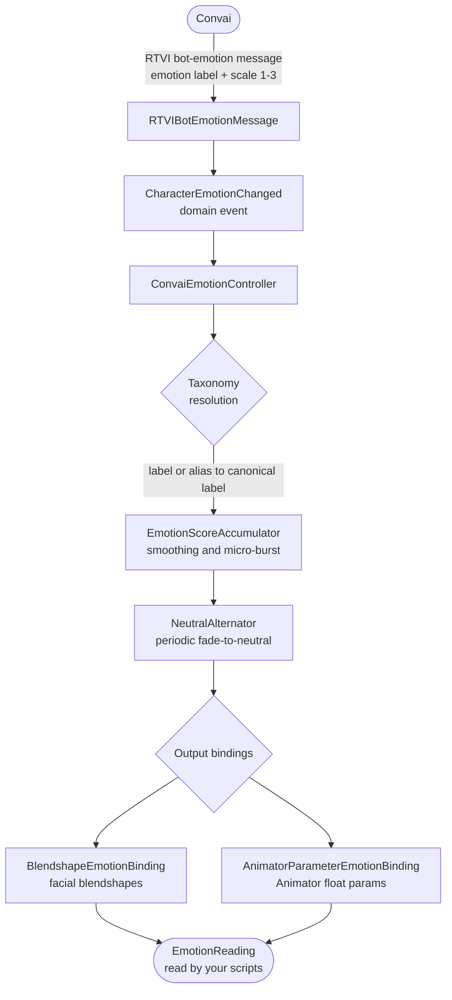

The Convai emotion system translates Convai emotion signals into live facial animation through a Unity-side presentation pipeline. Detection is enabled when the character connects, then `ConvaiEmotionController` resolves, smooths, and writes the result to blendshapes or Animator parameters.

## Enable emotion detection

Emotion detection is controlled by the **Emotion Detection (Connection Request)** section on `ConvaiCharacter`. Unity sends an `emotion_config` only when you choose a provider locally.

| Detection source | Connection request |
| --- | --- |
| `Disabled` | Sends no `emotion_config`. |
| `Llm` | Sends `emotion_config.provider = "llm"`. |
| `Nrclex` | Sends `emotion_config.provider = "nrclex"` with the configured threshold fields. |

There is no dashboard-backed provider mode in the Unity SDK. The character details response does not return an emotion provider, so Unity does not infer this setting from the Convai dashboard.

## How the emotion pipeline works

After detection is enabled, each emotion signal travels through the presentation pipeline:

Convai sends an emotion label, such as `"Joy"` or `"Ecstasy"`, and an intensity on a `1-3` scale. The taxonomy resolves that label to the canonical presentation label used by the profile. For example, `"Joy"` resolves to `joy`, and the higher-intensity label `"Ecstasy"` also resolves to `joy`.

The controller then converts the scale into a normalized score, applies profile smoothing and optional micro-burst, and periodically blends toward neutral when neutral alternation is enabled. The smoothed scores are written to blendshapes and Animator parameters through output bindings.

## Raw state and controller output

The SDK exposes two useful views of emotion state:

| View | Use it for | APIs |
| --- | --- | --- |
| Raw Convai signal | UI labels, analytics, logging, and debugging the incoming event | `ConvaiCharacter.CurrentEmotion`, `ConvaiCharacter.CurrentEmotionIntensity`, `ConvaiCharacter.OnEmotionChanged`, `CharacterEmotionChanged` |
| Controller output | Matching what the face is currently doing after taxonomy resolution and smoothing | `ConvaiEmotionController.CurrentResolvedEmotion`, `ConvaiEmotionController.CurrentNormalizedIntensity`, `ConvaiEmotionController.Current` |

Use the raw signal when you want to show exactly what Convai sent. Use the controller output when UI, gameplay, or debugging should match the visible expression.

## Key concepts

| Concept | What it is |
| --- | --- |
| `ConvaiEmotionController` | The MonoBehaviour that owns the entire pipeline for one NPC. Add one per character. |
| `ConvaiEmotionProfile` | A ScriptableObject asset that holds every tunable parameter: smoothing, micro-burst, neutral alternation, and output slot definitions. |
| `EmotionTaxonomyAsset` | A ScriptableObject that defines the emotion vocabulary, canonical labels, aliases, and mouth influence hints. The built-in default is Plutchik's nine emotions including neutral. |
| Output bindings | `BlendshapeEmotionBinding` and `AnimatorParameterEmotionBinding` map each canonical emotion label to mesh blendshape names or Animator float parameters. |
| `EmotionReading` | An immutable snapshot of the current emotional state: dominant label, dominant score, all scores, and mouth influence hint for LipSync. Available every frame via `ConvaiEmotionController.Current`. |
| Micro-burst | A short overshoot applied when a new emotion arrives, giving expressions a punchy entry before settling to their sustained level. |
| Neutral alternation | A timer that periodically fades the active expression toward neutral and back, preventing the character's face from locking into a single pose during long turns. |
| `ConvaiCharacterEventRelay` | An Inspector-friendly component that exposes emotion change callbacks as Unity Events — no code required. |

## Component placement

| Component | Where to place it | Notes |
| --- | --- | --- |
| `ConvaiEmotionController` | On the NPC's root GameObject, alongside the Embodiment component | One per character |
| `ConvaiEmotionProfile` | Anywhere in your `Assets/` folder as a ScriptableObject asset | Shared across multiple NPC prefabs if needed |
| `EmotionTaxonomyAsset` | Anywhere in your `Assets/` folder | Optional — omit to use the built-in Plutchik set |
| `ConvaiCharacterEventRelay` | On any GameObject in the scene | Auto-resolves `ConvaiCharacter` on the same GameObject; drag a different character if needed |

## Next steps


[Emotion quick start](quick-start.md)



[Emotion profile](emotion-profile.md)



[Emotion scripting API](scripting-api.md)

