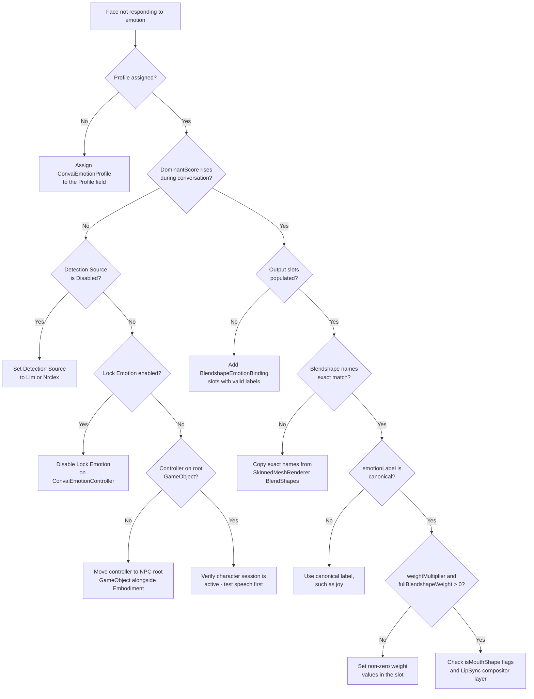

Most emotion problems fall into one of three categories: no visual output at all, scores updating but no face movement, or event and scripting callbacks not firing. Start by watching `Current.DominantScore` in Play Mode — this one signal identifies whether the issue is in the signal path or the output bindings.

## Inspecting live state

`ConvaiEmotionController` exposes the full pipeline state in the Inspector during Play Mode without any additional tooling.

| What to watch | Where to find it | What it tells you |
| --- | --- | --- |
| **Current → Dominant Label** | `ConvaiEmotionController` Inspector in Play Mode | Which canonical emotion is currently dominant. `"neutral"` means no active signal. |
| **Current → Dominant Score** | `ConvaiEmotionController` Inspector in Play Mode | Smoothed intensity `[0-1]` of the dominant emotion. A value above `0` confirms the pipeline is receiving and processing Convai signals. |
| **Lock Emotion** checkbox | `ConvaiEmotionController` Inspector (any mode) | When ticked, Convai signals are ignored. The character holds the locked expression. |

To preview blendshape slot mappings without entering Play Mode, enable **Lock Emotion**, set **Locked Emotion Label** to a canonical label, and set **Locked Intensity** to `1.0`. Because `ConvaiEmotionController` inherits `[ExecuteAlways]` from its base class, blendshapes update immediately in the Scene view — no Play Mode required.


**Lock Emotion** is a serialised field. Its value is saved with the scene or prefab. Always disable it before building for production — a serialised `true` silently disables all live emotion response in the shipped build.


## First-line investigation

Work through this checklist in order when emotion is not behaving as expected. Most issues resolve at step 1 or 2.



### Check the Profile field

Select your NPC's root GameObject. On the `ConvaiEmotionController` component, confirm the **Profile** field is not empty.

- **Empty** → Drag in a `ConvaiEmotionProfile` asset. For a quick test, use the bundled `ConvaiSamplesShared_EmotionProfile` from `Packages / Convai SDK for Unity / SamplesShared / Resources / Embodiment / Modules / Emotion`. The pipeline will not run without a profile.
- **Assigned** → Continue to the next step.



### Watch DominantScore in Play Mode

Press **Play**, speak to the character, and observe **Current → Dominant Score** on the `ConvaiEmotionController` Inspector.

- **Score rises above `0`** -> The pipeline is receiving Convai signals. The problem is in the output bindings. Skip to step 4.
- **Score stays at `0`** -> The controller is not receiving emotion signals. Continue to step 3.



### Check detection, Lock Emotion, and component placement

These causes prevent signals from reaching the accumulator:

1. **Detection Source is `Disabled`** -> Select the `ConvaiCharacter` and set **Detection Source** to `Llm` or `Nrclex`.
2. **Lock Emotion is ticked** -> Disable it. The controller discards all Convai events while locked.
3. **Component is on the wrong GameObject** -> `ConvaiEmotionController` must be on the **same root GameObject** as the Embodiment component. On a child object or a different NPC, it will not receive emotion events from the correct character session.

If neither applies, verify the character is actively connected — it should respond to speech in the Console before emotion signals can arrive.



### Check output slot population

Open the `ConvaiEmotionProfile` asset. If both the **Blendshape Binding** and **Animator Binding** lists are empty, the pipeline runs internally but writes nowhere — `DominantScore` updates, but no face movement occurs.

Add at least one `EmotionSlotBinding` with a valid `emotionLabel` and a blendshape name or Animator parameter that exists on your character. See [Emotion output bindings](output-bindings.md).



### Verify blendshape names and slot labels

If `DominantScore` updates but the face still does not move:

1. Select your character's mesh GameObject → Inspector → **Skinned Mesh Renderer** → expand **BlendShapes**.
2. Copy the exact blendshape name into your slot's **Blendshape Names** field. Names are **case-sensitive**.
3. Confirm the slot's **Emotion Label** field uses a canonical taxonomy label, such as `joy`. The binding matches against canonical labels; aliases do not resolve here.




After completing the checklist, if **Current → Dominant Score** rises above 0 during conversation and blendshapes move, the pipeline is healthy.


## Common issues quick reference

| Symptom | Likely cause | Fix |
| --- | --- | --- |
| **Face does not move; DominantScore stays at 0** | No profile assigned | Assign a `ConvaiEmotionProfile` to the **Profile** field |
| **Face does not move; DominantScore stays at 0** | **Detection Source** is `Disabled` | Set **Detection Source** to `Llm` or `Nrclex` on `ConvaiCharacter` |
| **Face does not move; DominantScore stays at 0** | Lock Emotion is enabled | Disable **Lock Emotion** on `ConvaiEmotionController` |
| **Face does not move; DominantScore stays at 0** | Component on wrong GameObject | Move `ConvaiEmotionController` to the NPC's root GameObject, alongside the Embodiment component |
| **DominantScore updates but face unchanged** | Output slots are empty | Add at least one slot with a valid emotion label and blendshape name to the profile |
| **DominantScore updates but face unchanged** | Blendshape name mismatch | Copy the exact name from **Skinned Mesh Renderer → BlendShapes**; names are case-sensitive |
| **DominantScore updates but face unchanged** | Slot `emotionLabel` uses an alias instead of a canonical label | Use the canonical label, such as `joy`, in the slot's **Emotion Label** field |
| **DominantScore updates but face unchanged** | `weightMultiplier` or `fullBlendshapeWeight` is 0 | Set both to non-zero values in the slot |
| **Specific emotion never appears; character stays neutral** | Convai label not in taxonomy; warning fallback to neutral | Add the label as an alias to the nearest canonical entry in a custom taxonomy |
| **LipSync stops working during speech** | Non-mouth blendshapes marked `isMouthShape = true` | Set `isMouthShape = false` for brow, eye, cheek, and upper-face shapes |
| **Character holds one expression throughout the session** | `lockEmotion` serialised as `true` in scene or prefab | Disable **Lock Emotion**; save the scene (**Ctrl+S** / **Cmd+S**) |
| **No emotion response in production build** | `lockEmotion` left enabled before building | Disable **Lock Emotion** before building; verify per-prefab-instance in the Inspector |
| **Profile changes revert after reopening the project** | Editing the bundled read-only package asset | Duplicate the asset (**Ctrl+D** / **Cmd+D**), move the copy to `Assets/`, assign the copy |
| **`OnEmotionChanged` on `ConvaiCharacterEventRelay` never fires** | Character reference not resolved | Enable **Auto Resolve Character**, or assign `ConvaiCharacter` in the **Character** field |
| **`[EmotionTaxonomyAsset]` warning in Console** | Custom taxonomy has no neutral entry, or multiple neutral entries | Set `IsNeutral = true` on exactly one taxonomy entry |

## Unknown labels fall back to neutral

**Symptom:** An emotion Convai sends never appears on the character. The face returns to neutral.

**Cause:** When Convai sends a label that does not match any canonical label or alias in the active taxonomy, `TryResolve` returns `false`. `ConvaiEmotionController` logs `[ConvaiEmotionController] Unknown backend emotion label ...` and uses the neutral descriptor. The pipeline continues normally, writing neutral scores every frame.

**How to detect it:**

1. In Play Mode, check the Unity Console for `[ConvaiEmotionController] Unknown backend emotion label ...`.
2. Expand **Current → All Scores** on the `ConvaiEmotionController` Inspector. If an emotion you expect to see has a score of exactly `0.0`, the incoming label is likely not resolving.
3. Enable `lockEmotion` in the Inspector, set **Locked Emotion Label** to the canonical label you expect, such as `anticipation`, and confirm the blendshape slot activates. If it does, the output binding is correct and the incoming label needs a taxonomy alias.

**Fix:** Open your custom taxonomy asset, or create one if using the built-in default, and add the expected label as an alias to the nearest semantic match. For example, if a custom provider sends `"excited"` and it should map to the visual slot for `anticipation`, add `"excited"` to the **Aliases** list of the `anticipation` entry. See [Emotion taxonomy](emotion-taxonomy.md) for how to create and assign a custom taxonomy.

**Verify:** In Play Mode, watch **Current → Dominant Label** and **Current → All Scores**. The expected emotion should now score above `0` when Convai sends the previously unresolved label.

## Blendshape names do not match

**Symptom:** `Current.DominantScore` updates correctly in Play Mode, but the character's face does not visually change.

**Cause:** The blendshape name in the `EmotionSlotBinding` does not exactly match the name on the `SkinnedMeshRenderer`.

**Fix:**

1. Select your character's mesh GameObject in the Hierarchy.
2. In the Inspector, scroll to the **Skinned Mesh Renderer** component.
3. Expand the **BlendShapes** section.
4. Copy the exact name from there into your slot's **Blendshape Names** field. Names are case-sensitive and must match exactly — including underscores, spaces, and capitalisation.

**Verify:** In Play Mode, watch the blendshape value in the Inspector on the `SkinnedMeshRenderer`. It should change when `DominantScore` rises.


If the character has multiple `SkinnedMeshRenderer` components (body, head, and teeth as separate meshes), the blendshape binding targets the mesh registered with the Embodiment compositor. Confirm which mesh your Embodiment component's rig binding references before copying names.


## LipSync breaks when emotion is active

**Symptom:** While the character is speaking, LipSync-driven mouth shapes stop working, or emotion shapes suppress phoneme shapes unexpectedly.

**Cause:** One or more blendshape slots have `isMouthShape = true` for shapes that deform brows, eyes, or cheeks rather than the lips or jaw. These shapes are routed through the mouth compositor layer — the same layer LipSync writes to during speech — which causes them to interfere with phoneme output.

**Fix:** Open the `ConvaiEmotionProfile` asset. In every **Blendshape Binding** slot, set `isMouthShape = true` **only** for shapes that deform the lips, jaw, or chin. Brow raises, eye squints, cheek puffs, and upper-face shapes should have `isMouthShape = false`.

**Verify:** In Play Mode, speak to the character — mouth shapes should animate correctly during speech while emotion-driven brow and eye shapes continue to update simultaneously.

## Expressions frozen — character ignores conversation

**Symptom:** The NPC holds a single expression throughout the session and never reacts to AI emotion signals.

**Cause:** `lockEmotion` is serialised as `true` in the scene or prefab — a common authoring artefact left over from Inspector preview.

**Fix:**

1. Select the NPC's root GameObject.
2. On `ConvaiEmotionController`, disable **Lock Emotion**.
3. Save the scene (**Ctrl+S** / **Cmd+S**).

If you have multiple NPC prefabs, check each one individually — the field persists per-prefab-instance unless explicitly overridden.

**Verify:** In Play Mode, **Current → Dominant Label** should change as the conversation develops.


Always verify **Lock Emotion** is `false` before building for production. A serialised `true` value will silently disable all live emotion response in the shipped build with no runtime error.


## Profile changes are not saving

**Symptom:** You edit settings on the Emotion Profile asset, but the changes revert on reopening the project or returning to the Inspector.

**Cause:** You are editing the bundled read-only asset inside the package. Assets inside a Unity package cannot be modified.

**Fix:**

1. Select `ConvaiSamplesShared_EmotionProfile` in the Project window.
2. Duplicate it (**Ctrl+D** / **Cmd+D**).
3. Move the copy into your own `Assets/` folder.
4. On the `ConvaiEmotionController`, assign the copy instead of the original.

**Verify:** Edit a value on the copy and reopen the Inspector — the change should persist.

## ConvaiCharacterEventRelay OnEmotionChanged does not fire

**Symptom:** You wired a Unity Event to **On Emotion Changed** on `ConvaiCharacterEventRelay`, but it never fires in Play Mode.

**Checklist:**

1. **Character reference:** Either **Auto Resolve Character** is enabled and a `ConvaiCharacter` is on the same GameObject, or you have manually assigned a `ConvaiCharacter` in the **Character** field. If neither is true, the relay logs a configuration warning and stays inactive.
2. **Component enabled:** Confirm the `ConvaiCharacterEventRelay` component is enabled (the checkbox in the Inspector header is ticked).
3. **Subscription timing:** The relay fires only after the Convai session is established. Subscribe in `OnEnable` and unsubscribe in `OnDisable` to catch all events from the moment the component activates.
4. **Session active:** Confirm the character responds to speech normally before testing emotion callbacks.

**Verify:** Speak to the character in Play Mode — the UI or callback target should update as each new emotion signal arrives.

## Emotion scores visible but no output binding written

**Symptom:** `ConvaiEmotionController.Current.DominantScore` updates correctly in Play Mode, but neither blendshapes nor Animator parameters change.

**Checklist:**

1. Confirm the **Blendshape Binding** or **Animator Binding** list in the profile is not empty.
2. Confirm the `emotionLabel` in each slot matches a canonical taxonomy label, such as `joy`.
3. For Animator bindings, confirm the parameter name exists as a **Float** in the Animator Controller and that the Animator component is on the same GameObject as `ConvaiEmotionController`.
4. Confirm `weightMultiplier` is greater than 0 and `fullBlendshapeWeight` is greater than 0 in each slot.

**Verify:** Lock the emotion to a canonical label in the Inspector and confirm the blendshape or Animator parameter responds — this isolates the issue to the binding configuration rather than the signal path.

## Console log reference

The following messages appear in the Unity Console from the Emotion system.

| Log message | Component | Meaning |
| --- | --- | --- |
| `[ConvaiEmotionController] Ignored an emotion event without a character id. Character-scoped emotion events must include a character id to avoid cross-character expression bleed.` | `ConvaiEmotionController` | An emotion event arrived with no character ID. Common in multi-NPC scenes where events are broadcast globally. Ensure each NPC has a unique **Character ID** set on its `ConvaiCharacter` component. Logged once per controller lifetime. |
| `[ConvaiEmotionController] Unknown backend emotion label 'X'. Falling back to neutral. Add it as a taxonomy alias if this label is expected.` | `ConvaiEmotionController` | Convai sent a label that is not in the active taxonomy. Add the label as an alias in a custom taxonomy if it is expected. |
| `[EmotionTaxonomyAsset] No entry marked neutral; synthesized 'neutral' fallback. Mark exactly one entry as the neutral baseline to suppress this warning.` | `EmotionTaxonomyAsset` | A custom taxonomy asset has no entry with **IsNeutral** = true. The system synthesizes a fallback neutral so the pipeline runs. Set `IsNeutral = true` on exactly one entry to suppress the warning. |
| `[EmotionTaxonomyAsset] No entry has IsNeutral set. A synthetic 'neutral' will be used at runtime; mark one entry as the neutral baseline.` | `EmotionTaxonomyAsset` | Same as above — fired in the Inspector (`OnValidate`) when you save the taxonomy asset in Edit Mode. Fix by marking one entry as the neutral baseline. |
| `[EmotionTaxonomyAsset] N entries are marked IsNeutral; only the first will be used. Mark exactly one neutral baseline.` | `EmotionTaxonomyAsset` | Multiple taxonomy entries have **IsNeutral** = true. Only the first is used. Remove the `IsNeutral` flag from all but one entry. |


Unknown labels produce a `ConvaiEmotionController` warning and fall back to neutral. If an expected emotion never appears on the character, see [Unknown labels fall back to neutral](#unknown-labels-fall-back-to-neutral).


## Expressions not responding — decision tree


[Emotion output bindings](output-bindings.md)



[Emotion taxonomy](emotion-taxonomy.md)

