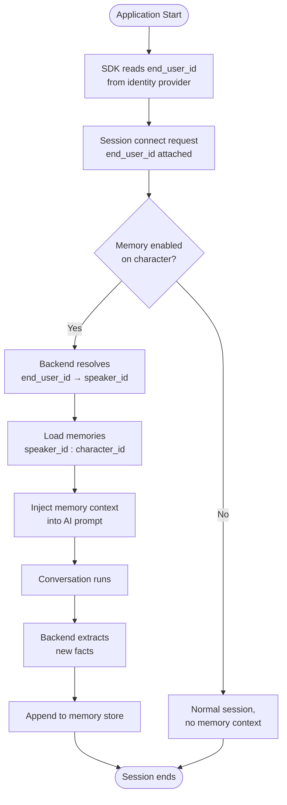

# Long-Term Memory

## Persistent Character Memory Across Sessions

Long-Term Memory (LTM) gives Convai characters the ability to remember facts about individual users between separate play sessions. Rather than starting every conversation from scratch, a character with LTM enabled can recall previous exchanges, adapt its behaviour over time, and build a relationship with each player.

Memory is stored on the Convai backend, partitioned per user and per character, and automatically injected into the AI's context at the start of each new session. The SDK's role is to send a stable user identifier on every connection, then surface a scripting API for applications that need programmatic control over what is remembered.

## How It Works

When a session starts, the SDK sends an `end_user_id` to the Convai server alongside the normal connect request. The server resolves that identifier to an internal speaker record, then looks up any memories stored under the key `speaker_id:character_id`. If memory is enabled for the character, those memories are injected into the AI context before the first response is generated.

At the end of the conversation, the backend extracts new facts from the exchange and appends them to the memory store. This cycle repeats every session, growing the character's knowledge of each individual user organically.

## Key Concepts

| Concept                     | Description                                                                                                                                                                     |
| --------------------------- | ------------------------------------------------------------------------------------------------------------------------------------------------------------------------------- |
| **end\_user\_id**           | A stable string identifier that your application supplies for each end user. Sent to the Convai server on every connect. Defaults to the device identifier or a persisted GUID. |
| **Memory partition**        | The server-side storage bucket for a specific user–character pair, keyed internally as `speaker_id:character_id`. All memories for that pair live here.                         |
| **MemoryRecord**            | A single fact stored in the partition. Has an `Id`, a `Memory` string (the natural-language fact text), timestamps, and an optional metadata dictionary.                        |
| **End-user metadata**       | Arbitrary key–value data your application can attach to a user at connect time (name, role, locale, etc.). Stored on the server and available via the scripting API.            |
| **DeviceEndUserIdProvider** | The default identity provider. Uses the device's unique identifier in player builds and a persisted GUID in the Unity Editor. Requires no configuration.                        |
| **MemoryService**           | The REST API service exposed on `ConvaiRestClient.Memory`. Provides add, list, get, and delete operations on memory records.                                                    |
| **EndUsersService**         | The REST API service exposed on `ConvaiRestClient.EndUsers`. Provides list, get, update metadata, and delete operations on end-user records.                                    |

## In This Section

<table data-view="cards"><thead><tr><th></th><th></th></tr></thead><tbody><tr><td><strong>Quick Start</strong></td><td>Enable memory on a character and verify cross-session recall without writing any code.</td></tr><tr><td><strong>End-User Identity</strong></td><td>How end users are identified across sessions and how to supply your own identifier.</td></tr><tr><td><strong>Enabling Memory on Characters</strong></td><td>Turn Long-Term Memory on or off via the Convai dashboard or the scripting API.</td></tr><tr><td><strong>Memory Management API</strong></td><td>Add, list, retrieve, and delete individual memory records programmatically.</td></tr><tr><td><strong>End-User Management</strong></td><td>Browse and manage end-user records using the editor tool or the scripting API.</td></tr><tr><td><strong>Usage Examples</strong></td><td>Complete code examples for common Long-Term Memory scenarios.</td></tr><tr><td><strong>Troubleshooting &#x26; Diagnostics</strong></td><td>Diagnose why memories are not persisting, resolve identity problems, and fix API errors.</td></tr></tbody></table>

## Conclusion

Long-Term Memory connects natural conversation to persistent user history — the character accumulates knowledge automatically, and the SDK gives you programmatic control when you need it. Start with Quick Start to enable memory on a character and see it working end to end.
