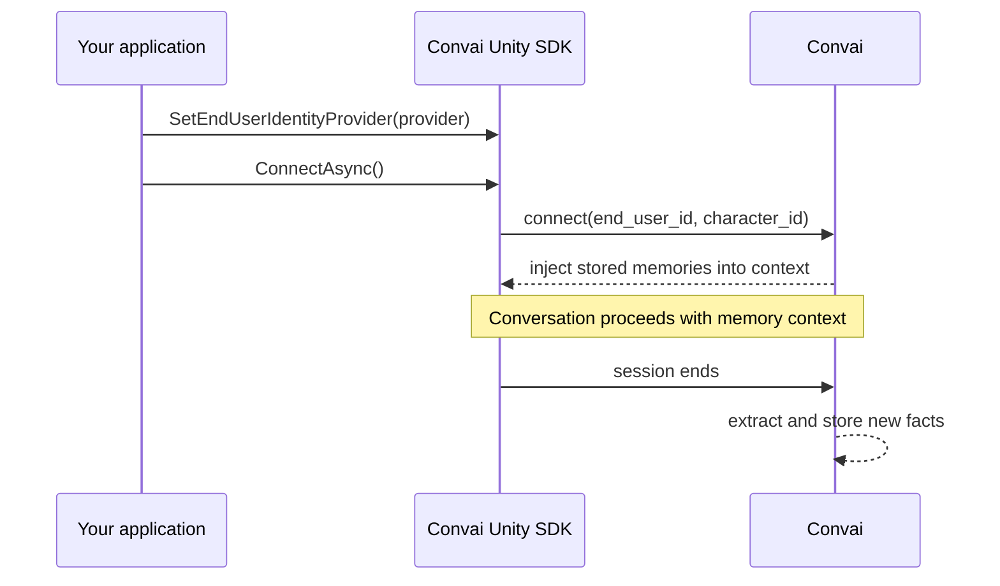

Long-term memory (LTM) is designed to give Convai characters a per-user knowledge store across conversation sessions. This page describes the expected service workflow and the Unity identifiers involved.


Unity SDK 4.5 source verifies that connection requests carry end-user and character IDs and that the REST models expose memory records. It does not prove backend extraction, recall timing, isolation, deduplication, or deletion. Treat the lifecycle below as expected product behavior and verify it with live staging sessions.


## Session lifecycle

The expected backend flow has four stages:



**Connect:** The SDK sends the `end_user_id` and `character_id` at session start. In a live validation, check whether the service makes expected records available to the conversation and when that happens.

**Conversation:** The expected experience is that the character can use recalled facts. Storage timing and any session buffering are backend behavior and require live verification.

**Session end:** The service may extract selected information into natural-language `MemoryRecord` entries. Verify eligibility and processing timing by querying the Memory API after a completed staging session.

**Next connect:** Use a second live session with the same identifiers to verify whether the expected records are recalled.

## Memory scoping

Memory API calls are keyed by one user-character pair:

```text
end_user_id  +  character_id  →  set of MemoryRecord entries
```

The Unity REST client sends both IDs for memory operations. Test distinct users and distinct characters in staging to verify backend isolation; Unity source alone cannot guarantee that service boundary.

The `end_user_id` is supplied by your `IEndUserIdentityProvider` or the default `DeviceEndUserIdProvider`. If it changes, the request carries a different key. Verify the resulting backend record and recall behavior with live queries.

## Memory records

Each stored fact is a `MemoryRecord` with a natural-language `Memory` string and an auto-assigned `Id`.

Example `Memory` values:
- `"The user's name is Jordan."`
- `"Jordan completed confined-space entry certification on 2025-03-12."`
- `"Jordan prefers step-by-step explanations over summaries."`

The `Memory` field is a natural-language string. Its wording and how a character uses it are backend-generated behavior.

## Deduplication

`MemoryAddResult.Event` can report values such as `"add"` or `"update"`. The semantic deduplication policy is backend behavior: submit overlapping facts in staging, inspect the returned event and record set, and do not assume that every similar phrase updates an existing record.

## What LTM does not do

Understanding the limits of LTM prevents incorrect assumptions:

- **Do not assume recall timing.** Validate when records become available to a conversation in the live service.
- **Do not assume every spoken detail is stored.** Extraction selection is a backend policy.
- **Do not assume cross-character sharing or isolation without a test.** Query and converse with distinct character IDs in staging.
- **LTM is not enabled by default.** Memory is disabled (`MemorySettings.IsEnabled = false`) until you explicitly enable it on the Convai dashboard or via the scripting API.

## Next steps


[Long-term memory quick start](quick-start.md)



[End-user identity](end-user-identity.md)

