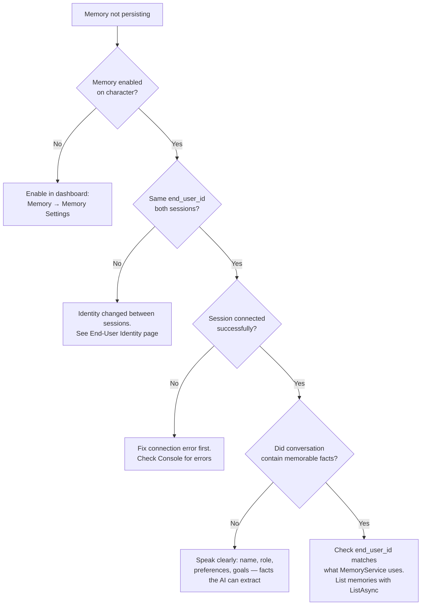

# Troubleshooting & Diagnostics

## Diagnosing and Resolving Long-Term Memory Problems

Most Long-Term Memory problems fall into one of three categories: memories are not persisting between sessions, the wrong user is receiving memories, or API calls are failing. This page provides a structured checklist, a decision tree for the most common failure path, and a reference table for every known issue.

## First-Line Investigation

Work through this checklist before diving into specific symptoms. The majority of problems resolve at step 1 or 2.



**Confirm memory is enabled on the character**

Open the [Convai dashboard](https://convai.com), select the character, and navigate to **Memory → Memory Settings**. Verify the **Long-Term Memory** toggle is on.

Memory is **off by default**. Nothing is stored or recalled unless you explicitly enable it. This is the single most common cause of LTM appearing not to work.



**Verify the end\_user\_id is stable between sessions**

Add a temporary `Debug.Log` to confirm the same `end_user_id` is sent on every session:

```csharp
using Convai.Runtime.Identity;
using UnityEngine;

public class IdentityDebugger : MonoBehaviour
{
    private void Awake()
    {
        string id = new DeviceEndUserIdProvider().GetEndUserId();
        Debug.Log($"[LTM] end_user_id for this session: {id}");
    }
}
```

Run Play Mode twice and compare the logged ID. If the ID changes between sessions, memories will not carry over — see End-User Identity to understand why and how to fix it.



**Check that the session is connecting successfully**

Long-Term Memory requires an active Convai session. If `ConvaiManager` fails to connect — wrong API key, no internet, server unreachable — the character cannot receive memory context regardless of what is stored on the backend.

Open the Unity Console and look for connection errors from `ConvaiManager`. Resolve those before investigating memory issues.



## Memory Not Persisting — Decision Tree



## Common Issues

| Symptom                                                  | Likely Cause                                            | Fix                                                                                                                                                             |
| -------------------------------------------------------- | ------------------------------------------------------- | --------------------------------------------------------------------------------------------------------------------------------------------------------------- |
| Character never recalls anything                         | Memory disabled on character                            | Enable in Convai dashboard: **Memory → Memory Settings → Long-Term Memory**                                                                                     |
| Memory works in Editor but not in player build           | Different device identifier in player build             | Expected — player builds use `SystemInfo.deviceUniqueIdentifier`. Test on the same device.                                                                      |
| All devices share the same character memories            | Same `end_user_id` for all users                        | Each user needs a distinct identifier. Implement a custom `IEndUserIdentityProvider`. See End-User Identity.                                                    |
| After reinstall, player has no memories                  | `PlayerPrefs` GUID cleared on reinstall                 | Expected for the GUID fallback. Use a server-backed identity (account ID) for persistent cross-install memory.                                                  |
| Memories from Play Mode appear in production build       | Editor and production share the same character ID       | Use a separate character ID for development/testing so editor test data does not contaminate production memory.                                                 |
| Character recalls old memories that should be gone       | `DeleteAllAsync` not called before re-enabling          | Call `MemoryService.DeleteAllAsync(characterId, endUserId)` to clear the partition.                                                                             |
| `end_user_id` is null in logs                            | Identity provider returning empty string                | `DeviceEndUserIdProvider` falls back to a GUID — it never returns null. If you are using a custom provider, ensure `GetEndUserId()` returns a non-empty string. |
| API call throws 401 Unauthorized                         | Invalid or missing API key                              | Verify the key in **Tools → Convai → Configuration**. Ensure `ConvaiSettings.Instance.ApiKey` is not empty at runtime.                                          |
| API call throws 404 Not Found                            | Wrong character ID or end user ID                       | Confirm the character ID from the `ConvaiCharacter` Inspector. Confirm the `end_user_id` from a `Debug.Log` before calling the API.                             |
| `AddAsync` returns `Event = "NONE"`                      | Fact is a duplicate of an existing memory               | The server deduplicates. The fact is already stored — no action needed.                                                                                         |
| `ListAsync` returns empty list                           | No memories stored yet, or different end\_user\_id used | Verify the `end_user_id` matches what the session sends. Memories are only created after at least one conversation session.                                     |
| End-user list in editor tool is empty                    | No users have connected yet, or API key invalid         | Speak to a memory-enabled character in Play Mode first to create a user record, then click Refresh.                                                             |
| Disabling memory still returns old memories next session | Memories persist after disabling                        | Disabling memory stops new accumulation but does not delete existing records. Call `DeleteAllAsync` before disabling if a clean slate is needed.                |

## Runtime Diagnostics

### Verifying What the Character Knows

List all memory records for a user–character pair to confirm what has been stored:

```csharp
using System;
using System.Threading;
using Convai.RestAPI;
using Convai.RestAPI.Internal;
using UnityEngine;

public class MemoryDiagnostics : MonoBehaviour
{
    [SerializeField] private string _characterId;

    private ConvaiRestClient _client;

    private void Awake()
    {
        _client = new ConvaiRestClient(ConvaiSettings.Instance.ApiKey);
    }

    private void OnDestroy()
    {
        _client?.Dispose();
    }

    [ContextMenu("Dump All Memories")]
    public async void DumpAllMemories()
    {
        string endUserId = new Convai.Runtime.Identity.DeviceEndUserIdProvider().GetEndUserId();
        Debug.Log($"[LTM Diagnostics] end_user_id: {endUserId}");

        try
        {
            int page = 1;
            int total = 0;

            do
            {
                MemoryListResponse response = await _client.Memory.ListAsync(
                    _characterId, endUserId, page, pageSize: 50);

                foreach (MemoryRecord record in response.Memories)
                {
                    Debug.Log($"  [{record.Id[..8]}...] {record.Memory}");
                    total++;
                }

                if (!response.HasMore) break;
                page++;

            } while (true);

            Debug.Log($"[LTM Diagnostics] Total memories: {total}");
        }
        catch (Exception e)
        {
            Debug.LogError($"[LTM Diagnostics] {e.Message}");
        }
    }
}
```

Add this component to any GameObject in your scene. Right-click the component header in the Inspector and select **Dump All Memories** to log every stored fact to the Console without entering Play Mode.

### Checking Memory Settings Programmatically

```csharp
[ContextMenu("Check Memory Enabled")]
public async void CheckMemoryEnabled()
{
    try
    {
        bool enabled = await _client.Characters.GetMemoryEnabledAsync(_characterId);
        Debug.Log($"[LTM Diagnostics] Memory enabled for {_characterId}: {enabled}");
    }
    catch (Exception e)
    {
        Debug.LogError($"[LTM Diagnostics] {e.Message}");
    }
}
```

## API Error Reference

| HTTP Status             | Likely Cause                                          | Fix                                                                               |
| ----------------------- | ----------------------------------------------------- | --------------------------------------------------------------------------------- |
| `401 Unauthorized`      | API key missing, expired, or incorrect                | Re-enter your API key under **Tools → Convai → Configuration**                    |
| `403 Forbidden`         | API key does not have permission for this character   | Ensure the character belongs to the same Convai account as the API key            |
| `404 Not Found`         | `characterId` or `memoryId` does not exist            | Log and verify the IDs before calling the API                                     |
| `429 Too Many Requests` | Rate limit exceeded                                   | Back off and retry; avoid calling memory APIs in tight loops                      |
| Network exception       | No internet connection, or Convai backend unreachable | Check connectivity; implement retry logic with exponential backoff for production |

## Conclusion

Start with the first-line checklist — memory enabled on the character and a stable `end_user_id` resolve the vast majority of issues. Use the `DumpAllMemories` diagnostic to confirm what the server actually has stored, and cross-reference the Common Issues table for any specific symptom. If the problem persists after working through this guide, the API error reference provides the mapping from HTTP status codes to actionable fixes.
