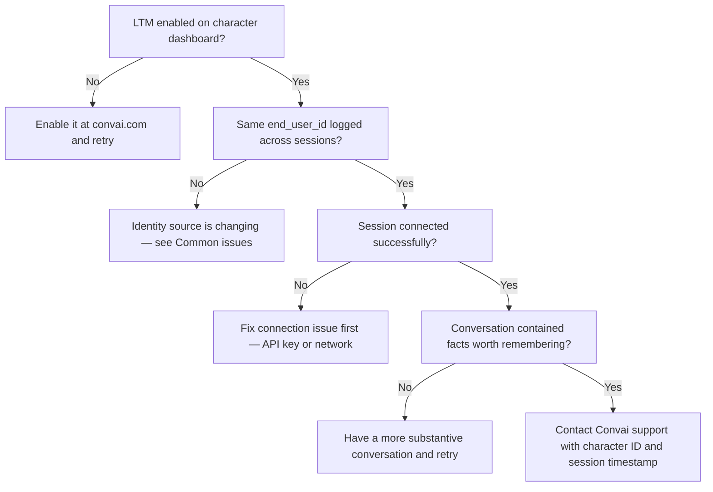

Most LTM issues fall into three categories: identity changes, unexpected live backend behavior, and REST calls failing with HTTP errors. Work through the diagnostic flow below before consulting the reference tables.


Unity SDK source can confirm which IDs and requests the client produces. Extraction, recall, deduplication, MAU accounting, and deletion are backend behavior; reproduce them with live staging sessions and record IDs and timestamps for support.


***

## First-line investigation

Before checking anything else, run through these three steps in order:

**1. Confirm memory is enabled for the character**

Sign in at [convai.com](https://convai.com), open the character, and verify the **Memory** tab shows **Long-Term Memory: On**. Memory is disabled by default — this is the single most common reason LTM appears not to work.

**2. Verify the end-user ID is stable across sessions**

Add the diagnostic script below to your scene. Run Play Mode, stop, then run again. The logged ID must be identical both times.

```csharp
using Convai.Runtime.Identity;
using UnityEngine;

public class EndUserIdDebug : MonoBehaviour
{
    private void Start()
    {
        var provider = new DeviceEndUserIdProvider();
        string id = provider.GetEndUserId();
        Debug.Log($"[LTM] end_user_id this session: {id}");
    }
}
```

If the ID changes between sessions, the client sends a different identity key. Keep it stable and compare live backend results for the two values.

**3. Confirm the session connected successfully**

Check the Console for Convai startup messages. A failed connection (invalid API key, network error) prevents all LTM operations regardless of stored data.

***

## Decision flow

Use this flow when memory isn't persisting:


```mermaid
graph TD
    A[LTM enabled on character dashboard?] -->|No| B[Enable it at convai.com and retry]
    A -->|Yes| C[Same end_user_id logged across sessions?]
    C -->|No| D[Identity source is changing — see Common issues]
    C -->|Yes| E[Session connected successfully?]
    E -->|No| F[Fix connection issue first — API key or network]
    E -->|Yes| G[Conversation contained facts worth remembering?]
    G -->|No| H[Have a more substantive conversation and retry]
    G -->|Yes| I[Contact Convai support with character ID and session timestamp]
```

***

## Common issues

| Symptom | Likely cause | Fix |
| --- | --- | --- |
| Character never references previous sessions | LTM not enabled on character | Enable it in the character's Memory tab at [convai.com](https://convai.com) |
| Memory works in editor, not in build | `DeviceEndUserIdProvider` uses different sources | The Editor uses a PlayerPrefs GUID. A player prefers `SystemInfo.deviceUniqueIdentifier` and falls back to a PlayerPrefs GUID only when invalid. Log the value in both contexts or use an account provider. |
| Identity changes after reinstall | Platform identity or the PlayerPrefs fallback changed | Use a server-assigned account ID. Device-ID stability is platform-dependent, and a fallback GUID does not survive preference deletion. |
| Different users on the same device share memories | Multiple users sharing one device | Each user must receive a unique `end_user_id`. If `DeviceEndUserIdProvider` is in use, the device-scoped GUID is shared. Implement a custom provider that returns a per-user account ID. |
| Custom provider not taking effect | Provider registered after `ConnectAsync` | For synchronous identity, register in `Awake()` before `ConvaiRoomManager.Start()`. For async login, disable **Connect On Start** on `ConvaiRoomManager`, then register and connect manually. |
| Memory facts look wrong or outdated | Staging may contain records from earlier tests | Use list/get calls to inspect records. If you send a deletion request, verify completion with a follow-up live query before retesting. |
| `GetEndUserId()` returns empty string | Custom provider returning null or whitespace | SDK 4.5 normalizes the value to `null`; it does not reject the connection solely for that reason. Return a non-empty ID and verify backend behavior live. |

***

## Runtime diagnostics

### List all memories for a user

Use this script to confirm what the server has stored. Run it from the Inspector via right-click → **List Memories**.

```csharp
using Convai.RestAPI;
using Convai.RestAPI.Internal;
using Convai.Runtime;
using Convai.Runtime.Identity;
using UnityEngine;

public class MemoryDiagnostic : MonoBehaviour
{
    [SerializeField] private string _characterId;

    [ContextMenu("List Memories")]
    private async void ListMemories()
    {
        var provider = new DeviceEndUserIdProvider();
        string endUserId = provider.GetEndUserId();

        Debug.Log($"[LTM] Querying memories for end_user_id: {endUserId}");

        using var client = new ConvaiRestClient(ConvaiSettings.Instance.ApiKey);

        int page = 1;
        bool hasMore = true;
        int recordCount = 0;

        while (hasMore)
        {
            var response = await client.Memory.ListAsync(_characterId, endUserId, page);

            Debug.Log($"[LTM] Page {page} — {response.Memories.Count} records (total: {response.TotalCount})");

            foreach (MemoryRecord record in response.Memories)
                Debug.Log($"  [{record.Id}] {record.Memory}");

            recordCount += response.Memories.Count;
            hasMore = response.HasMore;
            page++;
        }

        if (recordCount == 0)
            Debug.Log("[LTM] No memory records found for this user–character pair.");
    }
}
```

### Check memory enable state

Confirm programmatically whether LTM is currently enabled for a character.

```csharp
// API usage excerpt: member of MemoryDiagnostic above.
[ContextMenu("Check Memory Enabled")]
private async void CheckMemoryEnabled()
{
    using var client = new ConvaiRestClient(ConvaiSettings.Instance.ApiKey);

    bool isEnabled = await client.Characters.GetMemoryEnabledAsync(_characterId);
    Debug.Log($"[LTM] Memory enabled for character '{_characterId}': {isEnabled}");
}
```

***

## API error codes

All Memory Management API errors throw `ConvaiRestException`. The `StatusCode` property maps to the causes below.

| HTTP status | Cause | Fix |
| --- | --- | --- |
| `400 Bad Request` | Missing required parameter (`character_id`, `end_user_id`, or `memories`) | Verify all required arguments are non-null and non-empty before calling |
| `401 Unauthorized` | Invalid or missing API key | Reconfigure your API key — see [Configure the API key](../../getting-started/configure-api-key.md) |
| `403 Forbidden` | The character does not belong to the account that owns the API key | Verify the character ID belongs to the account associated with your API key |
| `404 Not Found` | Invalid character ID, end-user ID, or memory ID | Double-check IDs against the Convai dashboard. If querying by `memoryId`, verify it from a prior `ListAsync` call. |
| `429 Too Many Requests` | Rate limit exceeded | Implement exponential backoff. Example: retry after `2^attempt` seconds with a `CancellationToken` to abort after a maximum number of retries. |
| `500 Internal Server Error` | Transient server error | Retry the request after a short delay. If errors persist, check the Convai status page and contact support with your character ID and timestamp. |

### Exponential backoff pattern

```csharp
using System;
using System.Net;
using System.Threading;
using System.Threading.Tasks;
using Convai.RestAPI;

public static class MemoryRetryHelper
{
    public static async Task<T> WithRetry<T>(
        Func<Task<T>> operation,
        int maxAttempts = 3,
        CancellationToken cancellationToken = default)
    {
        for (int attempt = 0; attempt < maxAttempts; attempt++)
        {
            try
            {
                return await operation();
            }
            catch (ConvaiRestException ex) when (
                ex.StatusCode == HttpStatusCode.TooManyRequests ||
                ex.StatusCode == HttpStatusCode.InternalServerError)
            {
                if (attempt == maxAttempts - 1) throw;

                int delayMs = (int)Math.Pow(2, attempt) * 1000;
                await Task.Delay(delayMs, cancellationToken);
            }
        }

        throw new InvalidOperationException("Unreachable.");
    }
}
```

***

## Next steps


[Long-term memory scripting reference](long-term-memory-scripting-reference.md)



[Configure memory for a character](configure-memory-for-a-character.md)

