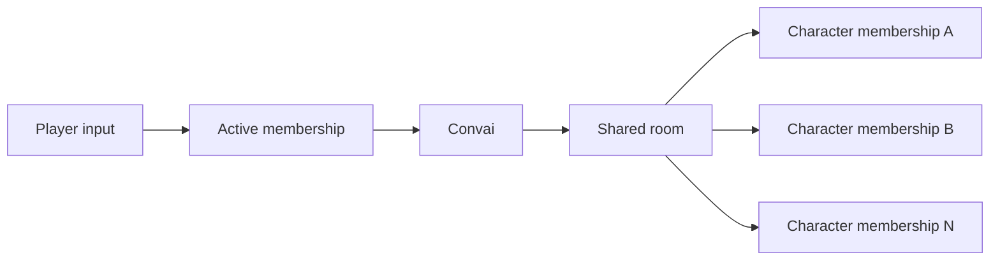

A multi-character conversation uses one room connection for several Convai characters. Each character has its own room membership and readiness state, while connection state, player input, transcripts, and roster changes remain room-scoped.

## One room with several memberships

The `IConvaiRoomConnectionService` owns the shared connection. `MultiCharacterRoomSession` is the client-side view of the roster Convai accepted for that connection.

The active membership determines where subsequent player input is routed. It does not create another room or disconnect the other characters. Character output and lifecycle events can still arrive from any membership in the roster.

| Scope | Canonical state |
| --- | --- |
| Shared room | Connection state, room session ID, input mode, transcript timeline, active membership, and roster epochs |
| Character membership | Character identity, character-session identity, participant identity, readiness, and failure state |
| Local character | The `ConvaiCharacter` instance, its presentation components, and its membership binding for the current connection |

### Choose the right discovery surface

These collections answer different questions and are not interchangeable.

| Surface | What it represents |
| --- | --- |
| `ConvaiManager.SetExplicitCharacters(...)` | Configures the manager's owned local characters before connection |
| `ConvaiManager.SetExplicitConversationTarget(...)` | Configures the required startup character; it is not the live routing API |
| `ConvaiManager.Characters` | The manager's owned local `ConvaiCharacter` instances, including explicitly owned characters that are currently inactive |
| `ConvaiManager.ActiveConversationCharacter` | The configured startup ownership target; it does not track acknowledged live routing |
| `IAgentRegistry.Characters` through `TryGetAgentRegistry(...)` | Runtime-registered character agents; this is a local registry, not the admitted room roster |
| `MultiCharacterRoomSession.Characters` | The canonical memberships admitted to the current room connection |
| `ConvaiManager.Events` | The room-wide event facade for readiness, speech, transcripts, and session events |
| `TryGetTranscripts(...)` | Safe access to the room-wide transcript facade during initialization and teardown |
| `TryGetRoomConnectionService(...)` | Access to the current connection, target, roster, and join operations |
| `TryGetRoomAudioService(...)` | Access to character and participant audio routing for the current room |

Use `ConvaiManager.Characters` to inspect ownership, the agent registry to inspect local runtime registration, and `MultiCharacterRoomSession.Characters` to decide whether Convai admitted a membership.

## Startup roster and initial character

At connection time, `ConvaiManager` captures the active and enabled characters it owns. One captured character follows the legacy single-character path. More than one captured character creates a multi-character startup roster.

An explicit initial character is required when the startup roster contains multiple characters. `SetExplicitConversationTarget` defines that startup choice before connection, and the SDK orders the selected character first in the roster request. The initial membership gates the room's transition to `Connected`.

Inactive or disabled owned characters are excluded from the startup roster. They can remain in the manager's explicit character list, become active later, and then be added through the room service. A legacy room that started with one character has no `MultiCharacterRoomSession`, so `AddCharacterAsync` cannot convert it into a multi-character room.

The SDK rejects a startup roster with more than `50` characters. The effective account or deployment limit can be lower, so application setup should treat `50` as a client ceiling rather than a guaranteed room size.

## Identity layers

Each identity answers a different question. Keeping them separate prevents events, audio, and transcripts from being assigned to the wrong character.

| Identity | Meaning | Lifetime |
| --- | --- | --- |
| `CharacterId` | The character definition selected in the Convai dashboard | Stable across rooms |
| `CharacterSessionId` | The identity of a resumable character conversation | Reused across connections only when session resume is enabled |
| `MembershipId` | The canonical roster entry used for targeting and removal | Current room connection |
| `ParticipantIdentity` | The transport identity assigned to the character membership | Current room connection |
| `ParticipantId` | The connected transport participant ID observed at runtime | Current transport connection |
| Human speaker ID | The human participant identity carried by player transcript events | Participant/session dependent |

Every startup character needs a non-empty `CharacterId`. Non-empty resumed `CharacterSessionId` values must be unique within the startup roster. Use distinct character IDs for the examples and for integrations that rely on character-ID-keyed audio controls.

## Initial and secondary readiness

Roster admission and character readiness are separate. A membership moves through the `CharacterRoomStatus` values below.

| Status | Meaning |
| --- | --- |
| `Starting` | Convai accepted or queued the membership, but the character is not ready for interaction yet. |
| `Ready` | The membership has received its character-ready signal and can participate in the conversation. |
| `Failed` | Character provisioning failed. `FailureCode` carries the reported reason when one is available. |

`MultiCharacterRoomSession.WaitUntilReadyAsync` waits for the initial membership only. Secondary memberships can still be `Starting` or `Failed` after the room reaches `Connected`. Observe `CharacterStatusChanged` when application logic depends on a secondary or newly added character.

`PartialDispatch` mirrors the partial-dispatch flag returned for the startup roster. When it is `true`, inspect each membership's `Status`, `ProvisioningStatus`, and `FailureCode` instead of assuming the whole roster became ready.

## Acknowledged interaction routing

Live target selection is an acknowledged room operation. `SetInteractionTargetAsync` sends the requested membership with the current `RouteEpoch`, waits for Convai's acknowledgement, and returns the canonical `InteractionTargetResult`. The session updates `ActiveMembershipId` only from canonical route state and raises `InteractionTargetChanged` when the route advances.

This acknowledgement model prevents an older response from replacing a newer route. It also means selection UI should show a pending state until the operation completes.

`ConvaiManager.ActiveConversationCharacter` remains the configured startup ownership target. It does not follow live `InteractionTargetChanged` updates. Read `MultiCharacterRoomSession.ActiveMembershipId` for the current route.

`ClearInteractionTargetAsync` clears routing for subsequent player input. It does not interrupt character audio that is already playing.

## Connection-scoped state

`MultiCharacterRoomSession`, membership IDs, participant bindings, `RouteEpoch`, and `RosterEpoch` belong to one connection. Disconnecting clears the session projection. After reconnect, reacquire `CurrentMultiCharacterSession` and subscribe to the events on the new instance.

This connection boundary also protects roster and target operations. An operation fails if the current multi-character session changes while it is waiting for its acknowledgement.

## Related guides


[Multi-character conversations quick start](quick-start.md)



[Choose the active character](choose-active-character.md)



[Multi-character session and roster API](session-and-roster-api.md)

