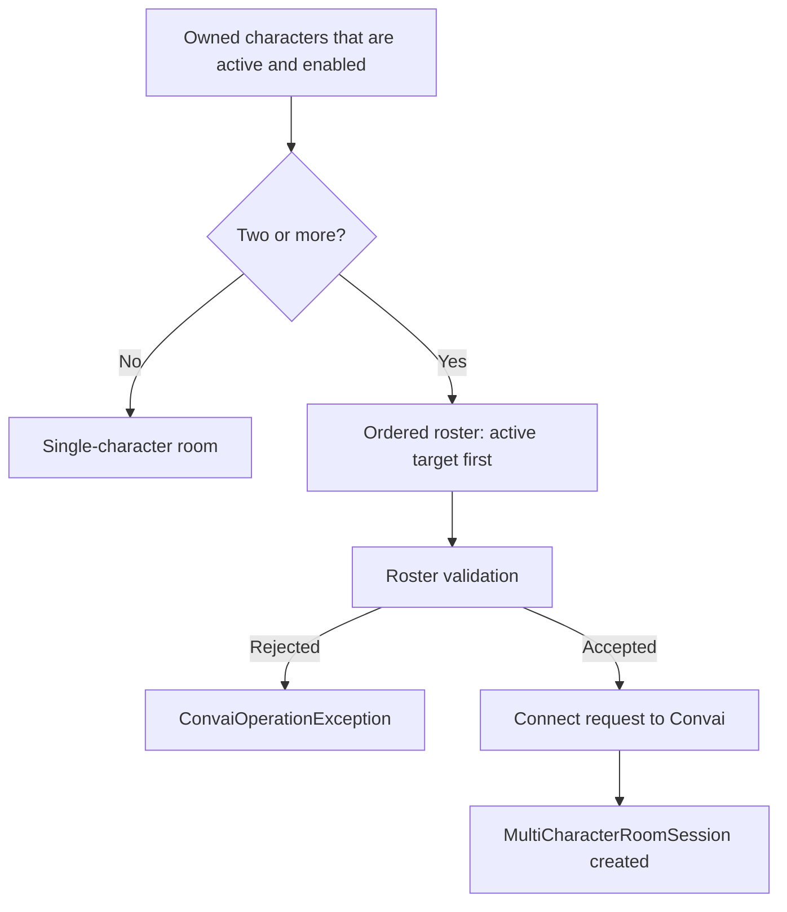

A multi-character session is one room that holds several character memberships at once, instead of one room per character. The SDK decides which shape to use at connect time, builds the roster from the characters it owns and that are active and enabled, and then keeps a local projection of that roster in step with Convai using an acknowledged, epoch-guarded command model. This page explains that machinery so the behavior of `MultiCharacterRoomSession` is predictable rather than surprising.

***

## Which characters count as owned

`ConvaiManager` resolves the characters it owns before it resolves a roster, and it prefers an explicit list over scene discovery. Ownership checks these sources in order and uses the first one that is not empty:

1. The characters passed to `ConvaiManager.SetExplicitCharacters`.
2. A `ConvaiSceneInstaller` in the scene — first its `OwnedCharacters` list, then its `Characters` list when `OwnedCharacters` is empty.
3. The single character passed to `ConvaiManager.SetExplicitConversationTarget`, when nothing above supplied any character.
4. Every `ConvaiCharacter` found in the loaded scenes, including inactive ones, ordered by scene hierarchy position.

`ConvaiManager.Characters` returns this full owned list, and it is **not** filtered by activation state — an inactive or disabled character stays in it. The active-only filter described below runs later, only when the SDK builds the roster it sends to Convai.

A multi-character scene can therefore expose three different character lists, and they answer different questions:

| Surface | What it lists | Includes an inactive character |
| --- | --- | --- |
| `ConvaiManager.Characters` | Every character the manager currently owns, resolved as above. | Yes |
| `IAgentRegistry.Characters`, from `ConvaiManager.TryGetAgentRegistry` | Every character currently registered — registration happens in `OnEnable` and is undone in `OnDisable`. | No |
| `MultiCharacterRoomSession.Characters` | Every membership currently in the connected room's roster. | No — an inactive character was excluded before the roster was built. |

Use `ConvaiManager.Characters` to inspect what the scene owns before connecting, `IAgentRegistry.Characters` to see what is registered right now, and `MultiCharacterRoomSession.Characters` to see what the connected room actually contains.

***

## Roster creation at connect

The SDK builds a roster from the owned characters that are active and enabled when `ConnectAsync` runs. With one such character, the connect path is unchanged and no roster is sent — the room is a single-character room and `CurrentMultiCharacterSession` stays `null`. With two or more, the SDK assembles a roster and submits the whole cast in the connect request.

The roster is built in a fixed order. The active conversation target is placed first, and every other active, enabled character follows in registration order. This is why the conversation target decides which character becomes the room's initial character, and why changing it changes the shape of the room rather than merely the input routing.


An inactive or disabled `ConvaiCharacter` is silently excluded from the roster. It does not trigger the missing-Character-ID validation below, because it never reaches validation — the real symptom is that the character is missing from `session.Characters`, not a connect failure. A scene with two characters where only one is active and enabled connects as a single-character room, so `CurrentMultiCharacterSession` stays `null`. Activate the character and add it with `AddCharacterAsync` once the room is connected; see [Add and remove characters at runtime](update-the-roster.md).


Before the request leaves the client, the SDK rejects rosters it knows Convai will not accept. Each of these failures faults the connect operation with a `ConvaiOperationException` rather than producing a partially-connected room.

| Condition | Message |
| --- | --- |
| More than 50 active, enabled characters registered | `Multi-character rooms support at most 50 characters.` |
| A null or repeated character reference | `Multi-character roster contains null or duplicate character references.` |
| A character with no Character ID | `Every character in a multi-character room requires a Character ID.` |
| Two characters resolving to the same character-session ID | `Character session IDs must be unique within a multi-character roster.` |

A separate, earlier check can also fault the connect attempt regardless of character count: if no active character is resolved at all when `ConnectAsync` runs, the SDK throws a `ConvaiOperationException` with `Cannot connect because no active character is available.` before it attempts to build a roster. This check does not apply to `JoinMultiCharacterRoomAsync`, which needs no active character because it joins a room another client already created.

A multi-character room also requires a non-empty end-user ID. The SDK takes that value from the configured identity provider, so the default device-based provider satisfies the requirement without extra work. See [Custom identity provider](../../advanced-topics/custom-providers/custom-identity-provider.md) when you need a stable ID tied to your own accounts.

***

## The initial character

Convai marks exactly one membership in the response as the initial character, and the SDK exposes it as `MultiCharacterRoomSession.InitialCharacter`. It is the membership the player addresses when the room opens, and it is the one whose readiness the session as a whole reports through `IsReady` and `WaitUntilReadyAsync`.

The reason readiness is defined this way is that the initial character is the only membership the room is guaranteed to need. Secondary characters may still be starting, or may have failed, without preventing the player from beginning a conversation. [Roster readiness and partial dispatch](readiness-and-partial-dispatch.md) covers that split in detail.

***

## The client-side roster projection

`MultiCharacterRoomSession` is a projection of the canonical roster that Convai owns, not a second source of truth. It holds one `CharacterRoomMembership` per character instance, an index from membership ID to membership, an index from participant identity to membership, and the two epochs described below. Every mutation applied to it comes from a message Convai sent — either an acknowledgement of a command the client issued, or an unsolicited lifecycle message.

Each membership binds one backend membership to one local character instance. That binding is resolved when the membership first appears: the SDK matches on character-session ID first, then falls back to character ID, and never binds one local instance to two memberships. A membership whose local instance cannot be resolved still exists in the roster with `Character` left `null`, so the room stays complete even when the scene does not hold a matching component.

***

## Epochs and the command acknowledgement model

Two integers guard the roster against out-of-order messages. `RouteEpoch` advances whenever the interaction target changes, and `RosterEpoch` advances whenever the cast changes. Every command the client sends carries the epoch it expects, and every acknowledgement carries the epoch that resulted.

The client applies acknowledgements defensively. An interaction-target update is applied only when its route epoch is strictly greater than the current `RouteEpoch`; an acknowledgement carrying an equal or lower epoch is discarded, and the canonical target is left alone. Roster epochs are merged by taking the higher of the two values. The effect is that a late or duplicated message can never move the roster backwards into a state Convai has already left.

Commands are also serialized on the client. Roster mutations share one gate and interaction-target changes share another, so at most one of each kind is in flight at a time. Each command waits for its own acknowledgement and gives up on a timeout:

| Command | Timeout | Exception on timeout |
| --- | --- | --- |
| Roster update | 15 seconds | `TimeoutException` with `Timed out waiting for the character-roster-update acknowledgement.` |
| Interaction target change | 10 seconds | `TimeoutException` with `Timed out waiting for the interaction-target acknowledgement.` |


A timeout means the acknowledgement did not arrive, not that the command was refused. Read the current `ActiveMembershipId`, `RosterEpoch`, and `Characters` before retrying, because Convai may already have applied the change.


***

## Roster changes that arrive without a command

Not every roster change starts on the client. Convai also sends lifecycle messages that the SDK applies to the projection directly.

| Message | Effect on the projection |
| --- | --- |
| `character-status` | Resolves the membership, merges the roster epoch, then marks it ready or failed. An unknown membership is inserted into the roster first. |
| `character-removed` | Removes the membership and merges the roster epoch. If it was the active target, the target is cleared. |
| `server-response` for `interaction-target` | Completes the pending target command and applies the new route epoch. |
| `server-response` for `character-roster-update` | Completes the pending roster command, inserts added memberships, removes removed ones, and applies both epochs. |

Removing the active membership produces two events in a fixed order: `InteractionTargetChanged` fires first with the removed membership as the previous value and `null` as the current one, then `CharacterRemoved` fires. Code that reacts to removal can therefore rely on the target already being cleared by the time it runs.

***

## What stays the same in a single-character room

A scene with one active, enabled character connects exactly as it did before multi-character rooms existed. `CurrentMultiCharacterSession` returns `null`, per-character event matching falls back to character ID and participant ID, and the multi-character operations on `IConvaiRoomConnectionService` throw `InvalidOperationException` with `No multi-character room session is active.` because there is no roster to act on.

This is also why adding a second `ConvaiCharacter` to an existing scene changes how the whole scene connects. Nothing about the first character's configuration changes, but the connect request now carries a roster, and the session gains a membership layer that per-character resolution goes through first. See [Character identity and addressing](character-identity.md) for what that means for code that matches events to characters.

A scene can also fall back into this single-character shape unintentionally: owning two characters where only one is active and enabled produces exactly the same room, because the inactive character never reaches the roster. See [Which characters count as owned](#which-characters-count-as-owned) above.

***

## Next steps


[Character identity and addressing](character-identity.md)



[Roster readiness and partial dispatch](readiness-and-partial-dispatch.md)



[Session lifecycle](../../core-concepts/session-lifecycle.md)

