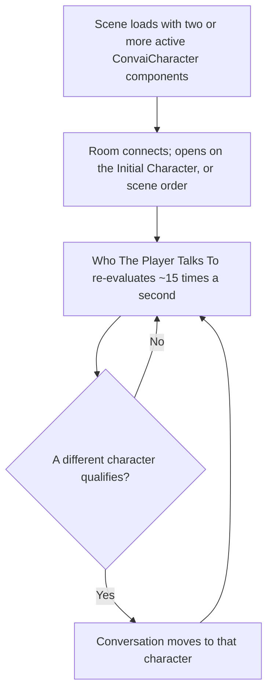

A Convai room can hold more than one character. This page explains how a scene with several `ConvaiCharacter` components becomes one shared room, how that room decides who the player is talking to, and why one character speaks at a time.

## Two or more characters is the whole setup

A room holds every active `ConvaiCharacter` in the loaded scenes. There is no multi-character mode to switch on, no component to add, and no field to fill — the room carries more than one character once the scene does. The reason there is nothing to configure is that a single-character scene and a multi-character scene go through the same connect path; the only difference is how many characters that path finds active when it runs.

The **Convai Manager** component reflects this directly. Its **Scene Setup** section detects every `ConvaiCharacter` in the scene automatically and lists them with a checkbox per character, plus an **Include Everyone** button to select them all at once. Nothing in that list is manually wired — it is a live view of what the scene already contains.

## The room opens on one character

The room opens on one character before the player has looked at or said anything, because a conversation has to start somewhere. Two things can decide which one:

- An assigned **Initial Character** in the Convai Manager inspector wins outright. The room opens on that character regardless of scene order or where the player's camera happens to be facing.
- With no **Initial Character** assigned, the room opens on the first character in scene order.

An assigned **Initial Character** only chooses where the conversation *starts*. From the moment the room is ready, the rule below re-evaluates who is being addressed roughly 15 times a second, so the conversation moves on to whoever the player is looking at unless targeting is set to `Manual`.

## Choosing who the player is talking to

The **Convai Manager → Who The Player Talks To** section decides which character an active room is addressing, and it only appears once a scene has more than one character to choose between — with one character there is nothing to decide. Three modes are available: **Look At**, **Proximity**, and **Manual**. See [Choose a targeting mode](../conversation-targeting/choose-a-targeting-mode.md) to compare them, and [Conversation targeting](../conversation-targeting/README.md) for the feature.

The rule never clears the target on its own. When nobody qualifies — the player looking at empty space, for example — the last character addressed keeps the conversation rather than being left with nobody to answer.

## One character speaks at a time

The room only ever has one character answering at a time — addressing a different character stops whichever one is mid-answer, even mid-sentence, so see [One character speaks at a time](../conversation-targeting/how-conversation-targeting-works.md#one-character-speaks-at-a-time) for the full rule and how to hold a conversation on one character deliberately.

## Why every character needs its own Character ID

The SDK routes ownership, participants, and audio by Character ID. Two characters sharing an ID collide instead of each being answered separately, which is why a Convai account with multi-character access still refuses a room whose two characters carry the same ID rather than connecting it half-working. See [Character identity](character-identity.md) for the exact rules and what the Character inspector reports.

## Related


[Build your first multi-character session](quick-start.md)



[Character identity](character-identity.md)



[Conversation targeting](../conversation-targeting/README.md)

