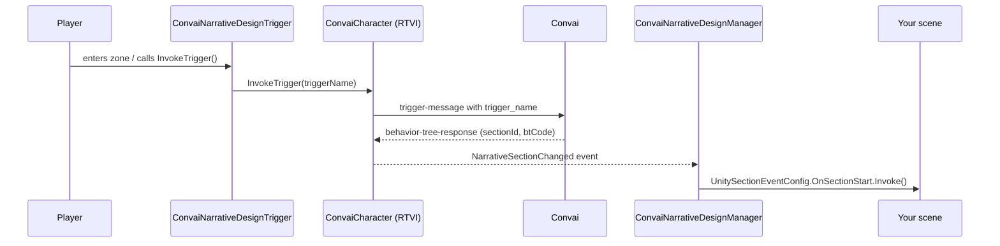

Narrative Design gives a Convai character a structured story to follow. You author a graph of sections and triggers in the Convai dashboard; at runtime, the SDK listens for section-change signals from Convai and fires the Unity Events you configured — no polling, no custom state machines. This page explains the underlying model: what the primitives are, how a trigger advances the graph, and which SDK component handles each part of the pipeline.

## How the runtime pipeline works

When the player activates a trigger, the SDK sends a named signal to the Convai backend. The backend advances the story graph and responds with a `behavior-tree-response` message that carries the new section ID. The SDK translates this into a `NarrativeSectionChanged` domain event and delivers it to `ConvaiNarrativeDesignManager`, which fires the per-section Unity Events you wired in the Inspector.

Triggers queue automatically if the character's real-time session is not yet open and are flushed when the connection is established. You do not need to check session state before calling `InvokeTrigger()`.

## Sections and triggers

**Sections** are named story beats defined in the Convai dashboard. The character's objectives, knowledge, and conversational behavior adapt to whichever section is active. A single character can play a neutral receptionist in an opening section and a strict examiner in an assessment section — all within one session — because the active section shapes what the backend returns.

**Triggers** are the directed edges in the story graph. Sending a saved trigger by name advances the graph from one section to the next along the matching edge. Trigger metadata fetched from Convai is read-only in Unity; the runtime sends the saved trigger name only.

Inline event messages are separate from saved triggers. Use `InvokeEvent("Player completed the safety checklist")` when application logic should add context and let Convai respond naturally. Use `InvokeSpeech("Proceed to checkpoint two")` when the character should say exact scripted text. Both send `trigger_message`, not `trigger_name`.

Template keys are runtime key-value pairs that fill placeholders in the dashboard's narrative objectives. Set `{PlayerName}` to `"Alex"` and every section that references `{PlayerName}` will use the current value without any graph changes.

## The three SDK components

| Component | Where it lives | What it does |
|---|---|---|
| `ConvaiNarrativeDesignManager` | On the character's GameObject | Listens for section changes, fires per-section `OnSectionStart` / `OnSectionEnd` Unity Events, manages template keys |
| `ConvaiNarrativeDesignTrigger` | On any world GameObject | Sends a named trigger to the character when activated (collision, proximity, timer, or manual) |
| `IConvaiNarrativeDesign` | Accessed via `convaiCharacter.NarrativeDesign` | Character-scoped C# API for trigger invocation, template key control, and async data fetching |

You can use any combination. Most projects use all three. Simple linear narratives may only need the Manager and one or two Triggers.

## Key concepts

| Term | Definition |
|---|---|
| **Section** | A named story beat in the Convai dashboard. The character's objectives and behavior adapt to the active section. |
| **Trigger** | A named edge in the story graph. Sending a trigger advances the graph from one section to the next. |
| **Template key** | A runtime key-value pair (e.g., `PlayerName = "Alex"`) that fills `{placeholder}` text in the dashboard's narrative objectives. |
| **Orphaned section** | A section deleted from the dashboard after it was synced locally. Its Unity Events are preserved but will never fire until the section is restored and re-synced. |
| **Behavior Tree Response** | The server message that carries the new `SectionId` plus optional `BehaviorTreeCode` and `BehaviorTreeConstants` used by advanced integrations. |

## Component placement

Understanding which component belongs on which GameObject avoids the most common setup mistakes.

| Component | Where to place it | Typical count per scene |
|---|---|---|
| `ConvaiNarrativeDesignManager` | On the **character's** GameObject, alongside `ConvaiCharacter` | One per character |
| `ConvaiNarrativeDesignTrigger` | On **any world GameObject** — a doorway, an exhibit, a UI event target | One per graph transition point |
| `IConvaiNarrativeDesign` | Not placed — accessed via `convaiCharacter.NarrativeDesign` in code | N/A |

## Next steps


[Narrative design quick start](quick-start.md)



[Configure the narrative design manager](setting-up-the-narrative-design-manager.md)



[Configure narrative design triggers](setting-up-narrative-design-triggers.md)

