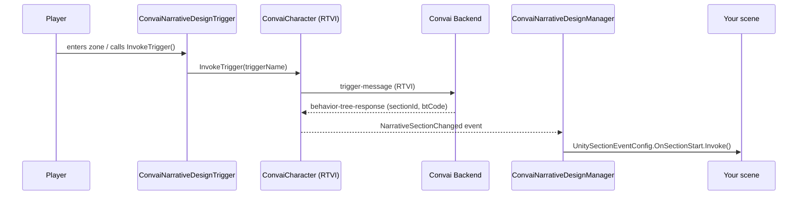

Narrative Design gives a Convai character a structured story to follow. You author a graph of sections and triggers in the Convai dashboard; at runtime, the SDK can submit trigger requests, listen for section-change signals, and fire the Unity Events you configured. This page explains the client-side model and the boundary where deployed backend behavior must be verified.

## How the runtime pipeline works

When the player activates a saved trigger, the SDK submits its name in the `trigger_name` field. Local acceptance does not acknowledge a backend graph transition. If the backend applies a transition and later sends a `behavior-tree-response` with a section ID, the SDK publishes `NarrativeSectionChanged`. `ConvaiNarrativeDesignManager` then matches that ID and fires the configured per-section Unity Events.

```mermaid
sequenceDiagram
    participant Player
    participant Trigger as ConvaiNarrativeDesignTrigger
    participant Char as ConvaiCharacter (RTVI)
    participant Backend as Convai Backend
    participant Manager as ConvaiNarrativeDesignManager
    participant Scene as Your scene

    Player->>Trigger: enters zone / calls InvokeTrigger()
    Trigger->>Char: InvokeTrigger(triggerName)
    Char->>Backend: trigger-message (RTVI)
    Backend-->>Char: behavior-tree-response (sectionId, btCode)
    Char-->>Manager: NarrativeSectionChanged event
    Manager->>Scene: UnitySectionEventConfig.OnSectionStart.Invoke()
```

The character API queues a valid trigger request if the real-time session is not open and flushes the queue when the character becomes ready. `ConvaiNarrativeDesignTrigger` has a separate **Queue Until Ready** option and timeout. In both cases, a `true` return or local activation event means the client accepted or queued the request—not that the backend advanced the graph.

## Sections and triggers

**Sections** are named story beats defined in the Convai dashboard. The character's objectives, knowledge, and conversational behavior adapt to whichever section is active. A single character can play a neutral receptionist in an opening section and a strict examiner in an assessment section — all within one session — because the active section shapes what the backend returns.

**Saved triggers** are named edges in the story graph. `InvokeTrigger(name)` submits only `trigger_name`; the backend decides whether that name is valid for the current section and whether to transition. Contextual text uses the separate `InvokeEvent(message)` API and `trigger_message` wire field. Scripted speech also uses `trigger_message`, after the SDK wraps plain input in one `<speak>...</speak>` element.

Template keys are runtime key-value pairs submitted for placeholder resolution in the dashboard's narrative objectives. For example, set `{PlayerName}` to `"Alex"` before the relevant narrative turn. The SDK source verifies the client-side send lifecycle; confirm placeholder substitution against a live backend narrative before relying on it in production.

## The three SDK components

| Component | Where it lives | What it does |
|---|---|---|
| `ConvaiNarrativeDesignManager` | On the character's GameObject | Listens for section changes, fires per-section `OnSectionStart` / `OnSectionEnd` Unity Events, manages template keys |
| `ConvaiNarrativeDesignTrigger` | On any world GameObject | Sends a named trigger to the character when activated (collision, proximity, timer, or manual) |
| `IConvaiNarrativeDesign` | Accessed via `convaiCharacter.NarrativeDesign` | Character-scoped C# API for trigger invocation, template key control, and async data fetching |

You can use any combination. Most projects use all three. Simple linear narratives may only need the Manager and one or two Triggers.

## Key concepts

| Term | Definition |
|---|---|
| **Section** | A named story beat in the Convai dashboard. The character's objectives and behavior adapt to the active section. |
| **Trigger** | A named edge in the story graph. Unity submits the name; a later section-change event is evidence that the backend advanced the graph. |
| **Template key** | A runtime key-value pair (e.g., `PlayerName = "Alex"`) that fills `{placeholder}` text in the dashboard's narrative objectives. |
| **Orphaned section** | A locally preserved section config that was absent from the latest backend sync. `IsOrphaned` affects counts and Inspector status only; the runtime lookup does not suppress its Unity Events if the backend later emits that section ID. |
| **Behavior Tree Response** | The server message that carries the new `SectionId` plus optional `BehaviorTreeCode` and `BehaviorTreeConstants` used by advanced integrations. |

## Component placement

Understanding which component belongs on which GameObject avoids the most common setup mistakes.

| Component | Where to place it | Typical count per scene |
|---|---|---|
| `ConvaiNarrativeDesignManager` | On the **character's** GameObject, alongside `ConvaiCharacter` | One per character |
| `ConvaiNarrativeDesignTrigger` | On **any world GameObject** — a doorway, an exhibit, a UI event target | One per graph transition point |
| `IConvaiNarrativeDesign` | Not placed — accessed via `convaiCharacter.NarrativeDesign` in code | N/A |

## Next steps


[Narrative design quick start](quick-start.md)



[Configure the narrative design manager](setting-up-the-narrative-design-manager.md)



[Configure narrative design triggers](setting-up-narrative-design-triggers.md)

