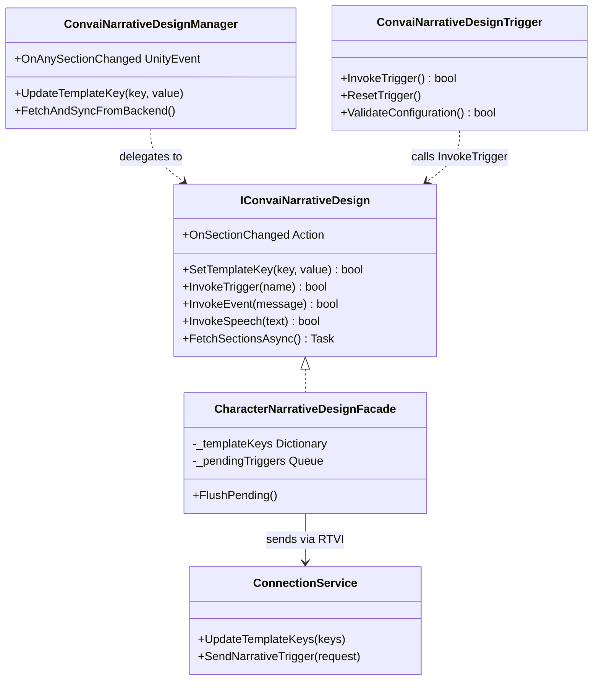

The Inspector workflow covers the majority of use cases. This page documents the full C# surface for situations where you need programmatic control — dynamic character switching, async data fetching at runtime, runtime-generated narrative flows, or deep integration with your own game systems.

All capabilities described here are available through `IConvaiNarrativeDesign`, exposed on every `ConvaiCharacter` via the `NarrativeDesign` property. `ConvaiNarrativeDesignManager` and `ConvaiNarrativeDesignTrigger` both delegate to this interface internally, so everything you configure in the Inspector is also reachable from code.

## Access the character API

Every `ConvaiCharacter` exposes a `NarrativeDesign` property that returns an `IConvaiNarrativeDesign` implementation:

```csharp
ConvaiCharacter character = GetComponent<ConvaiCharacter>();
IConvaiNarrativeDesign narrative = character.NarrativeDesign;
```

### Properties

| Property | Type | Description |
|---|---|---|
| `TemplateKeys` | `IReadOnlyDictionary<string, string>` | Snapshot of all template keys currently tracked for this character. |
| `CurrentSectionId` | `string` | The section ID most recently received from the backend. Empty string if no section has been received yet. |
| `CurrentSectionData` | `NarrativeSectionData` | Full section payload. Contains `SectionId`, `BehaviorTreeCode`, and `BehaviorTreeConstants`. `null` until the first section change is received. |

## Listen to section changes

Subscribe to these events in `OnEnable` and unsubscribe in `OnDisable` to avoid stale listeners after a component is disabled or destroyed.

```csharp
private void OnEnable()
{
    character.NarrativeDesign.OnSectionChanged     += HandleSectionChanged;
    character.NarrativeDesign.OnSectionDataReceived += HandleSectionData;
}

private void OnDisable()
{
    character.NarrativeDesign.OnSectionChanged     -= HandleSectionChanged;
    character.NarrativeDesign.OnSectionDataReceived -= HandleSectionData;
}

private void HandleSectionChanged(string previousId, string newId)
{
    Debug.Log($"Section: {previousId} → {newId}");
}

private void HandleSectionData(NarrativeSectionData data)
{
    Debug.Log($"Section ID: {data.SectionId}");
    // data.BehaviorTreeCode and data.BehaviorTreeConstants available here
}
```

These events are delivered via the SDK's internal `EventHub`. If your handler touches Unity API (e.g., `GameObject.SetActive`), use `ConvaiNarrativeDesignManager` in the scene — it performs main-thread delivery automatically. Raw subscriptions to `IConvaiNarrativeDesign` events may arrive on a background thread depending on configuration.

### Events

| Event | Signature | Description |
|---|---|---|
| `OnSectionChanged` | `Action<string, string>` | Fires on every section transition. Parameters: `previousId`, `newId`. |
| `OnSectionDataReceived` | `Action<NarrativeSectionData>` | Fires on every section transition with the full payload. |
| `OnTriggerInvoked` | `Action<ConvaiNarrativeTriggerInvocation>` | Fires after a trigger or speech request is accepted locally (before backend confirmation). |

## Invoke triggers from code

```csharp
// Saved trigger — advances the graph along a specific edge
bool accepted = character.NarrativeDesign.InvokeTrigger("CheckpointReached");
```

`InvokeTrigger` sends a saved Narrative Design trigger by name. The SDK trims whitespace, rejects an empty name, and sends only `trigger_name` over RTVI. It returns `true` when the request is accepted locally and queues the trigger if the session is not yet open.

Use `InvokeEvent` when you want to send contextual event text instead of a saved graph trigger:

```csharp
character.NarrativeDesign.InvokeEvent("The fire extinguisher is missing its pin.");
```

`InvokeEvent` sends only `trigger_message` over RTVI. Convai treats the message as inline context and responds naturally; it does not select a saved trigger by name.

## Control character speech

`InvokeSpeech` sends exact scripted speech without advancing the narrative graph. Pass the text you want the character to say; the SDK wraps it in `<speak>...</speak>` internally before sending `trigger_message`.

```csharp
character.NarrativeDesign.InvokeSpeech("Attention: the fire exit on level two is now unlocked.");
```

Do not include `<speak>` tags in Unity code. Use `InvokeEvent` for contextual events where Convai should decide the wording.

| Method | Wire field | Runtime behavior |
|---|---|
| `InvokeTrigger("TriggerName")` | `trigger_name` | Invokes a saved Narrative Design trigger and can advance the graph. |
| `InvokeEvent("event text")` | `trigger_message` | Adds inline event context and lets Convai respond naturally. |
| `InvokeSpeech("scripted text")` | `trigger_message` | Sends exact scripted speech; the SDK adds `<speak>` tags internally. |


Only saved triggers advance the graph by name. Inline events and scripted speech use `trigger_message` and do not send `trigger_name`.


### Listen to trigger invocations

```csharp
character.NarrativeDesign.OnTriggerInvoked += invocation =>
{
    Debug.Log($"Trigger: {invocation.TriggerName}, Queued: {invocation.Queued}");
};
```

`ConvaiNarrativeTriggerInvocation` fields:

| Field | Type | Description |
|---|---|---|
| `Request` | `ConvaiNarrativeTriggerRequest` | Typed request accepted by the SDK. Includes the mode, wire field name, and wire field value. |
| `TriggerName` | `string` | Saved trigger name. Empty for inline events and scripted speech. |
| `TriggerMessage` | `string` | Inline event text or SDK-generated scripted speech payload. Empty for saved triggers. |
| `Queued` | `bool` | `true` if the trigger was deferred because the session was not yet open. |

## Template keys via code

```csharp
// Set a single key
character.NarrativeDesign.SetTemplateKey("PlayerName", "Alex");

// Set multiple keys
character.NarrativeDesign.SetTemplateKeys(new Dictionary<string, string>
{
    { "PlayerName",  "Alex" },
    { "ScoreLevel",  "Intermediate" }
});
```

Both methods send immediately if the session is open, or queue for the next connection if it is not.

The character-level API and `ConvaiNarrativeDesignManager`'s methods converge on the same transport internally. Use the Manager's methods when you want the keys visible and editable in the Inspector; use the character API for purely code-driven flows where Inspector visibility is not needed.

## Fetch sections and triggers

### Via the character API

```csharp
NarrativeFetchResult<List<NarrativeSectionInfo>> result =
    await character.NarrativeDesign.FetchSectionsAsync();

if (result.Success)
{
    foreach (NarrativeSectionInfo section in result.Data)
        Debug.Log($"{section.SectionId}: {section.SectionName}");
}
else
{
    Debug.LogError(result.Error);
}
```

```csharp
NarrativeFetchResult<List<NarrativeTriggerInfo>> result =
    await character.NarrativeDesign.FetchTriggersAsync();

foreach (NarrativeTriggerInfo trigger in result.Data)
    Debug.Log($"{trigger.TriggerName} → {trigger.DestinationSection}");
```

`NarrativeSectionInfo` fields: `SectionId`, `SectionName`.

`NarrativeTriggerInfo` fields: `TriggerId`, `TriggerName`, `TriggerMessage`, `DestinationSection`.

### Via the static fetcher

`NarrativeDesignFetcher` provides the same data without needing a character component reference — useful in Editor tooling or loading screens:

```csharp
// Fetch sections
FetchResult<List<SectionData>> sections =
    await NarrativeDesignFetcher.FetchSectionsAsync(characterId);

// Fetch triggers
FetchResult<List<TriggerData>> triggers =
    await NarrativeDesignFetcher.FetchTriggersAsync(characterId);

// Fetch both in parallel
var (sectionsResult, triggersResult) =
    await NarrativeDesignFetcher.FetchAllAsync(characterId);
```

`FetchResult<T>` fields:

| Field | Type | Description |
|---|---|---|
| `Success` | `bool` | `true` if the request succeeded. |
| `Data` | `T` | The fetched data. `default` if `Success` is `false`. |
| `Error` | `string` | Error message. `null` if `Success` is `true`. |

## Advanced runtime control

### Reset controller state

```csharp
// Reset controller state only (clears CurrentSectionID and CurrentSectionData)
// Does NOT touch the section configs list or Unity Event wiring
narrativeManager.ResetController();
```

### Reconfigure ConvaiNarrativeDesignTrigger from code

All Inspector-configurable settings have corresponding setter methods:

```csharp
ConvaiNarrativeDesignTrigger trigger = GetComponent<ConvaiNarrativeDesignTrigger>();

// Override trigger selection
trigger.SetTrigger("trigger-uuid", "CheckpointA");

// Change activation mode at runtime
trigger.SetActivationMode(TriggerActivationMode.Proximity);
trigger.SetProximityRadius(5f);

// Provide a known player transform (useful when auto-find is insufficient)
trigger.SetPlayerTransform(playerController.transform);

// Switch the target character
trigger.SetCharacter(otherCharacter.GetComponent<IConvaiCharacterAgent>());

// Validate before a critical trigger
if (!trigger.ValidateConfiguration())
{
    foreach (string warning in trigger.ValidationWarnings)
        Debug.LogWarning(warning);
}
```


`ClearAllSectionConfigs()` removes all `UnitySectionEventConfig` entries and all Unity Event wiring. This cannot be undone at runtime. Call it only when you have confirmed you are switching to a different character and no longer need the existing section event bindings.


```csharp
// Clear all section configs permanently (removes all UnitySectionEventConfig entries)
// Use only when switching to a completely different character
narrativeManager.ClearAllSectionConfigs();
```

## Component relationships



`ConvaiNarrativeDesignManager` and `ConvaiNarrativeDesignTrigger` both delegate to `IConvaiNarrativeDesign`. The `CharacterNarrativeDesignFacade` implements the interface and manages the pending queue; `ConnectionService` handles the actual RTVI transport.

## Next steps


[Narrative design usage examples](usage-examples.md)



[Troubleshoot narrative design](troubleshooting-and-diagnostics.md)

