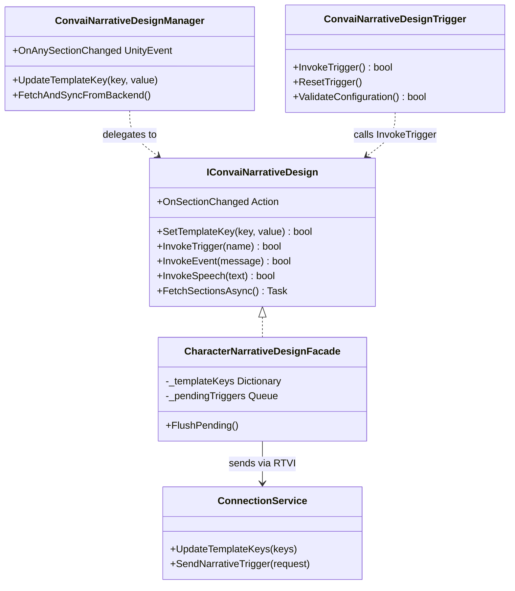

The Inspector workflow covers the majority of use cases. This page documents the full C# surface for situations where you need programmatic control — dynamic character switching, async data fetching at runtime, runtime-generated narrative flows, or deep integration with your own game systems.

The character-scoped surface is `IConvaiNarrativeDesign`, exposed on every `ConvaiCharacter` via `NarrativeDesign`. `ConvaiNarrativeDesignManager` and `ConvaiNarrativeDesignTrigger` delegate to parts of this interface, while also exposing their own component APIs. Not every serialized Inspector setting has a public runtime setter.

## Access the character API

Every `ConvaiCharacter` exposes a `NarrativeDesign` property that returns an `IConvaiNarrativeDesign` implementation:

```csharp
ConvaiCharacter character = GetComponent<ConvaiCharacter>();
IConvaiNarrativeDesign narrative = character.NarrativeDesign;
```

### Properties

| Property | Type | Description |
|---|---|---|
| `TemplateKeys` | `IReadOnlyDictionary<string, string>` | Live read-only view of the character facade's backing dictionary. Later `SetTemplateKey(s)` calls are visible through an existing reference; this is not a copied snapshot. |
| `CurrentSectionId` | `string` | The section ID most recently received from Convai. Empty string if no section has been received yet. |
| `CurrentSectionData` | `NarrativeSectionData` | Full section payload. Contains `SectionId`, `BehaviorTreeCode`, and `BehaviorTreeConstants`. `null` until the first section change is received. |

## Listen to section changes

Subscribe to these events in `OnEnable` and unsubscribe in `OnDisable` to avoid stale listeners after a component is disabled or destroyed.

```csharp
private void OnEnable()
{
    character.NarrativeDesign.OnSectionChanged     += HandleSectionChanged;
    character.NarrativeDesign.OnSectionDataReceived += HandleSectionData;
}

private void OnDisable()
{
    character.NarrativeDesign.OnSectionChanged     -= HandleSectionChanged;
    character.NarrativeDesign.OnSectionDataReceived -= HandleSectionData;
}

private void HandleSectionChanged(string previousId, string newId)
{
    Debug.Log($"Section: {previousId} → {newId}");
}

private void HandleSectionData(NarrativeSectionData data)
{
    Debug.Log($"Section ID: {data.SectionId}");
    // data.BehaviorTreeCode and data.BehaviorTreeConstants available here
}
```

`OnSectionChanged` and `OnSectionDataReceived` originate from the character's `NarrativeSectionChanged` EventHub subscription, which uses the default `MainThread` policy in Unity SDK 4.5.0. Their handlers are therefore scheduled on Unity's main thread, but the source does not promise same-frame delivery. `OnTriggerInvoked` is different: it runs synchronously on the thread that calls `InvokeTrigger`, `InvokeEvent`, or `InvokeSpeech`; call those APIs from Unity's main thread if the handler touches Unity objects.

### Events

| Event | Signature | Description |
|---|---|---|
| `OnSectionChanged` | `Action<string, string>` | Fires only when the received section ID differs from the current ID. Parameters: `previousId`, `newId`. |
| `OnSectionDataReceived` | `Action<NarrativeSectionData>` | Fires for every matching section-data event, including a repeated section ID. |
| `OnTriggerInvoked` | `Action<ConvaiNarrativeTriggerInvocation>` | Fires after a trigger or speech request is accepted locally (before confirmation from Convai). |

## Invoke triggers from code

```csharp
// Saved trigger — submits a named graph edge
bool accepted = character.NarrativeDesign.InvokeTrigger("CheckpointReached");
```

`InvokeTrigger` sends a saved Narrative Design trigger by name. The SDK trims whitespace, rejects an empty name, and sends only `trigger_name` over RTVI. It returns `true` when the request is accepted by the local client path or queued before readiness. If an immediate transport attempt fails, the SDK requeues the request but returns `false`. None of these return values acknowledges a backend graph transition; wait for the corresponding section event.

Use `InvokeEvent` when you want to send contextual event text instead of a saved graph trigger:

```csharp
bool accepted = character.NarrativeDesign.InvokeEvent(
    "The fire extinguisher is missing its pin.");
```

`InvokeEvent` sends only `trigger_message` over RTVI. It does not select a saved trigger by name. The Unity source proves the wire field and local queue behavior, not whether the backend produces a response or how it phrases one.

## Control character speech

`InvokeSpeech` requests scripted speech without sending a saved trigger name. The SDK trims the input, wraps it once as `<speak>...</speak>`, and sends that value in `trigger_message`.

```csharp
bool accepted = character.NarrativeDesign.InvokeSpeech(
    "Attention: the fire exit on level two is now unlocked.");
```

Pass plain text and do not include your own `<speak>` root—the SDK would nest it. The 4.5.0 client does not escape or validate arbitrary SSML markup; this API only guarantees the outer wrapper. Exact backend speech and playback must be tested in a live room. Use `InvokeEvent` for contextual events where the backend should decide the wording.

| Method | Wire field | Runtime behavior |
|---|---|---|
| `InvokeTrigger("TriggerName")` | `trigger_name` | Invokes a saved Narrative Design trigger and can advance the graph. |
| `InvokeEvent("event text")` | `trigger_message` | Submits inline contextual text. |
| `InvokeSpeech("scripted text")` | `trigger_message` | Submits `<speak>scripted text</speak>` as a scripted-speech request. |


Only `InvokeTrigger` sends a saved graph edge through `trigger_name`. Inline events and scripted speech use `trigger_message`; backend handling remains a live-service behavior.


### Listen to trigger invocations

```csharp
character.NarrativeDesign.OnTriggerInvoked += invocation =>
{
    Debug.Log($"Trigger: {invocation.TriggerName}, Queued: {invocation.Queued}");
};
```

`ConvaiNarrativeTriggerInvocation` fields:

| Field | Type | Description |
|---|---|---|
| `Request` | `ConvaiNarrativeTriggerRequest` | Typed request accepted by the SDK. Includes the mode, wire field name, and wire field value. |
| `TriggerName` | `string` | Saved trigger name. Empty for inline events and scripted speech. |
| `TriggerMessage` | `string` | Inline event text or SDK-generated scripted speech payload. Empty for saved triggers. |
| `Queued` | `bool` | `true` if the request was deferred before readiness or requeued after a transport send returned `false`. |

## Template keys via code

```csharp
// Set a single key and check local acceptance/queueing
bool accepted = character.NarrativeDesign.SetTemplateKey("PlayerName", "Alex");

// Set multiple keys
bool batchAccepted = character.NarrativeDesign.SetTemplateKeys(
    new Dictionary<string, string>
{
    { "PlayerName",  "Alex" },
    { "ScoreLevel",  "Intermediate" }
});
```

Both methods update the live local dictionary. If the session is open, they attempt to send the full current key snapshot immediately. Before readiness they mark that snapshot pending; after a failed live send they also keep it pending, but return `false`. Transport acceptance is not a backend acknowledgement.

The character-level API and `ConvaiNarrativeDesignManager`'s methods converge on the same transport internally. Use the Manager's methods when you want the keys visible and editable in the Inspector; use the character API for purely code-driven flows where Inspector visibility is not needed.

## Fetch sections and triggers

### Via the character API

```csharp
NarrativeFetchResult<List<NarrativeSectionInfo>> result =
    await character.NarrativeDesign.FetchSectionsAsync();

if (result.Success && result.Data != null)
{
    foreach (NarrativeSectionInfo section in result.Data)
        Debug.Log($"{section.SectionId}: {section.SectionName}");
}
else
{
    Debug.LogError(result.Error);
}
```

```csharp
NarrativeFetchResult<List<NarrativeTriggerInfo>> result =
    await character.NarrativeDesign.FetchTriggersAsync();

if (result.Success && result.Data != null)
{
    foreach (NarrativeTriggerInfo trigger in result.Data)
        Debug.Log($"{trigger.TriggerName} → {trigger.DestinationSection}");
}
else
{
    Debug.LogError(result.Error);
}
```

`NarrativeSectionInfo` fields: `SectionId`, `SectionName`.

`NarrativeTriggerInfo` fields: `TriggerId`, `TriggerName`, `TriggerMessage`, `DestinationSection`.

### Via the static fetcher

`NarrativeDesignFetcher` provides the transport DTOs without needing a character component reference—useful in Editor tooling or loading screens. Check each `FetchResult.Success` before reading `Data`:

```csharp
// Fetch sections
FetchResult<List<SectionData>> sections =
    await NarrativeDesignFetcher.FetchSectionsAsync(characterId);

// Fetch triggers
FetchResult<List<TriggerData>> triggers =
    await NarrativeDesignFetcher.FetchTriggersAsync(characterId);

// Fetch both in parallel
var (sectionsResult, triggersResult) =
    await NarrativeDesignFetcher.FetchAllAsync(characterId);

if (!sectionsResult.Success)
    Debug.LogError(sectionsResult.Error);
if (!triggersResult.Success)
    Debug.LogError(triggersResult.Error);
```

`FetchResult<T>` fields:

| Field | Type | Description |
|---|---|---|
| `Success` | `bool` | `true` if the request succeeded. |
| `Data` | `T` | The fetched data. `default` if `Success` is `false`. |
| `Error` | `string` | Error message. `null` if `Success` is `true`. |

## Advanced runtime control

### Reset controller state

```csharp
// Reset controller state only (clears CurrentSectionID and CurrentSectionData)
// Does NOT touch the section configs list or Unity Event wiring
narrativeManager.ResetController();
```

### Reconfigure ConvaiNarrativeDesignTrigger from code

The component exposes setters for character, trigger selection/name, activation mode, proximity radius, time delay, player transform, and diagnostics. Other serialized settings—including **Trigger Once**, player tag/layer, queue controls, and scene-load reset—have no public setter in Unity SDK 4.5.0.

```csharp
ConvaiNarrativeDesignTrigger trigger = GetComponent<ConvaiNarrativeDesignTrigger>();

// Override trigger selection
trigger.SetTrigger("trigger-uuid", "CheckpointA");

// Change activation mode at runtime
trigger.SetActivationMode(TriggerActivationMode.Proximity);
trigger.SetProximityRadius(5f);

// Provide a known player transform (useful when auto-find is insufficient)
trigger.SetPlayerTransform(playerController.transform);

// Switch the target character (ConvaiCharacter implements IConvaiCharacterAgent)
trigger.SetCharacter(otherCharacter);

// Validate before a critical trigger
if (!trigger.ValidateConfiguration())
{
    foreach (string warning in trigger.ValidationWarnings)
        Debug.LogWarning(warning);
}
```


`ClearAllSectionConfigs()` removes all `UnitySectionEventConfig` entries and all Unity Event wiring. This cannot be undone at runtime. Call it only when you have confirmed you are switching to a different character and no longer need the existing section event bindings.


```csharp
// Clear all section configs permanently (removes all UnitySectionEventConfig entries)
// Use only when switching to a completely different character
narrativeManager.ClearAllSectionConfigs();
```

## Component relationships


```mermaid
classDiagram
    class ConvaiNarrativeDesignManager {
        +UpdateTemplateKey(key, value)
        +FetchAndSyncFromBackend()
        +OnAnySectionChanged UnityEvent
    }
    class ConvaiNarrativeDesignTrigger {
        +InvokeTrigger() bool
        +ResetTrigger()
        +ValidateConfiguration() bool
    }
    class IConvaiNarrativeDesign {
        +SetTemplateKey(key, value) bool
        +InvokeTrigger(name) bool
        +InvokeEvent(message) bool
        +InvokeSpeech(text) bool
        +FetchSectionsAsync() Task
        +OnSectionChanged Action
    }
    class CharacterNarrativeDesignFacade {
        -_templateKeys Dictionary
        -_pendingTriggers Queue
        +FlushPending()
    }
    class ConnectionService {
        +UpdateTemplateKeys(keys)
        +SendNarrativeTrigger(request)
    }

    ConvaiNarrativeDesignManager ..> IConvaiNarrativeDesign : delegates to
    ConvaiNarrativeDesignTrigger ..> IConvaiNarrativeDesign : calls InvokeTrigger
    IConvaiNarrativeDesign <|.. CharacterNarrativeDesignFacade
    CharacterNarrativeDesignFacade --> ConnectionService : sends via RTVI
```

`ConvaiNarrativeDesignManager` and `ConvaiNarrativeDesignTrigger` both delegate to `IConvaiNarrativeDesign`. The `CharacterNarrativeDesignFacade` implements the interface and manages the pending queue; `ConnectionService` handles the actual RTVI transport.

## Next steps


[Narrative design usage examples](usage-examples.md)



[Troubleshoot narrative design](troubleshooting-and-diagnostics.md)

