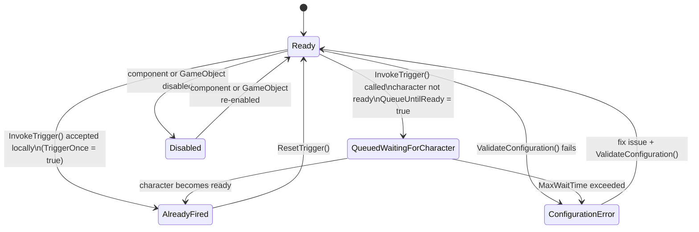

`ConvaiNarrativeDesignTrigger` submits a saved trigger name to Convai. If that name is valid for the backend's current section, a later backend event can advance the local section state. Place the component on any GameObject — a doorway, an exhibit, or a UI event target — and choose how it should activate.

## Add the trigger component



### Create or select a GameObject

For zone-based activation (Collision, Proximity, TimeBased), create an empty GameObject and position it in the scene where you want the trigger zone. For Manual activation, you can place the component anywhere.



### Add the component

Click **Add Component** and navigate to **Convai > Convai Narrative Design Trigger**.

<figure><figcaption><p>Adding ConvaiNarrativeDesignTrigger to a GameObject.</p></figcaption></figure>



### Assign the character

Drag your `ConvaiCharacter` into the **Character** field. If you leave it blank, **Auto Find Character** searches the parent hierarchy and then the `ConvaiManager`'s character list automatically. If more than one character is in the scene, assign the target explicitly.



### Fetch and select a trigger

Click **Fetch** in the **Trigger Selection** section. The SDK calls `NarrativeDesignFetcher.FetchTriggersAsync` and populates the dropdown with all triggers defined for this character on the dashboard.

Select the trigger you want this component to send. The component stores the selected **Trigger Name** and **Trigger ID**. The Inspector's read-only details can also show the fetched message and destination; those details are not sent by this component, and its runtime `TriggerMessage` property is cleared when a selection is applied.

<figure><figcaption><p>Trigger dropdown populated from the Convai dashboard.</p></figcaption></figure>



### Choose an activation mode

Select one of the four activation modes described below and configure its settings.



## Activation modes

<figure><figcaption><p>Activation Settings header with mode selector.</p></figcaption></figure>

### Collision

The default mode. The trigger fires when a tagged player GameObject enters the collider attached to the same GameObject.

**Requirements:**

* A `Collider` component on the same GameObject with **Is Trigger** enabled.
* Either the trigger GameObject or the player GameObject must have a `Rigidbody` for Unity physics to generate the `OnTriggerEnter` callback.


If **Is Trigger** is not enabled on the collider, or if neither the trigger object nor the player has a `Rigidbody`, `OnTriggerEnter` will never fire. Enable **Validate On Start** to catch this automatically when the scene runs.


**Detection settings:**

| Field            | Default    | Description                                                     |
| ---------------- | ---------- | --------------------------------------------------------------- |
| **Player Tag**   | `"Player"` | Only GameObjects with this tag are recognized as the player.    |
| **Player Layer** | All layers | Layer mask to further filter which objects count as the player. |

### Proximity

The trigger fires when the player's distance from the component's `Transform` falls within **Proximity Radius**. The check runs every frame in `Update`. A green sphere is drawn in the Scene view showing the detection radius.

| Field                | Default    | Description                                                            |
| -------------------- | ---------- | ---------------------------------------------------------------------- |
| **Proximity Radius** | `3`        | Detection radius in world units.                                       |
| **Player Tag**       | `"Player"` | Tag used to identify the player.                                       |
| **Auto Find Player** | `true`     | Searches the scene for a tagged player GameObject if none is assigned. |

This mode does not require a collider.

### TimeBased

The trigger fires after the player has been inside the collider zone for a set duration. If the player exits before the delay elapses, the countdown cancels and restarts the next time the player enters.

**Requirements:** same collider setup as Collision mode.

| Field          | Default    | Description                                                          |
| -------------- | ---------- | -------------------------------------------------------------------- |
| **Time Delay** | `0`        | Seconds the player must remain in the zone before the trigger fires. |
| **Player Tag** | `"Player"` | Tag used to identify the player.                                     |

### Manual

The trigger does nothing automatically. Call `InvokeTrigger()` or `TryInvokeTrigger()` from your own code or a Unity Event to fire it. Use this mode when the activation condition is controlled entirely by your game logic — a UI button, a quest completion callback, or a scored interaction.

```csharp
// Fire the trigger from code and check local acceptance/queueing
bool accepted = narrativeTrigger.InvokeTrigger();

// Attempt silently — skips without warning if TriggerOnce already fired
bool attempted = narrativeTrigger.TryInvokeTrigger();
```

## Trigger request mode

Activation mode and trigger request mode are two independent settings. Activation mode (`Collision`, `Proximity`, `TimeBased`, `Manual`) controls _when_ `ConvaiNarrativeDesignTrigger` fires, as described above. Trigger request mode controls _what_ gets sent to Convai over RTVI once it fires.

`ConvaiNarrativeDesignTrigger` always sends its configured trigger using `ConvaiNarrativeTriggerMode.SavedTrigger`. Internally it calls `convaiCharacter.NarrativeDesign.InvokeTrigger(_triggerName)`, which sends only the `trigger_name` field. This component has no Inspector option to switch to either of the other two trigger request modes.

Two additional trigger request modes exist on `ConvaiNarrativeTriggerRequest` (namespace `Convai.Runtime.NarrativeDesign`):

| Trigger request mode | Wire field | How to send it |
| --- | --- | --- |
| `SavedTrigger` | `trigger_name` | `ConvaiNarrativeDesignTrigger` (this component), or `IConvaiNarrativeDesign.InvokeTrigger(string)` from code |
| `InlineEvent` | `trigger_message` | `IConvaiNarrativeDesign.InvokeEvent(string)` — code only, no Inspector equivalent |
| `ScriptedSpeech` | `trigger_message` (the SDK wraps input in one `<speak>` root) | `IConvaiNarrativeDesign.InvokeSpeech(string)` — code only, no Inspector equivalent |

`InlineEvent` and `ScriptedSpeech` are not reachable from this component's Inspector. Use `InvokeEvent` to submit contextual text, or `InvokeSpeech` to request scripted speech without sending a saved trigger name. Pass plain text to `InvokeSpeech`; do not add your own `<speak>` root, because the SDK adds it without SSML validation or escaping. Backend playback and exact speech still require live-room validation.

## Auto-recovery settings

These settings make the trigger resilient to common runtime conditions where the character or player may not be ready immediately.

<figure><figcaption><p>Auto-Recovery Settings header.</p></figcaption></figure>

| Field                   | Default | Description                                                                                                                                                                                                                                                     |
| ----------------------- | ------- | --------------------------------------------------------------------------------------------------------------------------------------------------------------------------------------------------------------------------------------------------------------- |
| **Auto Find Character** | `true`  | Searches the parent hierarchy, then `ConvaiManager.Characters`. Assigns automatically if only one character exists; logs a warning if multiple characters are found.                                                                                            |
| **Auto Find Player**    | `true`  | Searches by Player Tag, then by common name list, then via `Camera.main.parent`.                                                                                                                                                                                |
| **Queue Until Ready**   | `true`  | If the character is not yet in an active conversation (`IsInConversation` is `false`), the component waits and submits when readiness is detected. This is local queue behavior, not a backend acknowledgement. |
| **Max Wait Time**       | `30`    | Maximum seconds to wait for the character to become ready. Set to `0` for no timeout.                                                                                                                                                                           |
| **Reset On Scene Load** | `true`  | Calls `ResetTrigger()` whenever a scene is loaded, so the trigger can fire again in reloaded scenes.                                                                                                                                                            |


Setting **Max Wait Time** to `0` in a production build where the session may never connect creates an indefinite coroutine. Always set a reasonable timeout unless you have explicit control over session lifetime.


## Control trigger frequency

**Trigger Once** (default `true`) prevents the component from accepting more than one invocation. After the first locally accepted send, `HasTriggered` becomes `true`, `CurrentStatus` becomes `AlreadyFired`, and subsequent calls return `false`. This state does not prove a backend graph transition.

To allow the trigger to fire again, call `ResetTrigger()`:

```csharp
narrativeTrigger.ResetTrigger();
```

`ResetTrigger()` also cancels any queued trigger that is waiting for the character to become ready.

To allow the trigger to fire on every activation, disable **Trigger Once** in the Inspector.

## Events reference

| Event                | Signature            | When it fires                                                                           |
| -------------------- | -------------------- | --------------------------------------------------------------------------------------- |
| `OnTriggerActivated` | `UnityEvent`         | The character API accepted the request locally after readiness. No backend acknowledgement is implied. |
| `OnPlayerEnterZone`  | `UnityEvent`         | The player entered the collider or proximity zone (before the trigger fires).           |
| `OnPlayerExitZone`   | `UnityEvent`         | The player exited the collider or proximity zone.                                       |
| `OnTriggerFailed`    | `UnityEvent<string>` | The trigger could not fire. The string argument contains the error message.             |
| `OnTriggerQueued`    | `UnityEvent`         | The trigger was accepted but deferred because the character is not yet in conversation. |

## Trigger status

The `CurrentStatus` property tracks the trigger's state at all times:



See [Troubleshoot narrative design](troubleshooting-and-diagnostics.md) for a full resolution guide for each status.

## Inspector reference

### Character Reference header

| Field                   | Default | Description                                                                               |
| ----------------------- | ------- | ----------------------------------------------------------------------------------------- |
| **Character**           | None    | The target `ConvaiCharacter`. Auto-found if blank and **Auto Find Character** is enabled. |
| **Auto Find Character** | `true`  | Searches hierarchy and ConvaiManager if Character field is empty.                         |

### Trigger Selection header

| Field | Default | Description |
| --- | --- | --- |
| **Trigger ID** | Empty | Read-only after selection. Unique identifier from the dashboard. |
| **Trigger Name** | Empty | Saved trigger name sent to Convai when this component fires. |
| **Trigger Message** | Empty | The runtime property remains empty after trigger selection. Fetched message text is shown only in the Inspector's trigger details and is not sent. |

### Activation Settings header

| Field                | Default     | Description                                                                    |
| -------------------- | ----------- | ------------------------------------------------------------------------------ |
| **Activation Mode**  | `Collision` | How the trigger activates: `Collision`, `Proximity`, `Manual`, or `TimeBased`. |
| **Proximity Radius** | `3`         | Detection radius for Proximity mode.                                           |
| **Time Delay**       | `0`         | Countdown seconds for TimeBased mode.                                          |
| **Trigger Once**     | `true`      | If enabled, fires only once until `ResetTrigger()` is called.                  |
| **Player Layer**     | All         | Layer mask for player detection.                                               |
| **Player Tag**       | `"Player"`  | Tag used to identify the player GameObject.                                    |

### Auto-Recovery Settings header

| Field                   | Default | Description                                                 |
| ----------------------- | ------- | ----------------------------------------------------------- |
| **Auto Find Player**    | `true`  | Searches the scene for a tagged player if none is detected. |
| **Queue Until Ready**   | `true`  | Defers the trigger until the character's session is open.   |
| **Max Wait Time**       | `30`    | Timeout in seconds for the queue. `0` = no timeout.         |
| **Reset On Scene Load** | `true`  | Resets `HasTriggered` on scene load.                        |

### Diagnostics header

| Field                  | Default | Description                                                  |
| ---------------------- | ------- | ------------------------------------------------------------ |
| **Enable Diagnostics** | `false` | Logs detailed state transitions to the Console.              |
| **Validate On Start**  | `true`  | Runs `ValidateConfiguration()` at Start and logs any issues. |

## Next steps


[Configure narrative template keys](template-keys-dynamic-narrative-variables.md)



[Narrative design scripting reference](scripting-narrative-design.md)

