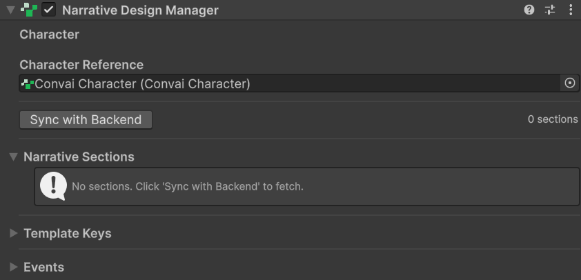
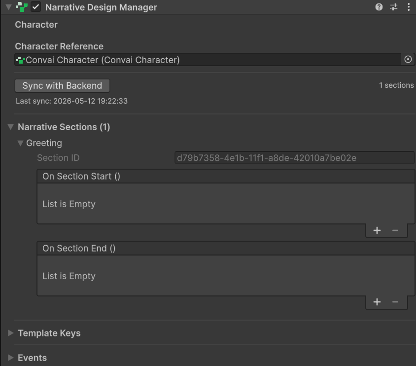
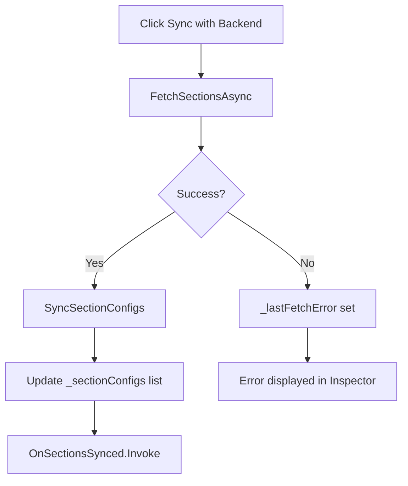
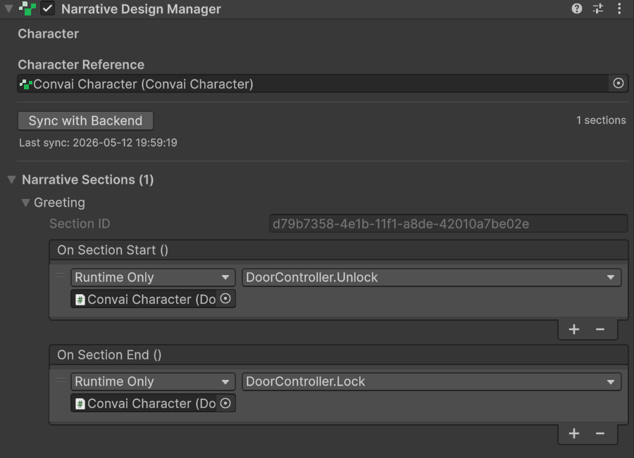
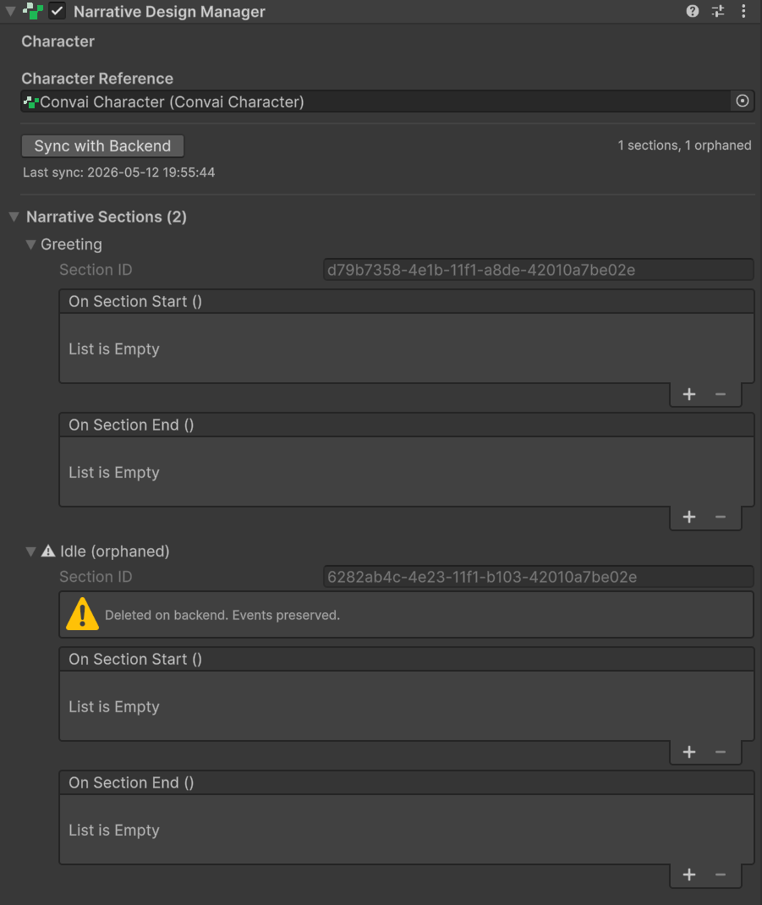
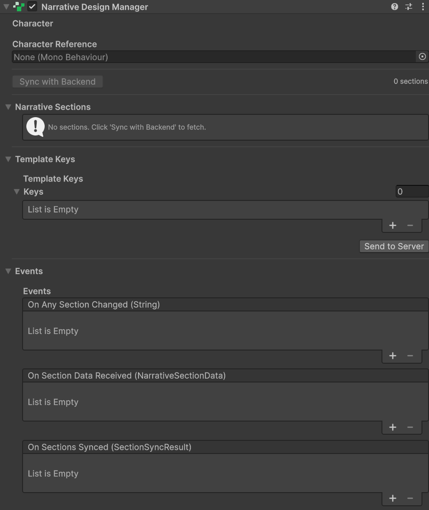

# Setting Up the Narrative Design Manager

## The ConvaiNarrativeDesignManager Component

`ConvaiNarrativeDesignManager` is the permanent listening post on your character. It subscribes to section-change signals from the Convai backend and forwards them to the Unity Events you configure in the Inspector. One Manager per character is the standard setup; it lives on the character GameObject for the lifetime of the scene.

## Adding the Component



#### Select the character GameObject

Choose the GameObject that has your `ConvaiCharacter` component. The Manager auto-detects the character if both components are on the same GameObject.



#### Add the component

In the Inspector, click **Add Component** and navigate to **Convai > Narrative Design Manager**.

The **Character** field is populated automatically if a `ConvaiCharacter` is on the same GameObject. If not, drag your character into the field manually.

<figure><figcaption></figcaption></figure>



#### Sync with the backend

Click the **Sync with Backend** button in the Inspector. The Manager calls `FetchAndSyncFromBackend()`, which fetches your character's sections from the Convai dashboard and populates the **Narrative Sections** list.

You only need to do this when your section list changes on the dashboard. The section IDs and Unity Event wiring persist between sessions in your scene file.

<figure><figcaption></figcaption></figure>



## Sync Status Panel

The **Sync Status** header in the Inspector shows the current state of the last fetch operation. All fields are read-only.

| Field                        | Description                                                                                                  |
| ---------------------------- | ------------------------------------------------------------------------------------------------------------ |
| **Is Fetching**              | `true` while a fetch operation is in progress. The Sync button is disabled during this time.                 |
| **Last Sync Time**           | Timestamp of the last successful sync (format: `yyyy-MM-dd HH:mm:ss`).                                       |
| **Last Synced Character ID** | The character ID used in the last successful sync. Useful for verifying the correct character is configured. |
| **Last Fetch Error**         | The error message from the most recent failed fetch, if any. Empty when the last fetch succeeded.            |

The sync result is also reported via the `OnSectionsSynced` event (see Global Events below). The `SectionSyncResult` it carries tells you exactly what changed:

| Field                 | Description                                                          |
| --------------------- | -------------------------------------------------------------------- |
| `SectionsAdded`       | Sections new to the local list (not previously synced).              |
| `SectionsUpdated`     | Sections whose name changed on the dashboard.                        |
| `SectionsOrphaned`    | Sections removed from the dashboard since the last sync.             |
| `SectionsReactivated` | Sections that were orphaned but have been restored on the dashboard. |


If **Last Fetch Error** is not empty, the most common causes are a missing or invalid API key (**Edit > Project Settings > Convai SDK**) or a blank character ID on the `ConvaiCharacter` component.


## Narrative Sections

After syncing, each dashboard section appears as an entry in the **Narrative Sections** list. Every entry is a `UnitySectionEventConfig` with the following fields:

| Field                | Type                 | Description                                                                                                                      |
| -------------------- | -------------------- | -------------------------------------------------------------------------------------------------------------------------------- |
| **Section ID**       | `string` (read-only) | Unique identifier matching the section on the dashboard. Never edit this manually.                                               |
| **Section Name**     | `string` (read-only) | Display name from the dashboard. Updated automatically on the next sync if the name changes.                                     |
| **Is Orphaned**      | `bool` (read-only)   | `true` if this section no longer exists on the dashboard. Orphaned sections show a warning badge and their events will not fire. |
| **On Section Start** | `UnityEvent`         | Invoked when the character transitions **into** this section.                                                                    |
| **On Section End**   | `UnityEvent`         | Invoked when the character transitions **out of** this section.                                                                  |

### Wiring Section Events

Click the **+** button on **On Section Start** or **On Section End** to add a listener. You can call any public method on any GameObject in the scene — Animator parameters, AudioSource playback, UI panel activation, and so on.

**Example:** To enable a locked door when the character enters an "Access Granted" section, drag the door's `DoorController` component into the listener field and select `DoorController.Unlock`.

<figure><figcaption></figcaption></figure>

### Orphaned Sections

A section becomes orphaned when it is deleted from the dashboard but still exists in your local list. Orphaned entries are preserved so you do not lose your Unity Event wiring.


Orphaned sections will never fire their `OnSectionStart` or `OnSectionEnd` events at runtime. If you restore the section on the dashboard, click **Sync with Backend** again to reactivate it.


<figure><figcaption></figcaption></figure>


Clicking **Clear All Sections** (available via `ClearAllSectionConfigs()` at runtime, and exposed in the Inspector when switching characters) permanently removes all `UnitySectionEventConfig` entries, including all `OnSectionStart` / `OnSectionEnd` wiring. This action cannot be undone. Use it only when you are intentionally switching to a different character and no longer need the existing wiring.


## Global Events

The **Events** foldout exposes three global Unity Events that fire regardless of which specific section is active.

| Event                   | Signature                          | When it fires                                                                                                                       |
| ----------------------- | ---------------------------------- | ----------------------------------------------------------------------------------------------------------------------------------- |
| `OnAnySectionChanged`   | `UnityEvent<string>`               | Every time the active section changes. Receives the new section ID as a string.                                                     |
| `OnSectionDataReceived` | `UnityEvent<NarrativeSectionData>` | Every section transition. Carries the full `NarrativeSectionData` payload including `BehaviorTreeCode` and `BehaviorTreeConstants`. |
| `OnSectionsSynced`      | `UnityEvent<SectionSyncResult>`    | After each successful call to `FetchAndSyncFromBackend()` or `FetchAndSyncFromBackendAsync()`.                                      |

`OnAnySectionChanged` is useful for UI that needs to reflect the current story state without knowing section IDs in advance — for example, a progress indicator that increments each time the section changes.

`OnSectionDataReceived` provides the raw behavior-tree payload. Most projects do not need this directly; it is intended for advanced integrations that interpret `BehaviorTreeCode` or `BehaviorTreeConstants`.

## Inspector Reference

### Character Reference Header

| Field         | Default       | Description                                                                                                           |
| ------------- | ------------- | --------------------------------------------------------------------------------------------------------------------- |
| **Character** | Auto-detected | The `ConvaiCharacter` (or any `IConvaiCharacterAgent`) to listen to. Auto-found on the same GameObject if left blank. |

### Narrative Sections Header

| Field                      | Default  | Description                                                                    |
| -------------------------- | -------- | ------------------------------------------------------------------------------ |
| **Section Configs**        | Empty    | List of `UnitySectionEventConfig` entries. Populated by **Sync with Backend**. |
| **Active Section Count**   | Computed | Number of non-orphaned entries (read-only, shown in Inspector header).         |
| **Orphaned Section Count** | Computed | Number of orphaned entries (read-only, shown in Inspector header).             |

### Template Keys Header

| Field             | Default | Description                                                                                             |
| ----------------- | ------- | ------------------------------------------------------------------------------------------------------- |
| **Template Keys** | Empty   | List of `UnityTemplateKeyConfig` entries (Key / Value pairs). See Template Keys for full documentation. |

### Sync Status Header

| Field                        | Default | Description                                      |
| ---------------------------- | ------- | ------------------------------------------------ |
| **Is Fetching**              | `false` | Read-only. `true` during an active fetch.        |
| **Last Sync Time**           | Empty   | Read-only. Timestamp of last successful sync.    |
| **Last Synced Character ID** | Empty   | Read-only. Character ID used in last sync.       |
| **Last Fetch Error**         | Empty   | Read-only. Last error message; empty on success. |

<figure><figcaption></figcaption></figure>

## Conclusion

`ConvaiNarrativeDesignManager` is the permanent listener that bridges the Convai backend's section transitions to Unity Events in your scene. Once synced, every section change automatically reaches the correct `OnSectionStart` or `OnSectionEnd` handler without any polling or manual state tracking. Continue to [Setting Up Narrative Design Triggers](../../../unity-plugin-beta-overview/features/narrative-design/setting-up-narrative-design-triggers.md) to place the world-space components that actually advance the story graph.
