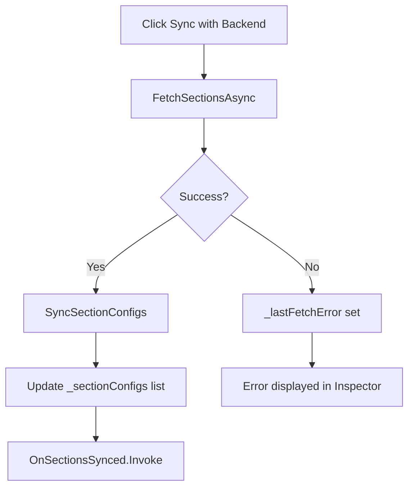

`ConvaiNarrativeDesignManager` is the permanent listening post on your character. It subscribes to section-change signals from Convai and forwards them to the Unity Events you configure in the Inspector. One Manager per character is the standard setup; it lives on the character GameObject for the lifetime of the scene.

## Add the component



### Select the character GameObject

Choose the GameObject that has your `ConvaiCharacter` component. The Manager auto-detects the character if both components are on the same GameObject.



### Add the component

In the Inspector, click **Add Component** and navigate to **Convai > Narrative Design Manager**.

The **Character** field is populated automatically if a `ConvaiCharacter` is on the same GameObject. If not, drag your character into the field manually.

<figure><figcaption>
ConvaiNarrativeDesignManager on the character's GameObject.
</figcaption></figure>



### Sync with the backend

Click the **Sync with Backend** button in the Inspector. The Manager calls `FetchAndSyncFromBackend()`, which fetches your character's sections from the Convai dashboard and populates the **Narrative Sections** list.

You only need to do this when your section list changes on the dashboard. The section IDs and Unity Event wiring persist between sessions in your scene file.

<figure><figcaption>
Narrative Sections list after a successful sync.
</figcaption></figure>



```mermaid
flowchart TD
    A[Click Sync with Backend] --> B[FetchSectionsAsync]
    B --> C{Success?}
    C -- Yes --> D[SyncSectionConfigs]
    D --> E[Update _sectionConfigs list]
    E --> F[OnSectionsSynced.Invoke]
    C -- No --> G[_lastFetchError set]
    G --> H[Error displayed in Inspector]
```

## Sync status

The **Sync Status** header in the Inspector shows the current state of the last fetch operation. All fields are read-only.

| Field                        | Description                                                                                                  |
| ---------------------------- | ------------------------------------------------------------------------------------------------------------ |
| **Is Fetching**              | `true` while a fetch operation is in progress. The Sync button is disabled during this time.                 |
| **Last Sync Time**           | Timestamp of the last successful sync (format: `yyyy-MM-dd HH:mm:ss`).                                       |
| **Last Synced Character ID** | The character ID used in the last successful sync. Useful for verifying the correct character is configured. |
| **Last Fetch Error**         | The error message from the most recent failed fetch, if any. Empty when the last fetch succeeded.            |


If **Last Fetch Error** is not empty, the most common causes are a missing or invalid API key — see [Configure the API key](../../getting-started/configure-api-key.md) or a blank character ID on the `ConvaiCharacter` component.


After a successful sync, `OnSectionsSynced` reports a `SectionSyncResult` (see Global events below). A failed fetch does not invoke this event; inspect **Last Fetch Error**, or await `FetchAndSyncFromBackendAsync()` and check `Success` before reading its counts.

| Field                 | Description                                                          |
| --------------------- | -------------------------------------------------------------------- |
| `SectionsAdded`       | Sections new to the local list (not previously synced).              |
| `SectionsUpdated`     | Sections whose name changed on the dashboard.                        |
| `SectionsOrphaned`    | Sections removed from the dashboard since the last sync.             |
| `SectionsReactivated` | Sections that were orphaned but have been restored on the dashboard. |

## Narrative sections

After syncing, each dashboard section appears as an entry in the **Narrative Sections** list. Every entry is a `UnitySectionEventConfig` with the following fields:

| Field                | Type                 | Description                                                                                                                      |
| -------------------- | -------------------- | -------------------------------------------------------------------------------------------------------------------------------- |
| **Section ID**       | `string` (read-only) | Unique identifier matching the section on the dashboard. Never edit this manually.                                               |
| **Section Name**     | `string` (read-only) | Display name from the dashboard. Updated automatically on the next sync if the name changes.                                     |
| **Is Orphaned**      | `bool` (read-only)   | `true` if this section was absent from the latest backend sync. It remains in the runtime lookup so its event wiring is preserved. |
| **On Section Start** | `UnityEvent`         | Invoked when the character transitions **into** this section.                                                                    |
| **On Section End**   | `UnityEvent`         | Invoked when the character transitions **out of** this section.                                                                  |

### Wire section events

Click the **+** button on **On Section Start** or **On Section End** to add a listener. You can call any public method on any GameObject in the scene — Animator parameters, AudioSource playback, UI panel activation, and so on.

**Example:** To unlock a door when the character enters an "Access Granted" section, drag the door's `DoorController` component into the listener field and select `DoorController.Unlock`.

<figure><figcaption>
On Section Start wired to a DoorController component.
</figcaption></figure>

### Orphaned sections

A section becomes orphaned when it is absent from the latest backend list but still exists locally. Orphaned entries are preserved so you do not lose Unity Event wiring. In Unity SDK 4.5.0, `IsOrphaned` changes Inspector status and active/orphan counts; it does not filter runtime section lookup. If the backend later emits that section ID, the preserved `OnSectionStart` or `OnSectionEnd` listener can still fire. Restore the section and sync again to clear the orphaned flag.

<figure><figcaption>
An orphaned section entry in the Narrative Sections list.
</figcaption></figure>


**Clear All Sections** permanently removes all `UnitySectionEventConfig` entries, including all `OnSectionStart` / `OnSectionEnd` wiring. This action cannot be undone. Use it only when switching to a different character and no longer need the existing wiring. The equivalent runtime call is `ClearAllSectionConfigs()`.


## Global events

The **Events** foldout exposes three global Unity Events. The Manager subscribes to `NarrativeSectionChanged` with the EventHub's default `MainThread` delivery policy, so these Unity-facing callbacks are scheduled on Unity's main thread. The source does not promise delivery in the same frame as the network message.

| Event                   | Signature                          | When it fires                                                                                                                       |
| ----------------------- | ---------------------------------- | ----------------------------------------------------------------------------------------------------------------------------------- |
| `OnAnySectionChanged`   | `UnityEvent<string>`               | Every matching backend section event processed by the Manager, including a repeated ID. Receives the event's section ID.            |
| `OnSectionDataReceived` | `UnityEvent<NarrativeSectionData>` | Every matching backend section event. Carries `SectionId` plus optional `BehaviorTreeCode` and `BehaviorTreeConstants`.              |
| `OnSectionsSynced`      | `UnityEvent<SectionSyncResult>`    | After each successful call to `FetchAndSyncFromBackend()` or `FetchAndSyncFromBackendAsync()`.                                      |

`OnAnySectionChanged` is useful for UI that needs to reflect the latest story state without knowing section IDs in advance. Because repeated section IDs also invoke this event, compare the received ID with your previous ID before incrementing a progress indicator.

`OnSectionDataReceived` provides the raw behavior-tree payload. Most projects do not need this directly; it is intended for advanced integrations that interpret `BehaviorTreeCode` or `BehaviorTreeConstants`.

## Inspector reference

### Character Reference header

| Field         | Default       | Description                                                                                                           |
| ------------- | ------------- | --------------------------------------------------------------------------------------------------------------------- |
| **Character** | Auto-detected | The `ConvaiCharacter` (or any `IConvaiCharacterAgent`) to listen to. Auto-found on the same GameObject if left blank. |

### Narrative Sections header

| Field                      | Default  | Description                                                                    |
| -------------------------- | -------- | ------------------------------------------------------------------------------ |
| **Section Configs**        | Empty    | List of `UnitySectionEventConfig` entries. Populated by **Sync with Backend**. |
| **Active Section Count**   | Computed | Number of non-orphaned entries (read-only, shown in Inspector header).         |
| **Orphaned Section Count** | Computed | Number of orphaned entries (read-only, shown in Inspector header).             |

### Template Keys header

| Field             | Default | Description                                                                                                                                                                 |
| ----------------- | ------- | --------------------------------------------------------------------------------------------------------------------------------------------------------------------------- |
| **Template Keys** | Empty   | List of `UnityTemplateKeyConfig` entries (Key / Value pairs). See [Configure narrative template keys](template-keys-dynamic-narrative-variables.md) for full documentation. |

### Sync Status header

| Field                        | Default | Description                                      |
| ---------------------------- | ------- | ------------------------------------------------ |
| **Is Fetching**              | `false` | Read-only. `true` during an active fetch.        |
| **Last Sync Time**           | Empty   | Read-only. Timestamp of last successful sync.    |
| **Last Synced Character ID** | Empty   | Read-only. Character ID used in last sync.       |
| **Last Fetch Error**         | Empty   | Read-only. Last error message; empty on success. |

<figure><figcaption>
Full Inspector view of ConvaiNarrativeDesignManager.
</figcaption></figure>

## Next steps


[setting-up-narrative-design-triggers.md](setting-up-narrative-design-triggers.md)



[template-keys-dynamic-narrative-variables.md](template-keys-dynamic-narrative-variables.md)

