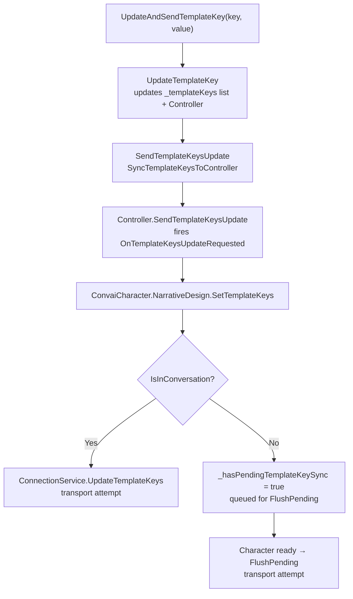

Template keys are runtime key-value pairs submitted for placeholders in a character's narrative objectives. Define placeholders in the [Convai dashboard](https://convai.com) using curly-brace syntax—for example, `{PlayerName}` or `{CurrentTask}`—then send matching values from Unity. Backend substitution and resulting dialogue must be verified in a live room.

### Define keys in the Inspector

Open `ConvaiNarrativeDesignManager` in the Inspector and expand the **Template Keys** foldout.

Click **+** to add an entry. Each entry has two fields:

| Field     | Description                                                                                                                    |
| --------- | ------------------------------------------------------------------------------------------------------------------------------ |
| **Key**   | The placeholder name, exactly as written in the narrative design section objective (case-sensitive, without the curly braces). |
| **Value** | The initial value. You can override this at runtime from code.                                                                 |

<figure><figcaption><p>Template Keys foldout in ConvaiNarrativeDesignManager.</p></figcaption></figure>

Keys defined in the Inspector are copied into the Manager's internal controller on `Awake`, but that step does **not** copy them into `ConvaiCharacter.NarrativeDesign` or send them. Call `SendTemplateKeysUpdate()` (or **Send to Server** in Play Mode) at least once. If called before character readiness, that explicit send request copies the full Manager snapshot into the character facade and marks it pending for the ready flush.

In Play Mode, the Inspector shows a **Send to Server** button that calls `SendTemplateKeysUpdate()`. The call requests a send or queues the character snapshot; it does not expose a backend acknowledgement.

### Update keys at runtime

Use any of the following methods on `ConvaiNarrativeDesignManager` to update keys from code:

**Update a single key:**

```csharp
narrativeManager.UpdateTemplateKey("PlayerName", "Alex");
```

**Update and request a send (one call):**

```csharp
narrativeManager.UpdateAndSendTemplateKey("ScenarioPhase", "Handwashing");
```

Use `UpdateAndSendTemplateKey` when the Manager should update one value and immediately attempt to submit its full key snapshot. The method returns `void`; it does not guarantee backend receipt or use in the next response.

**Update multiple keys at once:**

```csharp
narrativeManager.UpdateTemplateKeys(new Dictionary<string, string>
{
    { "PlayerName", "Alex" },
    { "Department",  "Facilities" },
    { "CompletedSteps", "3" }
});
narrativeManager.SendTemplateKeysUpdate();
```

**Read the current key dictionary:**

```csharp
Dictionary<string, string> current = narrativeManager.GetTemplateKeys();
```

### How keys are sent



After keys have reached `ConvaiCharacter.NarrativeDesign` at least once, disconnect marks that character facade's current dictionary for replay on the next ready signal. Inspector or Manager-only edits that were never passed through `SendTemplateKeysUpdate()` are not part of that replay. Reacquire live state after reconnect and validate the new transport attempt; the client does not expose a template-key backend acknowledgement.

### Key naming rules

| Rule                                                          | Example                                                          |
| ------------------------------------------------------------- | ---------------------------------------------------------------- |
| Must match the dashboard placeholder exactly (case-sensitive) | Dashboard: `{playerName}` → Key: `playerName` (not `PlayerName`) |
| Match whitespace exactly; the SDK does not trim key names     | `"PlayerName"` and `" PlayerName"` are different keys          |
| No empty or whitespace-only key                               | Character API rejects it and logs a warning                        |
| Values can be empty strings                                   | Key `"OptionalField"` with value `""` is valid                   |

**Good key names:**

| Key                    | Value example |
| ---------------------- | ------------- |
| `PlayerName`           | `"Maria"`     |
| `ScenarioLevel`        | `"Advanced"`  |
| `CompletedCheckpoints` | `"4"`         |
| `SessionStartTime`     | `"09:15"`     |

**Problematic key names:**

| Key             | Problem                                                                                          |
| --------------- | ------------------------------------------------------------------------------------------------ |
| `player name`   | Space in name — will not match `{player name}` placeholders if the dashboard uses `{playerName}` |
| `"PlayerName "` | Trailing space — silent mismatch                                                                 |
| `""`            | Empty — rejected by the character API                                                            |


Template key values are sent as plain strings over the network and may appear in the character's dialogue. Do not include passwords, personal identification numbers, API secrets, or any other sensitive data in template key values.


### Set keys on the character directly

If you are working without a `ConvaiNarrativeDesignManager`, you can set template keys directly through the character API:

```csharp
ConvaiCharacter character = GetComponent<ConvaiCharacter>();

// Single key: true means stored locally and sent or queued by the client path
bool accepted = character.NarrativeDesign.SetTemplateKey("PlayerName", "Alex");

// Multiple keys
character.NarrativeDesign.SetTemplateKeys(new Dictionary<string, string>
{
    { "PlayerName", "Alex" },
    { "Department", "Engineering" }
});
```

The character API and Manager send path converge on `ConnectionService.UpdateTemplateKeys`, but their local stores are not bidirectionally synchronized:

* Character-level `SetTemplateKey(s)` updates the live character dictionary and attempts or queues the full snapshot immediately. It does not update the Manager's Inspector list.
* Manager `UpdateTemplateKey(s)` changes only the Manager list and controller until `SendTemplateKeysUpdate()` is called.
* A later Manager send merges its snapshot into the character facade; it does not remove character-only keys that are absent from the Manager list.

Choose one owner for each key to avoid stale Inspector values and redundant full-snapshot sends. Character methods return local acceptance/transport status; Manager send methods return `void`. Neither path acknowledges backend application.

### Next steps


[scripting-narrative-design.md](scripting-narrative-design.md)

