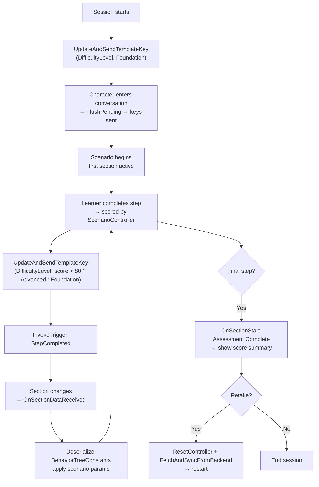

The following examples show how to compose `ConvaiNarrativeDesignManager`, `ConvaiNarrativeDesignTrigger`, and `IConvaiNarrativeDesign` into complete, working setups. They are ordered from simple to advanced and cover different domains to illustrate the breadth of what Narrative Design supports. Each example is self-contained — start from whichever matches your current complexity level.

These examples were checked against the Unity 4.5.0 client source. Local return values and activation events do not acknowledge a backend graph transition, template substitution, or scripted-speech playback. Verify those outcomes in Play Mode with a live room.

## Example 1: scripted welcome sequence

**Complexity:** Beginner | **Activation mode:** Manual | **Features used:** Manager, Trigger (Manual), one template key

**Scenario:** A visitor arrives at a reception desk. A "Start" button in the UI kicks off the experience by sending a single trigger that moves the character from an idle state into an active welcome section.

### Setup



### Prepare the scene

Add `ConvaiNarrativeDesignManager` to the character GameObject and sync sections from the dashboard. You need at least two sections: an idle section (where the character waits) and a welcome section (where the character begins the experience).



### Set the visitor's name before the session

Before starting the session, send a template key so the character can reference the visitor by name:

```csharp
using Convai.Modules.Narrative;
using UnityEngine;

public class ReceptionController : MonoBehaviour
{
    [SerializeField] private ConvaiNarrativeDesignManager _narrativeManager;
    [SerializeField] private string _visitorName;

    private void Start()
    {
        _narrativeManager.UpdateAndSendTemplateKey("VisitorName", _visitorName);
    }
}
```



### Add a Manual trigger

Add `ConvaiNarrativeDesignTrigger` to any GameObject (it won't be in the world — it's driven by UI). Set **Activation Mode** to **Manual** and fetch/select the welcome trigger from the dashboard.



### Wire the UI button

In the Button component's **On Click ()** event, assign the `ConvaiNarrativeDesignTrigger` and select `ConvaiNarrativeDesignTrigger.InvokeTrigger`.



### Wire the section event

In the Manager's **Narrative Sections** list, find the welcome section entry and add an `OnSectionStart` listener. Point it to whatever should change in the scene when the welcome begins — for example, enabling a name badge UI or starting an ambient animation.



**What happens on the client:** Player clicks Start → `InvokeTrigger()` submits or queues the saved name. If the backend later reports the welcome section ID, `OnSectionStart` fires on the matching local entry. A local `true` result or `OnTriggerActivated` alone does not prove the graph moved.

## Example 2: branching conversation

**Complexity:** Intermediate | **Activation mode:** Manual (code-driven) | **Features used:** Manager, `IConvaiNarrativeDesign`, `InvokeSpeech`, multiple template keys

**Scenario:** An orientation assistant can guide users through three independent topic areas (facilities, systems access, policies). Topic selection is driven by UI buttons, and the user can navigate freely between topics. Open-ended follow-up questions are supported after each topic.

### Setup

Sync all topic sections in the Manager. No `ConvaiNarrativeDesignTrigger` component is needed — triggers are sent directly via `IConvaiNarrativeDesign`.

```csharp
using Convai.Modules.Narrative;
using Convai.Runtime.Components;
using TMPro;
using UnityEngine;

public class OrientationController : MonoBehaviour
{
    [SerializeField] private ConvaiCharacter _character;
    [SerializeField] private ConvaiNarrativeDesignManager _narrativeManager;
    [SerializeField] private TextMeshProUGUI _activeTopicLabel;

    private void OnEnable()
    {
        _character.NarrativeDesign.OnSectionChanged += OnSectionChanged;
    }

    private void OnDisable()
    {
        _character.NarrativeDesign.OnSectionChanged -= OnSectionChanged;
    }

    // Called by UI buttons
    public bool SelectTopic(string triggerName)
    {
        return _character.NarrativeDesign.InvokeTrigger(triggerName);
    }

    // Submit contextual event text; this is not a player-transcript API.
    public bool SubmitFollowUpContext(string context)
    {
        return _character.NarrativeDesign.InvokeEvent(context);
    }

    // Request scripted speech. Pass plain text; the SDK adds the <speak> root.
    public bool AnnounceToUser(string announcement)
    {
        return _character.NarrativeDesign.InvokeSpeech(announcement);
    }

    private void OnSectionChanged(string previous, string next)
    {
        // Update breadcrumb UI — look up the human-readable name from the Manager
        if (_narrativeManager.FindSectionConfig(next) is { } cfg)
            _activeTopicLabel.text = cfg.SectionName;
    }
}
```

Assign trigger names to buttons in the Inspector: `"TopicFacilities"`, `"TopicSystemsAccess"`, `"TopicPolicies"`.

The character API has no `TriggerOnce` gate, so the UI can submit a topic name again. To prepare Manager-owned template keys (`UserName`, `Department`) before the session opens, call `UpdateTemplateKeys(...)` and then `SendTemplateKeysUpdate()`; updating the Manager list alone does not enter the character's pending queue.

`InvokeEvent` submits contextual text in `trigger_message`. `InvokeSpeech` uses the same wire field but automatically wraps plain input in one `<speak>` root. Do not add the root yourself, and do not use either API as a substitute for the normal player transcript pipeline. Exact response or playback behavior is backend-dependent. See [Control character speech](scripting-narrative-design.md#control-character-speech).

## Example 3: proximity-triggered exhibit tour

**Complexity:** Intermediate | **Activation mode:** Proximity | **Features used:** Manager, Trigger (Proximity), zone events, batch template keys

**Scenario:** A product showroom has five display stations. As the visitor walks toward each station, a host character begins narrating that product. Each station is independent and can be visited in any order.

### Setup

Create one `ConvaiNarrativeDesignTrigger` per station. For each:

- **Activation Mode:** `Proximity`
- **Proximity Radius:** adjust per station size (visible as green sphere gizmo in Scene view)
- **Trigger Once:** `true`
- **Reset On Scene Load:** `true` (so the tour resets on each visit)

Wire station-specific context via template keys. Populate them from a `ScriptableObject` at `Start()`:

```csharp
using System.Collections.Generic;
using Convai.Modules.Narrative;
using UnityEngine;

[CreateAssetMenu(menuName = "Showroom/Station Data")]
public class StationData : ScriptableObject
{
    public string ProductName;
    public string LaunchYear;
    public string KeyFeature;
}

public class StationController : MonoBehaviour
{
    [SerializeField] private ConvaiNarrativeDesignManager _narrativeManager;
    [SerializeField] private StationData _data;

    private void Start()
    {
        _narrativeManager.UpdateTemplateKeys(new Dictionary<string, string>
        {
            { "ProductName", _data.ProductName },
            { "LaunchYear",  _data.LaunchYear  },
            { "KeyFeature",  _data.KeyFeature  }
        });
        _narrativeManager.SendTemplateKeysUpdate();
    }
}
```

Use `OnPlayerEnterZone` to highlight the product model (for example, enable an outline shader). Use `OnPlayerExitZone` to remove the highlight.


If station proximity radii overlap, two components can submit trigger names in the same frame before either resulting section event arrives. Space stations so zones do not intersect, or serialize activation in your own gameplay policy.


## Example 4: adaptive scenario with dynamic feedback

**Complexity:** Advanced | **Activation mode:** Code-driven | **Features used:** Manager, `IConvaiNarrativeDesign`, `OnSectionDataReceived`, `BehaviorTreeConstants`, dynamic template keys, retake flow

**Scenario:** A technical skills evaluator runs a multi-step scenario. After each step, the learner's performance is scored. The character's level of guidance and the scenario's challenge level adapt dynamically based on the running score. The scenario can be retaken, resetting all state.

### Session lifecycle



### Implementation

```csharp
using System;
using System.Collections.Generic;
using Convai.Domain.Narrative;
using Convai.Modules.Narrative;
using Convai.Runtime.Components;
using UnityEngine;

public class ScenarioController : MonoBehaviour
{
    [SerializeField] private ConvaiNarrativeDesignManager _narrativeManager;
    [SerializeField] private ConvaiCharacter _character;

    private int _totalScore;
    private int _stepCount;

    private void OnEnable()
    {
        _character.NarrativeDesign.OnSectionDataReceived += OnSectionDataReceived;
    }

    private void OnDisable()
    {
        _character.NarrativeDesign.OnSectionDataReceived -= OnSectionDataReceived;
    }

    public void StartScenario(string learnerName)
    {
        _totalScore = 0;
        _stepCount  = 0;
        _narrativeManager.UpdateTemplateKeys(new Dictionary<string, string>
        {
            { "LearnerName",    learnerName   },
            { "DifficultyLevel", "Foundation" }
        });
        _narrativeManager.SendTemplateKeysUpdate();
    }

    public void OnStepCompleted(int stepScore)
    {
        _totalScore += stepScore;
        _stepCount++;

        string level = (_totalScore / _stepCount) > 80 ? "Advanced" : "Foundation";
        _narrativeManager.UpdateAndSendTemplateKey("DifficultyLevel", level);
        bool accepted = _character.NarrativeDesign.InvokeTrigger("StepCompleted");
        if (!accepted)
            Debug.LogWarning("StepCompleted was rejected or requeued after a transport failure.");
    }

    private void OnSectionDataReceived(NarrativeSectionData data)
    {
        if (string.IsNullOrEmpty(data.BehaviorTreeConstants)) return;

        // BehaviorTreeConstants is a JSON string authored in the Convai dashboard
        // containing scenario-specific parameters for this section
        var constants = JsonUtility.FromJson<ScenarioConstants>(data.BehaviorTreeConstants);
        ApplyScenarioParameters(constants);
    }

    public async void RetakeScenario()
    {
        _narrativeManager.ResetController();
        SectionSyncResult result = await _narrativeManager.FetchAndSyncFromBackendAsync();
        if (!result.Success)
        {
            Debug.LogError($"Narrative sync failed: {result.Error}");
            return;
        }
        StartScenario("LearnerName");
    }

    private void ApplyScenarioParameters(ScenarioConstants constants)
    {
        // Apply values from the dashboard-authored constants to your scene
    }

    [Serializable]
    private class ScenarioConstants
    {
        public float TimeLimit;
        public int   RequiredScore;
        public bool  ShowHints;
    }
}
```

`BehaviorTreeConstants` is an optional JSON string from a backend section response. When present, it can carry dashboard-authored scenario parameters such as time limits, score thresholds, or hint flags. Check for null or empty content, as the example does, before deserializing it.


`BehaviorTreeCode` and `BehaviorTreeConstants` are read-only from the SDK side. They carry data authored in the Convai dashboard and are not modifiable at runtime from Unity.


## Next steps


[Narrative design scripting reference](scripting-narrative-design.md)



[Troubleshoot narrative design](troubleshooting-and-diagnostics.md)

