# scene metadata

Scene Metadata gives Convai characters awareness of the physical objects in your Unity scene. Add a `ConvaiObjectMetadata` component to any GameObject, describe what it is, and the SDK automatically collects and sends that information to Convai when a session connects — no scripting required for the standard workflow.

The result is a character that references scene objects by name, answers questions about them, and grounds its responses in the actual contents of the world rather than relying solely on what was written into its system prompt.

## How It Works

Every `ConvaiObjectMetadata` component registers itself with a central `ConvaiMetadataRegistry` when enabled. When a room connects, `ConvaiSceneMetadataCollector` reads that registry, assembles a payload, and sends it to Convai as an `update-scene-metadata` RTVI message.

```mermaid
flowchart TD
    A[ConvaiObjectMetadata\nOnEnable] -->|registers| B[ConvaiMetadataRegistry\nstatic, O&#40;1&#41; lookup]
    B -->|GetSceneMetadataList| C[ConvaiSceneMetadataCollector]
    C -->|SessionState.Connected| D[RTVIUpdateSceneMetadata\nupdate-scene-metadata]
    D --> E([Convai])
```

The flow is automatic. Objects register and unregister themselves as they are enabled and disabled — no manual cleanup is needed. Convai receives the current state of all registered objects at connection time.

## Scene Metadata vs. Dynamic Context

Both systems inject information into a character's context, but they serve different purposes:

|                       | Scene Metadata                                   | Dynamic Context                           |
| --------------------- | ------------------------------------------------ | ----------------------------------------- |
| **Who populates it**  | SDK auto-discovers objects                       | Developer manually injects state          |
| **What it describes** | Physical objects and entities in the scene       | Runtime state, events, player actions     |
| **When it's sent**    | Once, at room connection                         | Anytime, on demand                        |
| **Typical use**       | "There is a fire extinguisher on the south wall" | "The trainee just failed the valve check" |

Use both together for the most context-rich AI experience.


Scene Metadata describes the static world — what exists. Dynamic Context describes the dynamic world — what is happening. They are complementary, not competing.


## Pages in This Section

<table data-view="cards"><thead><tr><th></th><th data-hidden data-card-target data-type="content-ref"></th></tr></thead><tbody><tr><td><strong>Quick Start</strong> Register your first scene object and confirm it reaches Convai in under five minutes.</td><td><a href="/broken/pages/692879a8db1b83ffdd396cefc1edd359158c2933">Broken link</a></td></tr><tr><td><strong>Component Reference</strong> Every Inspector field for ConvaiObjectMetadata and ConvaiSceneMetadataCollector.</td><td><a href="/broken/pages/202097ef2f7fffdc4817286b3a99dd004e57c621">Broken link</a></td></tr><tr><td><strong>Scripting API Reference</strong> ConvaiMetadataRegistry static API and ConvaiSceneMetadataCollector public methods.</td><td><a href="/broken/pages/0edf3592c628f10a6e63435094ee7d358c5ff91f">Broken link</a></td></tr><tr><td><strong>Usage Examples</strong> Complete setups for medical training, industrial safety, museum guides, and runtime object exclusion.</td><td><a href="/broken/pages/05408490b49cb432c4e54071ca638563743891e6">Broken link</a></td></tr><tr><td><strong>Troubleshooting and Diagnostics</strong> Diagnosis for AI ignoring objects, validation errors, empty metadata payloads, and dependency failures.</td><td><a href="/broken/pages/08940377fe4c19c98bf99a41d002e0a44af394b2">Broken link</a></td></tr></tbody></table>

## Conclusion

Scene Metadata requires no scripting for the standard workflow — add components, fill in descriptions, and the SDK handles delivery at session start. Start with [Quick Start](/broken/pages/692879a8db1b83ffdd396cefc1edd359158c2933) to register your first object in under five minutes, or go directly to [Component Reference](/broken/pages/202097ef2f7fffdc4817286b3a99dd004e57c621) for a full Inspector field breakdown.
