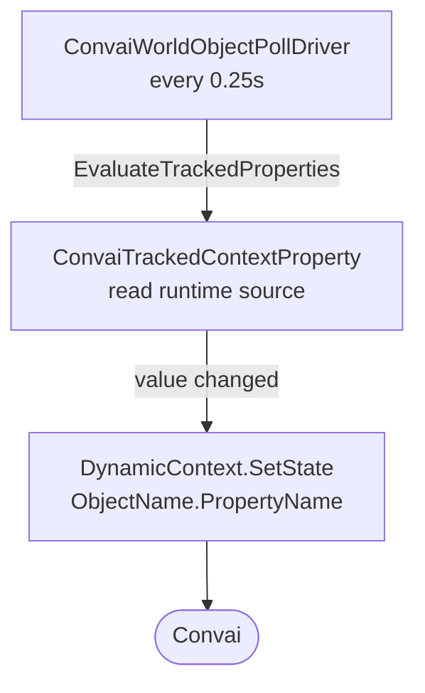

`ConvaiObjectMetadata` and `ConvaiMetadataRegistry` form the core pipeline that collects object descriptions from your scene and delivers them to Convai as each character becomes ready. That pipeline also keeps a connected character's object awareness current afterward — a registered object can re-sync its static description on change, or report changing runtime state through tracked properties. `ConvaiSceneMetadataCollector` is an optional companion component for manual control, statistics, and auditing — it is not required for the automatic delivery described below. Understanding both paths helps you configure the system correctly and debug it when objects are not reaching the character.

## Connect-time delivery flow

Every `ConvaiObjectMetadata` component registers itself with `ConvaiMetadataRegistry` when enabled. This happens independently of any `ConvaiSceneMetadataCollector` in the scene.

The automatic connect-time send is driven by `ConvaiCharacter` itself, not by the collector. When a character receives its ready signal from Convai, it captures a snapshot of its action-config objects and characters, seeds any tracked-property values, and marks scene metadata pending. That pending flag is flushed on the character's next batched update — the same batching window used for dynamic context updates — which reads the registry and sends the payload as an `update-scene-metadata` RTVI message.

```mermaid
flowchart TD
    A[ConvaiObjectMetadata\nOnEnable] -->|registers| B[ConvaiMetadataRegistry\nstatic, O&#40;1&#41; lookup]
    C[ConvaiCharacter\nreceives character-ready signal] -->|MarkPendingSceneMetadataSync| D[Batched flush\nsame window as dynamic context]
    D -->|GetSceneMetadataList| B
    D --> E[RTVIUpdateSceneMetadata\nupdate-scene-metadata]
    E --> F([Convai])
```

Objects register and unregister themselves as they are enabled and disabled — no manual cleanup is needed. Convai receives the current state of all registered objects once the character is ready, with no `ConvaiSceneMetadataCollector` required. Any change made after that point is delivered through the live re-sync path described below.

`ConvaiSceneMetadataCollector`'s **Collect On Start** option also sends the full payload on connect if enabled — this duplicates the automatic send above and is redundant for basic setups. Use the collector when you want the statistics logging, a manual trigger point (`CollectAndSendSceneMetadata()`), or a pre-send audit (`ValidateAllMetadata()`), not because it is required for objects to reach the character. See [Scene metadata component reference](component-reference.md) for its full field list.

## Live re-sync and tracked properties

Two mechanisms keep a character's object awareness current after the initial connect-time send.

### Live re-sync of static metadata

Setting `ObjectName`, `ObjectDescription`, or `IncludeInMetadata` from script on a `ConvaiObjectMetadata` that is currently registered marks `ConvaiMetadataRegistry` dirty and notifies every connected character. Registering or unregistering a `ConvaiObjectMetadata` component while a session is connected — for example enabling or disabling its `GameObject`, or adding the component at runtime — has the same effect. Each notified character automatically sends a follow-up `update-scene-metadata` message on its next flush, without a manual `CollectAndSendSceneMetadata()` call.

### Tracked properties

`ConvaiObjectMetadata` can also declare tracked properties: a list of `ConvaiTrackedContextProperty` entries, each naming a property, an initial value, an optional runtime source (a `Component` and member name read through reflection on each poll), and a `ConvaiRespondMode` reaction. An internal poll driver checks every registered object's tracked properties every 0.25 seconds and pushes any changed value to every connected character through `DynamicContext.SetState`, keyed as `{ObjectName}.{PropertyName}`.

Tracked properties do not travel as an `update-scene-metadata` message. They use the same dynamic-context transport as a manual `SetState` call, keeping a scene object's own state in sync without any polling code in your own scripts.


Tracked properties ride the Dynamic Context channel, but they are authored declaratively on the world object in the Inspector rather than pushed imperatively from a script. Use them when an object's own state should stay in sync with the character automatically. Use a manual `SetState` call for events and state that do not belong to any single scene object.


## Scene metadata vs. dynamic context

Both systems inject information into a character's context, but they serve different purposes:

|                       | Scene Metadata                                   | Dynamic Context                           |
| --------------------- | ------------------------------------------------ | ----------------------------------------- |
| **Who populates it**  | SDK auto-discovers objects                       | Developer manually injects state          |
| **What it describes** | Physical objects and entities in the scene       | Runtime state, events, player actions     |
| **When it's sent**    | At room connection, then re-sent automatically whenever a registered object's name, description, or inclusion changes | Anytime, on demand — including continuously for tracked properties, which poll every 0.25 s |
| **Typical use**       | "There is a fire extinguisher on the south wall" | "The trainee failed the valve check" |

Use both together for the most context-rich AI experience.


Scene Metadata describes the static world — what exists. Dynamic Context describes the dynamic world — what is happening. They are complementary, not competing.


## Next steps


[Scene metadata quick start](quick-start.md)



[Scene metadata usage examples](usage-examples.md)

