# How scene metadata works

`ConvaiObjectMetadata`, `ConvaiMetadataRegistry`, and `ConvaiSceneMetadataCollector` form a three-part pipeline that collects object descriptions from your scene and delivers them to Convai when a session connects. Understanding this flow helps you configure the system correctly and debug it when objects are not reaching the character.

### Registration and delivery flow

Every `ConvaiObjectMetadata` component registers itself with `ConvaiMetadataRegistry` when enabled. When a room connects, `ConvaiSceneMetadataCollector` reads that registry, assembles a payload, and sends it to Convai as an `update-scene-metadata` RTVI message.

```mermaid
flowchart TD
    A[ConvaiObjectMetadata\nOnEnable] -->|registers| B[ConvaiMetadataRegistry\nstatic, O&#40;1&#41; lookup]
    B -->|GetSceneMetadataList| C[ConvaiSceneMetadataCollector]
    C -->|SessionState.Connected| D[RTVIUpdateSceneMetadata\nupdate-scene-metadata]
    D --> E([Convai])
```

Objects register and unregister themselves as they are enabled and disabled — no manual cleanup is needed. Convai receives the current state of all registered objects at connection time.

### Scene metadata vs. dynamic context

Both systems inject information into a character's context, but they serve different purposes:

|                       | Scene Metadata                                   | Dynamic Context                           |
| --------------------- | ------------------------------------------------ | ----------------------------------------- |
| **Who populates it**  | SDK auto-discovers objects                       | Developer manually injects state          |
| **What it describes** | Physical objects and entities in the scene       | Runtime state, events, player actions     |
| **When it's sent**    | Once, at room connection                         | Anytime, on demand                        |
| **Typical use**       | "There is a fire extinguisher on the south wall" | "The trainee just failed the valve check" |

Use both together for the most context-rich AI experience.


Scene Metadata describes the static world — what exists. Dynamic Context describes the dynamic world — what is happening. They are complementary, not competing.


### Next steps


[quick-start.md](quick-start.md)



[usage-examples.md](usage-examples.md)

