`ConvaiObjectMetadata`, `ConvaiMetadataRegistry`, and `ConvaiSceneMetadataCollector` form the Scene Metadata pipeline. It collects object descriptions from your scene, delivers them to Convai when a session connects, and can keep selected object properties synced through Dynamic Context.

## Registration and delivery flow

Every `ConvaiObjectMetadata` component registers itself with `ConvaiMetadataRegistry` when enabled. When a room connects, `ConvaiSceneMetadataCollector` reads that registry, assembles a payload, and sends it to Convai as an `update-scene-metadata` RTVI message.

```mermaid
flowchart TD
    A[ConvaiObjectMetadata\nOnEnable] -->|registers| B[ConvaiMetadataRegistry\nstatic, O&#40;1&#41; lookup]
    B -->|GetSceneMetadataList| C[ConvaiSceneMetadataCollector]
    C -->|SessionState.Connected| D[RTVIUpdateSceneMetadata\nupdate-scene-metadata]
    D --> E([Convai])
    A -->|tracked properties| F[ConvaiCharacter.DynamicContext]
    F -->|context-update| E
```

Objects register and unregister themselves as they are enabled and disabled - no manual cleanup is needed. Convai receives the current state of all valid registered objects at connection time.

If a world object has tracked properties, the SDK also seeds those values into each connected character as Dynamic Context. The state key format is `{ObjectName}.{PropertyName}`. Runtime changes are sent when you call `SetTrackedPropertyValue()` or when the optional source-member polling detects a new value.

## Scene metadata vs. dynamic context

Both systems inject information into a character's context, but they serve different purposes:

|                       | Scene Metadata                                   | Dynamic Context                                            |
| --------------------- | ------------------------------------------------ | ---------------------------------------------------------- |
| **Who populates it**  | SDK auto-discovers world objects                 | Developer scripts, relays, or tracked world-object fields  |
| **What it describes** | Physical objects and entities in the scene       | Runtime state, events, player actions, and object state    |
| **When it's sent**    | At room connection or manual collection          | Anytime during the active session                          |
| **Typical use**       | "There is a fire extinguisher on the south wall" | "Fire Extinguisher.Status is Empty"                       |

Use both together for the most context-rich AI experience.


Scene Metadata describes the static world — what exists. Dynamic Context describes the dynamic world — what is happening. They are complementary, not competing.


## Next steps


[Scene metadata quick start](quick-start.md)



[Scene metadata usage examples](usage-examples.md)

