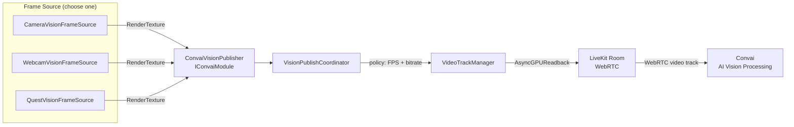

Vision streams a live camera feed from Unity to Convai, where it is processed alongside the audio conversation. This page explains the pipeline architecture, the role of each component, and what the SDK does at runtime when Vision starts.

## Architecture

A frame source captures images from your scene and passes them to `ConvaiVisionPublisher`, which manages a WebRTC video track through the LiveKit layer. The coordinator applies the configured publish policy (frame rate and bitrate), then forwards frames to Convai for AI processing alongside the audio conversation.

On WebGL, `ConvaiVisionPublisher` bypasses the frame source entirely and publishes the browser canvas directly via `canvas.captureStream()`. The WebRTC and Convai processing layers are identical across all platforms.

## Key concepts

| Concept | What it means |
| --- | --- |
| **Frame Source** | A `MonoBehaviour` that captures frames and exposes them as a Y-flipped `RenderTexture`. Three built-in implementations cover Unity cameras, physical webcams, and Meta Quest passthrough. |
| **Publish Policy** | Controls the client-side frame rate and bitrate used when streaming to Convai. Does not control which AI model or vision provider is used on the backend. |
| **Video Track** | A WebRTC video track published to the active Convai room. Identified by the **Track Name** field on `ConvaiVisionPublisher` (default: `"unity-scene"`). |
| **Room Connection** | Vision only publishes when `ConvaiRoomManager` is connected with **Connection Type** set to **Video**. Audio-only connections do not carry video. |
| **Dynamic Vision Context** | An additive, backend-driven sampling mode. Instead of every published frame being processed as it arrives, Convai samples the video track into a rolling buffer and decides which frames reach the model and when. Configured through `ConvaiVisionContextMode` on `ConvaiRoomManager`. |

## Component placement

Understanding which component belongs where prevents the most common setup mistakes.

| Component | Where to place it | Notes |
| --- | --- | --- |
| `ConvaiRoomManager` | Any persistent scene GameObject | **Connection Type** must be set to **Video** |
| `ConvaiVisionPublisher` | Any persistent scene GameObject | Typically placed on or near the NPC's root |
| `CameraVisionFrameSource` | Same or child GameObject as the publisher | One per capture source |
| `WebcamVisionFrameSource` | Same or child GameObject as the publisher | One per capture source |
| `QuestVisionFrameSource` | Same or child GameObject as the publisher | Meta Quest 3 / 3S only; requires Meta XR SDK |
| `VisionDebugPreview` | Any scene GameObject | Editor-only; auto-disabled in player builds |

## Startup sequence

When `ConvaiRoomManager` connects with **Connection Type** set to **Video**, the following occurs automatically for `AutoCompatible`, `HighResponsiveness`, and `LowOverhead` policies. If **Dynamic Vision Context** is set to `Enabled`, `ConvaiRoomManager` resolves its effective connection type to Video automatically at connect time, even when **Connection Type** is configured as `Audio`.

1. `ConvaiRoomManager` establishes a Video connection to Convai.
2. `ConvaiVisionPublisher` detects the active room and resolves the frame source via `GetComponent` or `GetComponentsInChildren`.
3. The frame source starts capture and signals `Ready`. For `CameraVisionFrameSource`, this renders the assigned camera (or `Camera.main`) into a `RenderTexture`.
4. `VisionPublishCoordinator` applies the selected publish policy (for example, `AutoCompatible`: 10 fps, 750 kbps) and begins forwarding frames to the video pipeline.
5. A WebRTC video track named `"unity-scene"` is published to the Convai room. `ConvaiVisionPublisher.IsPublishing` becomes `true` and the `VideoTrackPublished` domain event fires.

For the `Manual` policy, step 5 does not happen automatically — call `EnablePublishing(true)` from a script to start publishing.

## Dynamic vision context

Dynamic vision context is an additive, opt-in alternative to processing every published frame as it arrives. Instead of the client deciding what to publish and how often, Convai samples the video track that is already being published into a rolling frame buffer and attaches the freshest frames to model turns only when needed. It shares the same input-lane model as [dynamic context](../dynamic-context/how-dynamic-context-works.md): vision is one lane with its own respond mode, alongside `context_update`, `trigger`, and `scene_metadata` lanes, all using the same `ConvaiRespondMode` values (`Silent`, `Auto`, `MustRespond`).

Dynamic vision context does not replace the frame-source pipeline described in Architecture — it depends on it. A frame source and `ConvaiVisionPublisher` must still publish a WebRTC video track for Convai to sample; dynamic vision context only changes how Convai decides which sampled frames reach the model and when a frame update should make the character respond.

The reason this exists is token cost, not network transport. An attached frame costs image tokens on every model turn a character produces — including ordinary voice and text turns, since silently absorbed vision frames still ride along. At a provider's default downscale (Gemini's 384 px admission costs roughly 258 image tokens per frame), the default five-frame attach adds roughly 1,290 tokens to every turn while dynamic vision context is enabled. Dynamic vision context exists to make that cost an explicit, tunable choice instead of an implicit one.

`ConvaiVisionContextMode` on `ConvaiRoomManager` controls whether this backend sampling is requested at connect time:

| Mode | Effect |
| --- | --- |
| `Auto` (default) | Vision context is enabled only when **Connection Type** is already Video. Audio-only rooms are never upgraded automatically. |
| `Enabled` | Always enables vision context and forces the room's effective connection type to Video. |
| `Disabled` | Never sends vision context configuration. **Connection Type** is left untouched, so legacy native-video paths keep publishing without backend sampling. |

When enabled, `ConvaiRoomManager` sends a `vision_input_config` payload on room connect that describes the sampling interval, frames-per-turn budget, buffer size, staleness window, and resolution cap. Convai then decides which buffered frames to attach to a turn and whether a vision update should stay silent, let the model decide, or force a response — configured per lane through `ConvaiVisionRespondModeSettings`.


Dynamic vision context requires a Convai account with the feature enabled and a vision-capable non-realtime model. When it is unavailable, status and trigger acknowledgements report `vision_not_enabled` and the session continues without it.


For the sampling settings, respond-mode defaults, and the runtime API to query buffer status or trigger a vision response, see [Dynamic vision context](dynamic-vision-context.md).

## Next steps


[Vision quick start](quick-start.md)



[Vision frame sources](frame-sources.md)



[Dynamic vision context](dynamic-vision-context.md)



[Vision scripting API](scripting-api.md)

