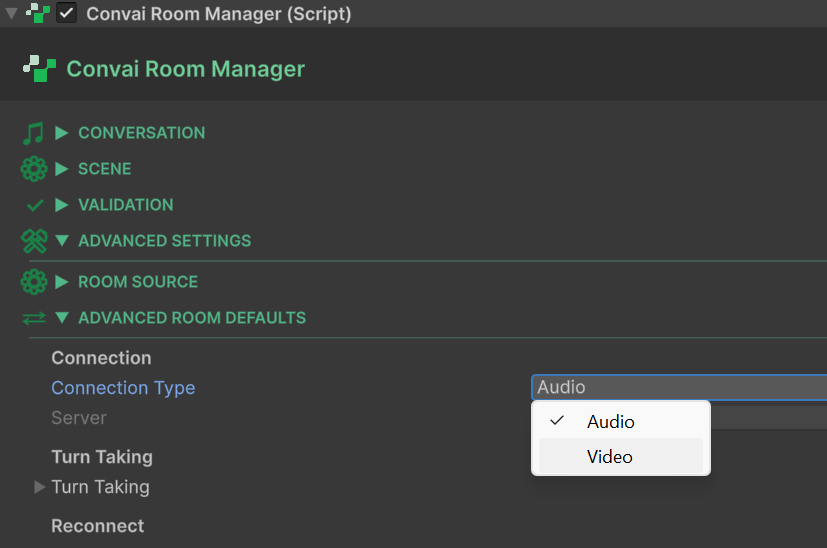
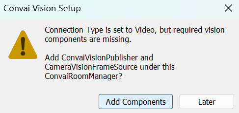
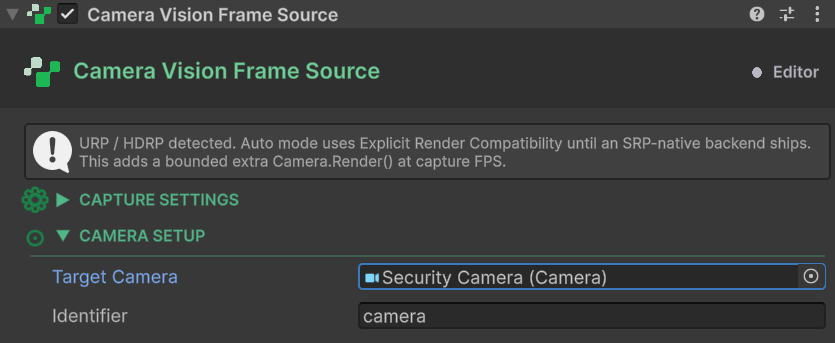
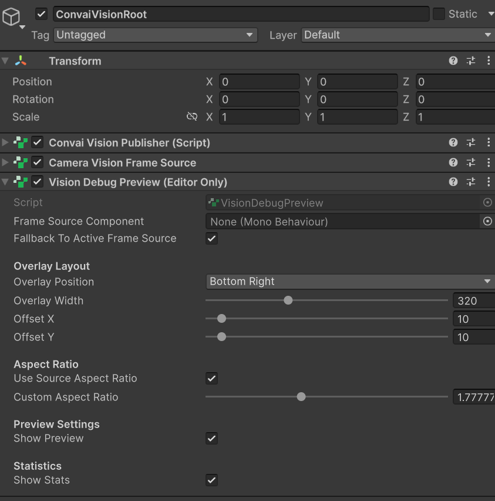
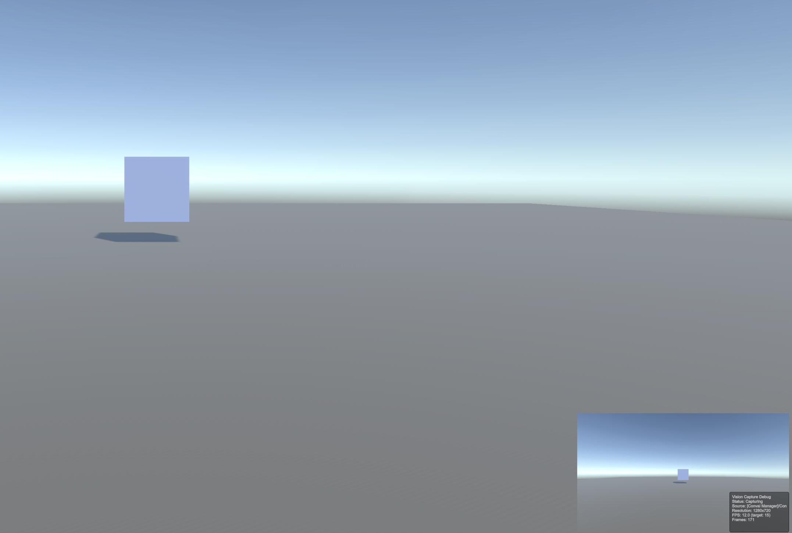
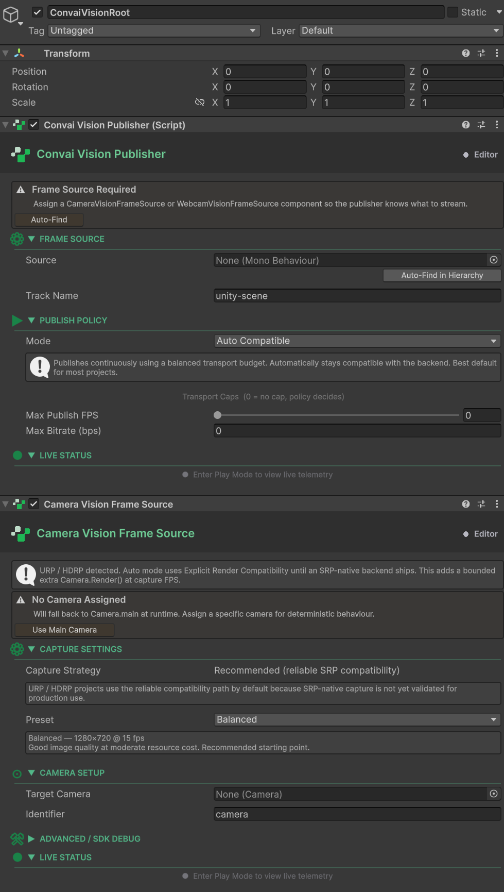

# Quick Start

## Your First Vision Setup

This guide walks you through the minimum steps needed to get a Convai character receiving a live camera feed from your Unity scene. The SDK can add the required components for you automatically — follow the primary path below, or use the manual path if you dismissed the prompt or need a custom placement.


**Prerequisites**

* A Unity scene with a `ConvaiCharacter` component already set up and working (the character should respond to speech).
* Your Convai API key is configured in **Tools → Convai → Configuration**.




#### Set the Connection Type to Video

Select the `ConvaiRoomManager` GameObject in the Hierarchy. In the Inspector, set **Connection Type** to **Video**.

<figure><figcaption></figcaption></figure>

A dialog appears immediately:

> **Convai Vision Setup** Connection Type is set to Video, but required vision components are missing. Add `ConvaiVisionPublisher` and `CameraVisionFrameSource` under this ConvaiRoomManager?

Click **Add Components**.

<figure><figcaption></figcaption></figure>

The SDK creates a child GameObject named **ConvaiVisionRoot** under `ConvaiRoomManager` and adds both `ConvaiVisionPublisher` and `CameraVisionFrameSource` to it. No further component setup is required.


If you clicked **Later** and need to add the components manually, see Manual Component Setup below.




#### Assign a Camera (if not using Camera.main)

Select the **ConvaiVisionRoot** GameObject (under `ConvaiRoomManager`). On the `CameraVisionFrameSource` component, locate the **Target Camera** field.

* If your scene has a `Camera` tagged **MainCamera**, leave the field blank — the component resolves it automatically at runtime.
* If you want to capture a specific camera (an overhead view, a security camera, etc.), drag that camera into the **Target Camera** field now.

<figure><figcaption></figcaption></figure>

The default **Capture Preset** is **Balanced** (1280 × 720 at 15 fps), which suits most use cases.



#### Add Vision Debug Preview and Verify

On any scene GameObject, click **Add Component** → **Convai/Vision/Vision Debug Preview (Editor Only)**.

<figure><figcaption></figcaption></figure>

Press **Play**. An overlay appears in the Game view showing the live camera feed and a statistics panel. Once the room connects, the FPS counter increments and the frame count begins increasing — the character is now receiving visual context.

<figure><figcaption></figcaption></figure>




**Success check**

The Debug Preview overlay shows a live image and a non-zero FPS counter. Reading `ConvaiVisionPublisher.IsPublishing` from any script returns `true`.



If the overlay stays blank or the FPS counter reads zero, verify that `ConvaiRoomManager.Connection Type` is set to **Video** and that the room has fully connected. See [Troubleshooting](../../../unity-plugin-beta-overview/features/vision/troubleshooting-and-diagnostics.md) for a step-by-step diagnosis.


***

## Manual Component Setup

If you clicked **Later** on the dialog, or want to place the components on a specific GameObject, add them manually:

1. Select the target GameObject (any persistent scene object — typically on or near your NPC).
2. **Add Component** → search for **Convai Vision Publisher**.
3. On the same GameObject (or a child), **Add Component** → **Convai/Vision/Camera Vision Frame Source**.
4. Assign the **Target Camera** if not using `Camera.main`.
5. Leave the **Frame Source Component** field on `ConvaiVisionPublisher` blank — the publisher discovers `CameraVisionFrameSource` on the same GameObject at runtime. Assign it explicitly only if you have multiple frame sources in the scene.

<figure><figcaption></figcaption></figure>

***

## What Just Happened

When you clicked **Add Components** and pressed Play, the following occurred:

1. The SDK created a **ConvaiVisionRoot** child GameObject under `ConvaiRoomManager` and added `ConvaiVisionPublisher` and `CameraVisionFrameSource` to it.
2. `ConvaiRoomManager` established a **Video** connection to the Convai backend.
3. `ConvaiVisionPublisher` detected the active room and waited for the frame source to become ready.
4. `CameraVisionFrameSource` rendered the assigned camera (or `Camera.main`) into a `RenderTexture` and signalled that frames were available.
5. `VisionPublishCoordinator` applied the `AutoCompatible` publish policy — 10 fps, 750 kbps — and passed the texture to the video pipeline.
6. A video track named `"unity-scene"` was published to the Convai backend. `IsPublishing` became `true`.

From this point the character receives the live scene camera feed alongside the audio conversation, processed together.

## What's Next

* [Frame Sources](../../../unity-plugin-beta-overview/features/vision/frame-sources.md) — Switch to a webcam source on desktop, configure mobile camera permissions, or set up Meta Quest passthrough.
* [Publishing & Policies](../../../unity-plugin-beta-overview/features/vision/publishing-and-policies.md) — Tune frame rate and bitrate, or switch to Manual policy for explicit control over when publishing starts.
* [Debug Preview](../../../unity-plugin-beta-overview/features/vision/debug-preview.md) — Customise the overlay position, size, and statistics display.
* [Troubleshooting & Diagnostics](../../../unity-plugin-beta-overview/features/vision/troubleshooting-and-diagnostics.md) — If anything is not working, start here.

## Conclusion

You now have a working Vision setup. The SDK handles component placement and runtime wiring automatically — the character receives a live feed from your scene camera and can reason about what it sees. Continue to [Frame Sources](frame-sources.md) to configure the right capture method for your platform, or jump to [Troubleshooting & Diagnostics](../../../unity-plugin-beta-overview/features/vision/troubleshooting-and-diagnostics.md) if anything is not working.
