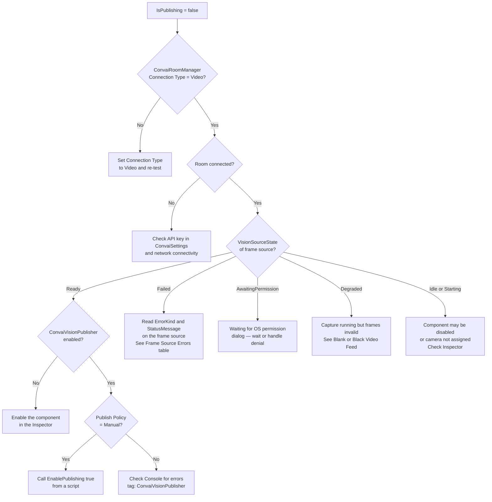

# Troubleshooting & Diagnostics

## Diagnosing and Resolving Vision Problems

Most Vision problems fall into one of three categories: the publisher is not publishing, the video feed is blank or incorrect, or a frame source is stuck in a non-ready state. This page covers all three, starting with the fastest first-line tools and working through platform-specific issues. Use the Decision Tree for a quick visual diagnosis path.

## Using VisionDebugPreview for First-Line Diagnostics

`VisionDebugPreview` is the fastest diagnostic tool available. Add it to any scene GameObject before pressing Play — it shows the live `RenderTexture` output and a statistics overlay including the current `VisionSourceState`, FPS, and frame count.

**Add Component:** `Convai/Vision/Vision Debug Preview (Editor Only)`

| What you see                          | What it means                                                                                      |
| ------------------------------------- | -------------------------------------------------------------------------------------------------- |
| Live image, FPS > 0                   | Frame source is `Ready` and producing frames                                                       |
| Blank/black image, FPS = 0            | Frame source is not producing frames — check `State` and `ErrorKind` below                         |
| Overlay not appearing at all          | No active frame source found — assign one explicitly or enable **Fallback to Active Frame Source** |
| Overlay appears but shows placeholder | Frame source assigned but not yet started — check its `State` in the Inspector                     |


`VisionDebugPreview` does **not** show the WebGL canvas capture path. On WebGL the overlay will be blank by design — this is expected behaviour, not a fault.


See [Debug Preview](../../../unity-plugin-beta-overview/features/vision/debug-preview.md) for full configuration options.

***

## First-Line Investigation

Work through this checklist in order when something is not working. Most issues resolve at step 1 or 2.



#### Verify Connection Type

Select `ConvaiRoomManager` in the Hierarchy. Confirm **Connection Type** is set to **Video**.

`ConvaiVisionPublisher` will never publish on an audio-only connection regardless of how any other component is configured. This is the single most common cause of `IsPublishing` staying `false`.



#### Check the Frame Source State

Add `VisionDebugPreview` to any scene GameObject and press Play. The statistics overlay shows the current `VisionSourceState`.

* **Ready** → The frame source is working. Move to step 3.
* **Degraded** → Capture is running but frame health checks are failing — see Blank or Black Video Feed.
* **Failed** → Check `ErrorKind` and `StatusMessage` on the frame source component — see Frame Source Errors.
* **AwaitingPermission** → On Android / iOS, waiting for the user to grant camera permission — see Mobile Permission Issues.
* **Idle or Starting** → The frame source has not completed startup. Check that the component is enabled, its **Target Camera** is assigned, and there are no errors in the Console.



#### Check IsPublishing on the Publisher

Add a temporary script or check in Play Mode whether `ConvaiVisionPublisher.IsPublishing` is `true`. If the frame source is `Ready` but `IsPublishing` is still `false`:

* Confirm the room has **fully connected** — not just that Play was pressed.
* Confirm `ConvaiVisionPublisher` is **enabled**.
* If **Publish Policy** is set to `Manual`, call `publisher.EnablePublishing(true)` — publishing does not start automatically with this policy.



#### Check the Console for Errors

Look for messages tagged with `[Vision]`, `[ConvaiVisionPublisher]`, or `[CameraVisionFrameSource]` in the Unity Console. Vision logs errors with the source component name, making it straightforward to identify the failing component.



***

## Common Issues

| Symptom                                                     | Likely cause                                             | Fix                                                                                                         |
| ----------------------------------------------------------- | -------------------------------------------------------- | ----------------------------------------------------------------------------------------------------------- |
| `IsPublishing` stays `false`                                | `ConvaiRoomManager.Connection Type` is not `Video`       | Set **Connection Type** to **Video**                                                                        |
| `IsPublishing` stays `false`                                | Room is not connecting (API key, network)                | Verify API key in `ConvaiSettings`; check network; inspect Console                                          |
| `IsPublishing` stays `false`                                | Frame source never reached `Ready`                       | Add `VisionDebugPreview`; check `State` and `ErrorKind` on the frame source                                 |
| `IsPublishing` stays `false`                                | Publish Policy is `Manual`                               | Call `publisher.EnablePublishing(true)` from a script                                                       |
| `IsPublishing` stays `false`                                | `ConvaiVisionPublisher` component is disabled            | Enable the component in the Inspector                                                                       |
| Black or blank feed in Debug Preview                        | Wrong `CameraCaptureMode` for the render pipeline        | Set **Camera Capture Mode** to `Auto` on `CameraVisionFrameSource`                                          |
| Black or blank feed in Debug Preview                        | **Target Camera** is null (`Camera.main` not found)      | Assign a camera explicitly in the **Target Camera** field                                                   |
| Black or blank feed in Debug Preview                        | `VisionSourceState` is `Degraded`                        | Enable **Enable Diagnostic Frame Health Probe** temporarily to identify the cause                           |
| Frame source stuck in `AwaitingPermission`                  | Android / iOS camera permission dialog pending           | Wait for the OS dialog; if denied, `ErrorKind` becomes `PermissionDenied`                                   |
| Frame source in `Failed`, `ErrorKind = PermissionDenied`    | Camera permission denied by the user                     | Inform the user; on Android, direct them to app settings to re-grant permission                             |
| Frame source in `Failed`, `ErrorKind = UnsupportedPlatform` | `QuestVisionFrameSource` running on a non-Quest platform | Expected in the Editor — use `CameraVisionFrameSource` for Editor testing                                   |
| Frame source in `Failed`, `ErrorKind = DeviceUnavailable`   | Requested webcam device not found                        | Leave **Webcam Device Name** blank to select the first available device, or verify the device name          |
| `QuestVisionFrameSource` in `Failed`                        | `PassthroughCameraAccess` not in scene                   | Add the `PassthroughCameraAccess` component or leave **Passthrough Camera Access** blank for auto-discovery |
| Wrong frame source publishing                               | Auto-discovery selected the wrong source                 | Assign the correct source explicitly in `ConvaiVisionPublisher`'s **Frame Source Component** field          |
| `VisionDebugPreview` overlay blank                          | No active frame source found                             | Assign a frame source or enable **Fallback to Active Frame Source**                                         |
| `VisionDebugPreview` overlay blank on WebGL                 | No `RenderTexture` path on WebGL                         | Expected — WebGL uses canvas capture; the preview does not apply                                            |
| Audio not playing on WebGL while video is publishing        | Browser requires a user gesture before audio             | Ensure the user has clicked or interacted with the page before the room connects                            |
| Video publishing but character not responding visually      | Backend model / session configuration                    | Confirm the character is configured for multimodal input in the Convai dashboard                            |

***

## Blank or Black Video Feed

A black feed means the frame source is running but producing empty or invalid frames. `VisionSourceState` will typically be `Ready` or `Degraded`.

**Step 1 — Check Camera Capture Mode**

On `CameraVisionFrameSource`, confirm **Camera Capture Mode** is `Auto`. Selecting `BuiltInHooks` on a URP/HDRP project will produce a black feed because the built-in render callbacks are not raised by SRP cameras.

**Step 2 — Confirm Target Camera is rendering**

The assigned camera must be active, enabled, and actually rendering. A camera that has `Enabled = false` or whose GameObject is inactive produces no output.

**Step 3 — Enable the Diagnostic Frame Health Probe**

On `CameraVisionFrameSource`, enable **Enable Diagnostic Frame Health Probe**. This performs a per-frame synchronous pixel readback that logs to the Console when consecutive invalid frames are detected.


Disable **Enable Diagnostic Frame Health Probe** before shipping. It performs a synchronous GPU-to-CPU readback every frame and incurs a measurable performance cost.


**Step 4 — Check for post-processing issues**

Some post-processing effects write to the camera texture in ways that can confuse the capture backend. If the feed is black only with post-processing active, try switching **Camera Capture Mode** to `ExplicitRenderCompatibility`.

***

## Frame Source Errors

### VisionSourceState Reference

| State                | Meaning                                          | What to do                                                                   |
| -------------------- | ------------------------------------------------ | ---------------------------------------------------------------------------- |
| `Idle`               | Capture has not started                          | Check that the component is enabled and the publisher has started            |
| `AwaitingPermission` | Waiting for OS camera permission (Android / iOS) | Wait for the system dialog; handle denial via `ErrorKind = PermissionDenied` |
| `Starting`           | Device opening, `RenderTexture` allocating       | Wait a moment; if stuck, check Console for errors                            |
| `Ready`              | Capture running; frames being produced           | Normal operational state                                                     |
| `Degraded`           | Running but frame health checks detecting issues | See Blank or Black Video Feed                                                |
| `Stopped`            | Capture stopped normally                         | Start capture again if needed                                                |
| `Failed`             | Unrecoverable error                              | Read `ErrorKind` and `StatusMessage` for the specific cause                  |

### VisionSourceErrorKind Reference

| Error kind             | Cause                                               | Resolution                                                                                                         |
| ---------------------- | --------------------------------------------------- | ------------------------------------------------------------------------------------------------------------------ |
| `None`                 | No error                                            | —                                                                                                                  |
| `Timeout`              | No usable frame produced within the expected window | Check camera is active and rendering; review `CameraCaptureMode`                                                   |
| `PermissionDenied`     | OS camera permission denied                         | Direct user to grant permission in device settings                                                                 |
| `UnsupportedPlatform`  | Source not supported on this platform               | Use `CameraVisionFrameSource` in the Editor for `QuestVisionFrameSource` scenarios                                 |
| `DeviceUnavailable`    | Webcam device cannot be opened                      | Leave **Webcam Device Name** blank, or verify device name with `WebcamVisionFrameSource.GetAvailableDeviceNames()` |
| `InvalidConfiguration` | A field value is inconsistent                       | Read `StatusMessage` for the specific field; correct in the Inspector                                              |
| `Unknown`              | Unexpected internal error                           | Check the Console for the full exception; report to support if it persists                                         |

***

## Mobile Permission Issues

On Android and iOS, `WebcamVisionFrameSource` requests camera permission asynchronously when capture starts. The permission dialog appears once — on the first session that runs after the app is installed.

**If permission is granted:** `State` advances from `AwaitingPermission → Starting → Ready` automatically.

**If permission is denied:** `State` moves to `Failed` with `ErrorKind = PermissionDenied`. The component does not retry automatically. To handle this gracefully in your application:

```csharp
using Convai.Runtime.Vision.Sources;

void Update()
{
    var statusProvider = _webcamSource as IVisionFrameSourceStatusProvider;
    if (statusProvider != null
        && statusProvider.State == VisionSourceState.Failed
        && statusProvider.ErrorKind == VisionSourceErrorKind.PermissionDenied)
    {
        // Show in-app message directing user to device settings
        ShowPermissionDeniedUI();
    }
}
```


Ensure your Android manifest declares `android.permission.CAMERA` and your iOS `Info.plist` includes `NSCameraUsageDescription`. Without these declarations the system may silently deny the permission request or prevent submission to app stores.


***

## Meta Quest Issues

`QuestVisionFrameSource` binds to `PassthroughCameraAccess` via reflection at runtime. Common failure modes:

| Issue                             | Cause                                                      | Fix                                                                                                        |
| --------------------------------- | ---------------------------------------------------------- | ---------------------------------------------------------------------------------------------------------- |
| `ErrorKind = UnsupportedPlatform` | Running in the Editor or on non-Quest hardware             | Use `CameraVisionFrameSource` in the Editor; `QuestVisionFrameSource` only works on Quest hardware         |
| `Failed` at startup               | `PassthroughCameraAccess` not found in scene               | Add the component to any scene GameObject, or leave **Passthrough Camera Access** blank for auto-discovery |
| `Failed` after Meta XR SDK update | `PassthroughCameraAccess` API changed between SDK versions | Check the Meta XR SDK changelog; update `QuestVisionFrameSource` bindings if needed                        |
| Feed orientation incorrect        | `Flip Y` disabled                                          | Ensure **Flip Y** is `true` (default)                                                                      |

***

## Decision Tree: IsPublishing Stays False



***

## Conclusion

Start with `VisionDebugPreview` for an instant visual diagnosis — the overlay's `State` and FPS counter cover the most common failure modes immediately. For everything else, work through the First-Line Investigation checklist, then consult the Common Issues table. If the problem persists after following this guide, the Console error message tagged with the Vision component name will identify the exact failure point.
